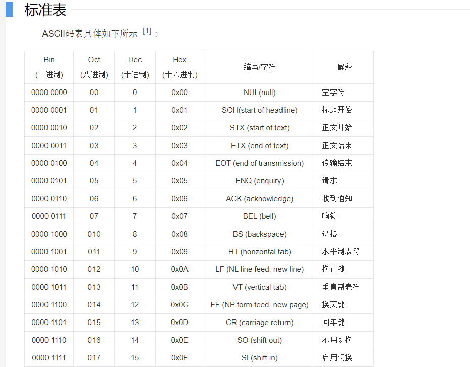

# ddia笔记

## 存储

- ### SSTables（Sorted String Table）

  - 存储过程：

    - 内存维护一个平衡树数据结构，当达到阈值则进行写入到磁盘当中。成为SST段文件。这一部分是排好序。
    - 内部对该段文件进行合并，成为一个新的大文件。
    - 每次写入记录日志表，然后当SST写入文件后，则丢弃（防止数据库崩溃后丢失问题）

    - 内存维护索引表（您仍然需要一个内存中索引来告诉您一些键的偏移量，但它可能很稀疏：每几千字节的段文件就有一个键就足够了，因为几千字节可以很快被扫描）

- **B Tree 分析**


- **索引**

  - > 在 **聚集索引（clustered index）** （在索引中存储所有行数据）和 **非聚集索引（nonclustered index）** （仅在索引中存储对数据的引用）之间的折衷被称为 **包含列的索引（index with included columns）**或**覆盖索引（covering index）**，其存储表的一部分在索引内【33】。这允许通过单独使用索引来回答一些查询（这种情况叫做：索引 **覆盖（cover）** 了查询）【32】。
    >
    > 与任何类型的数据重复一样，聚簇和覆盖索引可以加快读取速度，但是它们需要额外的存储空间，并且会增加写入开销。数据库还需要额外的努力来执行事务保证，因为应用程序不应该因为重复而导致不一致。

  - > #### 多列索引
    >
    > 最常见的多列索引被称为 **连接索引（concatenated index）** ，它通过将一列的值追加到另一列后面，简单地将多个字段组合成一个键（索引定义中指定了字段的连接顺序）。这就像一个老式的纸质电话簿，它提供了一个从（姓，名）到电话号码的索引。由于排序顺序，索引可以用来查找所有具有特定姓氏的人，或所有具有特定姓-名组合的人。**然而，如果你想找到所有具有特定名字的人，这个索引是没有用的**。

  - > **多维索引（multi-dimensional index）** 是一种查询多个列的更一般的方法，这对于地理空间数据尤为重要。例如，餐厅搜索网站可能有一个数据库，其中包含每个餐厅的经度和纬度。当用户在地图上查看餐馆时，网站需要搜索用户正在查看的矩形地图区域内的所有餐馆。这需要一个二维范围查询，如下所示：
    >
    > ```sql
    > SELECT * FROM restaurants WHERE latitude > 51.4946 AND latitude < 51.5079 
    >                            AND longitude > -0.1162 AND longitude < -0.1004;
    > ```
    >
    > 一个标准的B树或者LSM树索引不能够高效地响应这种查询：它可以返回一个纬度范围内的所有餐馆（但经度可能是任意值），或者返回在同一个经度范围内的所有餐馆（但纬度可能是北极和南极之间的任意地方），但不能同时满足。
    >
    > 一种选择是使用空间填充曲线将二维位置转换为单个数字，然后使用常规B树索引【34】。更普遍的是，使用特殊化的空间索引，例如R树。例如，PostGIS使用PostgreSQL的通用Gist工具【35】将地理空间索引实现为R树。这里我们没有足够的地方来描述R树，但是有大量的文献可供参考。
    >
    > 一个有趣的主意是，多维索引不仅可以用于地理位置。例如，在电子商务网站上可以使用维度（红色，绿色，蓝色）上的三维索引来搜索特定颜色范围内的产品，也可以在天气观测数据库中搜索二维（日期，温度）的指数，以便有效地搜索2013年的温度在25至30°C之间的所有观测资料。使用一维索引，你将不得不扫描2013年的所有记录（不管温度如何），然后通过温度进行过滤，反之亦然。 二维索引可以同时通过时间戳和温度来收窄数据集。这个技术被HyperDex使用【36】。

- 内存数据库如何持久化

  - > 1.追加日志 ，2.定时保存快照文件保存。（保存完成之后，删除已经同步的日志，瘦身。）

- 内存数据库优势
  - 内存数据库的性能优势并不是因为它们不需要从磁盘读取的事实。即使是基于磁盘的存储引擎也可能永远不需要从磁盘读取，因为操作系统缓存最近在内存中使用了磁盘块。相反，它们更快的原因在于省去了将内存数据结构编码为磁盘数据结构的开销。

- D的目标

  

- 行列存储查询差异

  - 在大多数OLTP数据库中，存储都是以面向行的方式进行布局的：表格的一行中的所有值都相邻存储。文档数据库是相似的：整个文档通常存储为一个连续的字节序列。

  - 面向行的存储引擎仍然需要将所有这些行（每个包含超过100个属性）从磁盘加载到内存中，解析它们，并过滤掉那些不符合要求的条件。这可能需要很长时间。

    面向列的存储背后的想法很简单：不要将所有来自一行的值存储在一起，而是将来自每一列的所有值存储在一起。如果每个列存储在一个单独的文件中，查询只需要读取和解析查询中使用的那些列，这可以节省大量的工作。

- bitMap 压缩存储

  - 

  - 通常情况下，一列中不同值的数量与行数相比较小（例如，零售商可能有数十亿的销售交易，但只有100,000个不同的产品）。现在我们可以得到一个有 n 个不同值的列，并把它转换成 n 个独立的位图：每个不同值的一个位图，每行一位。如果该行具有该值，则该位为 1 ，否则为 0 。

    如果 n 非常小（例如，国家/地区列可能有大约200个不同的值），则这些位图可以每行存储一位。但是，如果n更大，大部分位图中将会有很多的零（我们说它们是稀疏的）。在这种情况下，位图可以另外进行游程编码，如[图3-11](https://vonng.gitbooks.io/ddia-cn/content/fig3-11.png)底部所示。这可以使列的编码非常紧凑。

  - 这些位图索引非常适合数据仓库中常见的各种查询。例如：

    ```sql
    WHERE product_sk IN（30，68，69）
    ```

    加载 `product_sk = 30` , `product_sk = 68` , `product_sk = 69` 的三个位图，并计算三个位图的按位或，这可以非常有效地完成。

    ```sql
    WHERE product_sk = 31 AND store_sk = 3
    ```

    加载 `product_sk = 31` 和 `store_sk = 3` 的位图，并逐位计算AND。 这是因为列按照相同的顺序包含行，因此一列的位图中的第 k 位对应于与另一列的位图中的第 k 位相同的行。

    对于不同种类的数据，也有各种不同的压缩方案，但我们不会详细讨论它们，参见【58】的概述。


## 编码（序列化）

- 程序通常（至少）使用两种形式的数据：

  1. 在内存中，数据保存在对象，结构体，列表，数组，哈希表，树等中。 这些数据结构针对CPU的高效访问和操作进行了优化（通常使用指针）。
  2. 如果要将数据写入文件，或通过网络发送，则必须将其 **编码（encode）** 为某种自包含的字节序列（例如，JSON文档）。 由于每个进程都有自己独立的地址空间，一个进程中的指针对任何其他进程都没有意义，所以这个字节序列表示会与通常在内存中使用的数据结构完全不同[i](https://vonng.gitbooks.io/ddia-cn/content/ch4.html#fn_i)。

  > i. 除一些特殊情况外，例如某些内存映射文件或直接在压缩数据上操作（如“[列压缩](https://vonng.gitbooks.io/ddia-cn/content/ch4.html#列压缩)”中所述）。[ ↩](https://vonng.gitbooks.io/ddia-cn/content/ch4.html#reffn_i)

  所以，需要在两种表示之间进行某种类型的翻译。 从内存中表示到字节序列的转换称为 **编码（Encoding）** （也称为**序列化（serialization）**或**编组（marshalling）**），反过来称为**解码（Decoding）**[ii](https://vonng.gitbooks.io/ddia-cn/content/ch4.html#fn_ii)（**解析（Parsing）**，**反序列化（deserialization）**，**反编组( unmarshalling）**）[译i](https://vonng.gitbooks.io/ddia-cn/content/ch4.html#fn_译i)。

- 0x 是16进制开头，0x83 , 1000 0110 ,两个16进制代表一个字节。共8位。 16进制一位代表4位

**向后兼容 (backward compatibility)**

 新代码可以读旧数据。

**向前兼容 (forward compatibility)**

 旧代码可以读新数据。

> **向后兼容性通常并不难实现：新代码的作者当然知道由旧代码使用的数据格式，因此可以显示地处理它（最简单的办法是，保留旧代码即可读取旧数据）。**
>
> **向前兼容性可能会更棘手，因为旧版的程序需要忽略新版数据格式中新增的部分。**
>
> **本章中将介绍几种编码数据的格式，包括 JSON，XML，Protocol Buffers，Thrift和Avro。尤其将关注这些格式如何应对模式变化，以及它们如何对新旧代码数据需要共存的系统提供支持。然后将讨论如何使用这些格式进行数据存储和通信：在Web服务中，具象状态传输（REST）和远程过程调用（RPC），以及消息传递系统（如Actor和消息队列）。**


### Schema

抽象概念： 模式，即定义对象的元数据信息，数据类型、大小、字段名称。


### Thrift与Protocol Buffers

Apache Thrift 【15】和Protocol Buffers（protobuf）【16】是基于相同原理的二进制编码库。 Protocol Buffers最初是在Google开发的，Thrift最初是在Facebook开发的，并且在2007~2008年都是开源的【17】。 Thrift和Protocol Buffers都需要一个模式来编码任何数据。要在Thrift的[例4-1](https://vonng.gitbooks.io/ddia-cn/content/ch4.html)中对数据进行编码，可以使用Thrift **接口定义语言（IDL）** 来描述模式，如下所示：

```c
struct Person {
    1: required string       userName,
    2: optional i64          favoriteNumber,
    3: optional list<string> interests
}
```

Protocol Buffers的等效模式定义看起来非常相似：

```protobuf
message Person {
    required string user_name       = 1;
    optional int64  favorite_number = 2;
    repeated string interests       = 3;
}
```

- PB 与 Thrift 最大区别是，PB 使用repeat 来表数组，可以表示一个或者多个，拓展性强，Thrift则有List对象

### Thrift


###  PB


### Avro

- Json 表示

  ```json
  {
      "type": "record",
      "name": "Person",
      "fields": [
          {"name": "userName", "type": "string"},
          {"name": "favoriteNumber", "type": ["null", "long"], "default": null},
          {"name": "interests", "type": {"type": "array", "items": "string"}
      ] 
  }
  ```

- 序列化结果

  

- Avro 采用json 定义对象。可以不通过生成特定语言对象，而使用GenericRecord。灵活性强。

- 其序列化时需要将模式写入到序列化当中( 被称为 writer_schema )。存储100w个相同的record。大批量数据。
- 其反序列时，new SpecificDatumReader<User>(User.class);，该User的schema 被称为Reader schema.
- Writer Schema需要知道字段写入的顺序，而Reader schema需要知道期望的字段是什么，以及如何为自文件写入以来添加的字段填充默认值。如果两个模式之间存在差异，则根据模式解析规范进行解析。(一定程度可以进行兼容，动态模式匹配)

- Difference

  - > 如果您为此使用Thrift或Protocol Buffers，则**字段标记(字段序号)**可能必须手动分配：每次数据库模式更改时，管理员都必须手动更新从数据库列名到字段标签。 （这可能会自动化，但模式生成器必须非常小心，不要分配以前使用的字段标记。）这种动态生成的模式根本不是Thrift或Protocol Buffers的设计目标，而是为Avro。


- 资料

  - > ### Serializing
    >
    > Now let's serialize our Users to disk.
    >
    > ```
    > // Serialize user1, user2 and user3 to disk
    > DatumWriter<User> userDatumWriter = new SpecificDatumWriter<User>(User.class);
    > DataFileWriter<User> dataFileWriter = new DataFileWriter<User>(userDatumWriter);
    > dataFileWriter.create(user1.getSchema(), new File("users.avro"));
    > dataFileWriter.append(user1);
    > dataFileWriter.append(user2);
    > dataFileWriter.append(user3);
    > dataFileWriter.close();
    > 
    > We create a DatumWriter, which converts Java objects into an in-memory serialized format. The SpecificDatumWriter class is used with generated classes and extracts the schema from the specified generated type.
    > 
    > Next we create a DataFileWriter, which writes the serialized records, as well as the schema, to the file specified in the dataFileWriter.create call. We write our users to the file via calls to the dataFileWriter.append method. When we are done writing, we close the data file.
    > Deserializing
    > Finally, let's deserialize the data file we just created.
    > 
    > // Deserialize Users from disk
    > DatumReader<User> userDatumReader = new SpecificDatumReader<User>(User.class);
    > DataFileReader<User> dataFileReader = new DataFileReader<User>(file, userDatumReader);
    > User user = null;
    > while (dataFileReader.hasNext()) {
    > // Reuse user object by passing it to next(). This saves us from
    > // allocating and garbage collecting many objects for files with
    > // many items.
    > user = dataFileReader.next(user);
    > System.out.println(user);
    > }
    >         
    > This snippet will output:
    > 
    > {"name": "Alyssa", "favorite_number": 256, "favorite_color": null}
    > {"name": "Ben", "favorite_number": 7, "favorite_color": "red"}
    > {"name": "Charlie", "favorite_number": null, "favorite_color": "blue"}
    >         
    > Deserializing is very similar to serializing. We create a SpecificDatumReader, analogous to the SpecificDatumWriter we used in serialization, which converts in-memory serialized items into instances of our generated class, in this case User. We pass the DatumReader and the previously created File to a DataFileReader, analogous to the DataFileWriter, which reads both the schema used by the writer as well as the data from the file on disk. The data will be read using the writer's schema included in the file and the schema provided by the reader, in this case the User class. The writer's schema is needed to know the order in which fields were written, while the reader's schema is needed to know what fields are expected and how to fill in default values for fields added since the file was written. If there are differences between the two schemas, they are resolved according to the Schema Resolution specification.
    > 
    > Next we use the DataFileReader to iterate through the serialized Users and print the deserialized object to stdout. Note how we perform the iteration: we create a single User object which we store the current deserialized user in, and pass this record object to every call of dataFileReader.next. This is a performance optimization that allows the DataFileReader to reuse the same User object rather than allocating a new User for every iteration, which can be very expensive in terms of object allocation and garbage collection if we deserialize a large data file. While this technique is the standard way to iterate through a data file, it's also possible to use for (User user : dataFileReader) if performance is not a concern.
    > ```

## ASCII 码

- ASCII 码，用来表示英文字符串，本质是将二进制字节数组转化为西方常用的字符。
- 

- 若不在此种就会乱码。（不支持中文）

- 编码代表一种算法。将字节数组转化为内容。ascii 不支持中文，所以后面衍生了UTF-8.

> UTF-8使用1~4字节为每个字符编码：
>
> **·**一个US-ASCIl字符只需1字节编码（Unicode范围由U+0000~U+007F）。
>
> **·**带有变音符号的拉丁文、希腊文、[西里尔字母](https://baike.baidu.com/item/西里尔字母/11058406)、亚美尼亚语、希伯来文、阿拉伯文、叙利亚文等字母则需要2字节编码（Unicode范围由U+0080~U+07FF）。
>
> **·**其他语言的字符（包括中日韩文字、东南亚文字、中东文字等）包含了大部分常用字，使用3字节编码。
>
> **·**其他极少使用的语言字符使用4字节编码。 [1]

