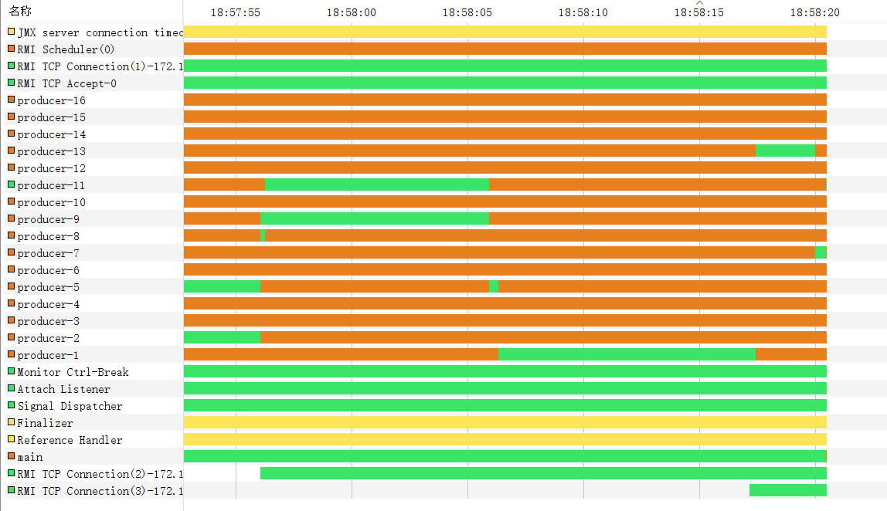
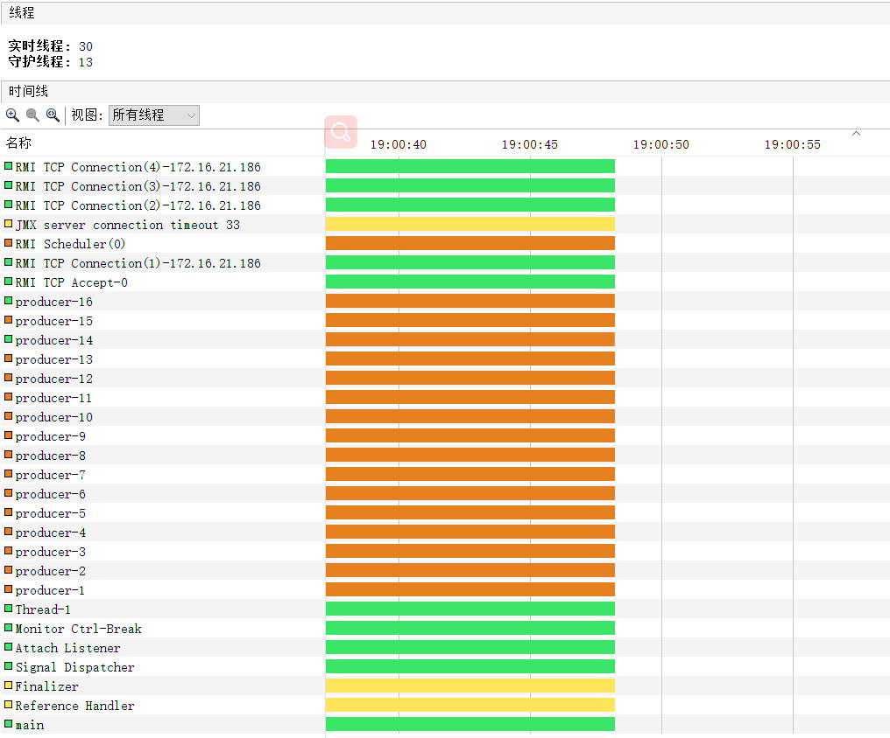
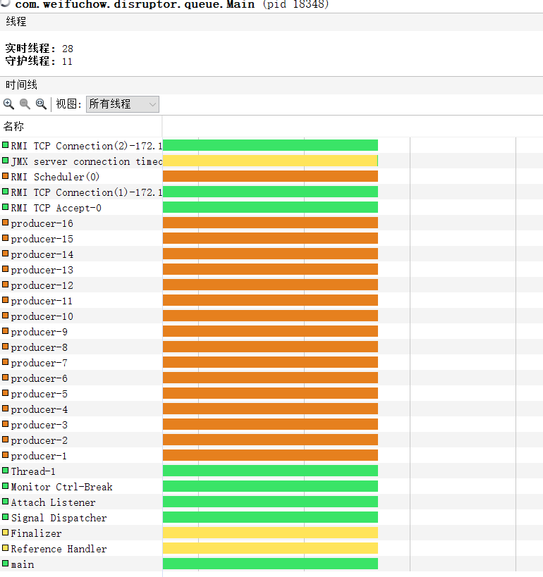

# 性能测试
- 基准（16生产者 1000000，1消费者） 对比消耗完成时间
    - blocking  queue    65723 ms
    - Disruptor queue    82922 ms
    
- 基准（16生产者 2000000，1消费者） 对比消耗完成时间
    - blocking  queue    166666 ms
    - Disruptor queue    151650 ms
    
- 基准（16生产者 3000000，1消费者） 对比消耗完成时间
    - blocking   queue    (卡在300w左右非常缓慢,几乎阻塞住)   
        - 具体原因还得深入分析一下
        - 273524 ms -Message{name='name-3748187', content='content-3748187'}
    - Disruptor queue    248290 ms


# Disruptor

### 生产者
- disruptor.start 得到ringbuffer
- 通过ringbuffer获取可用的空槽：ringBuffer.next();得到序列值
- 在通过ringBuffer.get(sequenceID) 生成一个新的事件Event.
  - 绑定sequence 与event进行映射
- 将新事件赋值再进行publish 发布出去即可。
- 无锁生产消息。

### 消费者
- disruptor.start在启动之前需要注册处理事件的回调。
```java
disruptor.handleEventsWith(new EventHandler<MessageEvent>() {
    @Override
    public void onEvent(MessageEvent messageEvent, long l, boolean b) throws Exception {
//                System.out.println(Thread.currentThread().getName() + " - messageEvent => " + messageEvent.getMessage() + "\t sequence =>" + l + " endOfBatch => " + b);
    }
});
```

- 通过观察得知。这是在响应线程中进行对任务的回调。
- 异步无锁。该模式适合单消费者。


## 传统的BlockingQueue中生产过程

### 生产

- 获取lock
- 检查队列是否已满。若慢进入阻塞队列中。释放锁。等待被唤醒。重新获取锁
- 将消息插入到相关的队列中
- 释放锁


### 消费

- 获取lock
- 检查队列是否为空。若为空进入阻塞队列，释放锁。等待被唤醒。重新获取锁。
- 获取对应的下表得到消息
- 释放锁。


# BlockingQueue




## Single-Producer



## Multi-Producer




