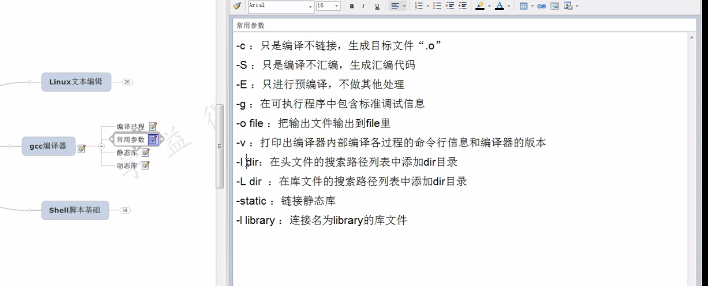

# java 程序运行全过程

## 为什么java程序运行就比c/c++ 慢。有何差异

- When you compile C, it compiles to the native machine code of the processor. When you launch the resulting executable, it runs directly on the processor, subject only to interrupts and other operating-system overhead. When you compile Java, it compiles, not to the native machine code of the processor, but to an “idealized machine code” called Java bytecode. Java bytecode has to be executed by another process, the Java virtual machine (JVM), which runs directly on the processor (it is, in fact, written in C and compiled as such) and interprets the bytecode. In practice, the modern JVM will run through a step called just-in-time compilation (JIT) in which, the first time you use a piece of Java code, it will compile the bytecode to native machine code, and execute that directly. Subsequent runs through the same code will use the cached machine code, so, eventually, the code may run nearly as fast as C code. But there’s still the overhead of the JVM (and niceties like automatic memory management and garbage collection) that will make it slower than C code.
- https://stackoverflow.com/questions/2163411/is-java-really-slow

## gcc 生成结果时汇编还是machine code

https://stackoverflow.com/questions/845355/do-programming-language-compilers-first-translate-to-assembly-or-directly-to-mac

> gcc 实际上生成汇编程序并使用**as**汇编程序进行汇编。并非所有编译器都这样做 - MS 编译器直接生成目标代码，但您可以让它们生成汇编器输出。将汇编程序翻译成目标代码是一个非常简单的过程，至少与编译相比是这样。
>
> 一些编译器生成其他高级语言代码作为其输出 - 例如，**cfront**，第一个 C++ 编译器生成 C 作为其输出，然后由 C 编译器编译。
>
> **请注意，直接编译或汇编实际上都不会产生可执行文件。这是由链接器完成的，它接受编译/汇编生成的各种目标代码文件，解析它们包含的所有名称并生成最终的可执行二进制文件。**

## c語言编译过程

> **让我们来看一个 C 程序。**
>
> 当您在 c 程序上运行`gcc`、`clang`或 'cl' 时，它将经历以下阶段：
>
> 1. 预处理器（#include、#ifdef、trigraph 分析、编码翻译、注释管理、宏...）包括词法分析到预处理器标记中，并最终生成用于输入到编译器的纯文本。
> 2. 词法分析（产生标记和词法错误）。
> 3. 语法分析（生成解析树和语法错误）。
> 4. 语义分析（生成符号表、范围信息和范围/输入错误）还有数据流，将程序逻辑转换为优化器可以使用的“中间表示”。（通常是[SSA](https://en.wikipedia.org/wiki/Static_single_assignment_form)）。clang/LLVM 使用 LLVM-IR，gcc 使用 GIMPLE，然后是 RTL。
> 5. 程序逻辑的优化，包括常量传播、内联、在循环外提升不变量、自动向量化和许多其他事情。（广泛使用的现代编译器的大部分代码都是优化传递。）通过中间表示进行转换只是某些编译器工作方式的一部分，因此[“禁用所有优化”](https://stackoverflow.com/questions/33278757/disable-all-optimization-options-in-gcc)变得[不可能/毫无意义](https://stackoverflow.com/questions/33278757/disable-all-optimization-options-in-gcc)
> 6. 生成汇编程序
> 7. 输出到程序集源（或其他中间格式，如[.NET IL 字节码](https://en.wikipedia.org/wiki/Common_Intermediate_Language)）
> 8. 将程序集组装成某种二进制对象格式。
> 9. 将程序集链接到任何需要的静态库中，并在需要时重新定位它。
> 10. elf、PE/coff、MachO64 或任何其他格式的最终可执行文件的输出
>
> 在实践中，其中一些步骤可能会同时完成，但这是逻辑顺序。大多数编译器都有在任何给定步骤（例如预处理或汇编）之后停止的选项，包括在 GCC 等开源编译器的优化传递之间转储内部表示。( `-ftree-dump-...`)
>
> 请注意，实际可执行二进制文件周围有一个 elf 或 coff 格式的“容器”，除非它是 DOS`.com`可执行文件
>
> 您会发现一本关于编译器的书（我推荐[Dragon](https://rads.stackoverflow.com/amzn/click/com/0321486811)书，该领域的标准入门书）将包含您需要的*所有*信息以及更多信息。
>
> 正如 Marco 评论的那样，链接和加载是一个很大的领域，Dragon book 或多或少停在可执行二进制文件的输出处。实际上从那里到在操作系统上运行是一个相当复杂的过程，[链接器和加载器中的](http://www.iecc.com/linker/)Levine 涵盖了这一过程。
>
> 总结：
>
> **预编译 （ 1，宏处理) 	gcc -E **
>
> **编译 -- （2- 6，词法分析，语法分析，语义分析，优化后生成相应的汇编代码）	 gcc -S 生成汇编代码**
>
> **汇编 -- （7 -8 ）将汇编程序翻译成二进制文件（ 就像刚才的hello.c它使用到了C标准库的东西“printf”，但是编译过程只是把源文件翻译成二进制而已，这个二进制还不能直接执行，这个时候就需要做一个动作）。gcc -c **
>
> **链接 -- （9- 10）将调用库通过静态链接（拷贝其文件）或动态链接（指定位置，重定向）绑定到该二进制文件中。生成最终的可执行文件。**

