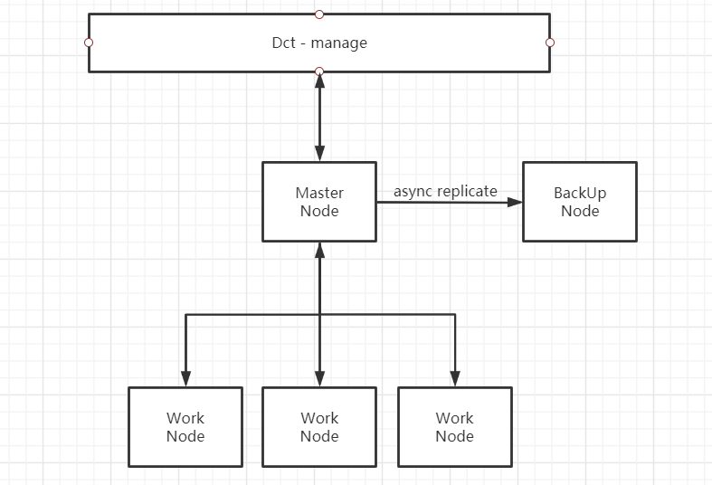
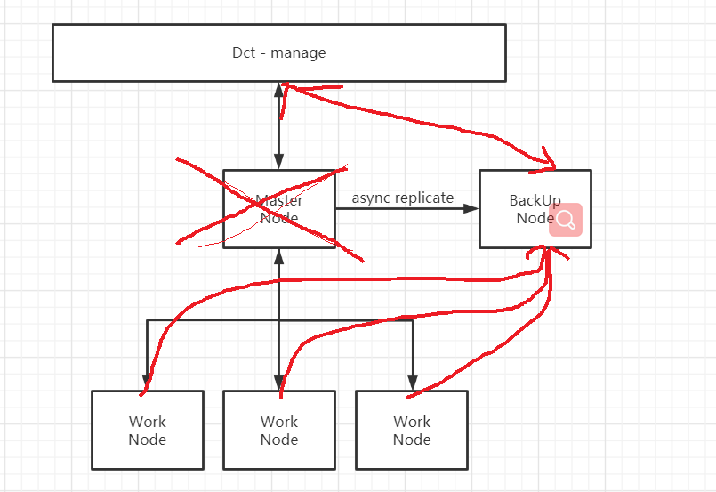

# DDR 请求路由

## 概述

- 由于目前DDR 采用主从架构。若主节点发生故障时，会导致程序中断。任务无法往下运行，导致比较严重的后果。

## DDR 架构

## 分析

若Master Node 发生崩溃，假设 Back Up能够实时获取到Master Node的数据。

Master Node 与 manage 之间的channel 将会断开。

Work Node 与 Master node 之间断开。

需要一种机制自动切换到BackUp node中。

Master Node => BackUp node.

Work Node => BackUp node

- - - 