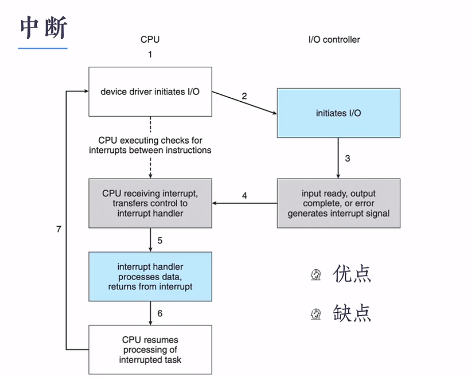

# IO 全过程

## IO

- IO 是Input/output ,IO设备表示输入输出设备。即外设。IO更加意义上指的是cpu 如何与io设备通信。

## 操作系统IO流程

- 操作系统在内核中设计一套IO子系统，用来管理IO设备。

  

  - Driver 指的是驱动,硬件厂家封装的一套对自家设备进行访问控制的一整套协议或命令。直接操作设备控制器进行硬件相关操作。
  - **IO设备本质的操作：实际即为read 、 write、open、close 操作，Linux 一切操作皆为文件。**
  - 流程：
    - 以磁盘控制器为例（不考虑缓存版本，linux版本）：
      - 当需要获取磁盘的数据时，
        - 1.java 应用程序调用 File.read() 操作。
        - 2.实际调用的系统提供 fd.read() 函数进行操作。发生一次软中断，用户态到内核态。（操作系统提供统一的接口对设备进行访问），让出CPU的控制权，进入阻塞状态
        - 3.内核通过一系列规则找到对应的驱动程序时，他是怎么找到对应的驱动程序，并将上述转化为对应控制器的命令。
        - 4.设备控制器（有自己的寄存器和处理器）通过自己的计算结果。将结果写入到寄存器中。然后发起中断请求。让cpu读取该数据写入到内存中。输出到指定的buffer。
        - 5.从buffer读出相应的结果到用户态。返回进行。

## IO控制方式演化

- IO 控制方式

  - 操作系统访问IO的控制方式

- V1 轮询

  - cpu 需要不定期访问设备状态，进行操作。（**but 忙等太严重**）
  - 

- V2 中断

  - 通过中断进行控制，让CPU 不要在忙等。进程进入阻塞态。（but cpu任然要对数据进行处理）
  - 

- V3 DMA 控制器

  - DMA 控制器通过和cpu获取总线的竞争获取权。负责将数据回写到内存中去。减少对cpu 的浪费。
    - 1.Cpu发送到命令到设备控制器（通过总线传递，进入阻塞）
    - 2.当设备控制器接收后，往DMA传输。
    - 3.DMA传输到指定内存空间（Buffer)
    - 4.传输满了之后发出中断。进行进入就绪状态。进行处理。

  - 

## Buffer

## BUFFER & Cache

## 缓冲

无论是对于块设备还是字符设备来说，缓冲都是一个非常重要的考量标准。下面是从 `ADSL(调制解调器)` 读取数据的过程，调制解调器是我们用来联网的设备。

用户程序调用 read 系统调用阻塞用户进程，等待字符的到来，这是对到来的字符进行处理的一种方式。每一个到来的字符都会造成中断。`中断服务程序`会给用户进程提供字符，并解除阻塞。将字符提供给用户程序后，进程会去读取其他字符并继续阻塞，这种模型如下

这一种方案是没有缓冲区的存在，因为用户进程如果读不到数据会阻塞，直到读到数据为止，这种情况效率比较低，而且阻塞式的方式，会直接阻止用户进程做其他事情，这对用户来说是不能接受的。还有一种情况就是每次用户进程都会重启，对于每个字符的到来都会重启用户进程，这种效率会严重降低，所以无缓冲区的软件不是一个很好的设计。

作为一个改良点，我们可以尝试在用户空间中使用一个能读取 n 个字节缓冲区来读取 n 个字符。这样的话，中断服务程序会把字符放到缓冲区中直到缓冲区变满为止，然后再去唤醒用户进程。这种方案要比上面的方案改良很多。

但是这种方案也存在问题，当字符到来时，如果缓冲区被调出内存会出现什么问题？解决方案是把缓冲区锁定在内存中，但是这种方案也会出现问题，如果少量的缓冲区被锁定还好，如果大量的缓冲区被锁定在内存中，那么可以换进换出的页面就会收缩，造成系统性能的下降。

一种解决方案是在`内核`中内部创建一块缓冲区，让中断服务程序将字符放在内核内部的缓冲区中。

当内核中的缓冲区要满的时候，会将用户空间中的页面调入内存，然后将内核空间的缓冲区复制到用户空间的缓冲区中，这种方案也面临一个问题就是假如用户空间的页面被换入内存，此时内核空间的缓冲区已满，这时候仍有新的字符到来，这个时候会怎么办？因为缓冲区满了，没有空间来存储新的字符了。

一种非常简单的方式就是再设置一个缓冲区就行了，在第一个缓冲区填满后，在缓冲区清空前，使用第二个缓冲区，这种解决方式如下

当第二个缓冲区也满了的时候，它也会把数据复制到用户空间中，然后第一个缓冲区用于接受新的字符。这种具有两个缓冲区的设计被称为 `双缓冲(double buffering)`。

还有一种缓冲形式是 `循环缓冲(circular buffer)`。它由一个内存区域和两个指针组成。一个指针指向下一个空闲字，新的数据可以放在此处。另外一个指针指向缓冲区中尚未删除数据的第一个字。在许多情况下，硬件会在添加新的数据时，移动第一个指针；而操作系统会在删除和处理无用数据时会移动第二个指针。两个指针到达顶部时就回到底部重新开始。

缓冲区对输出来说也很重要。对输出的描述和输入相似

缓冲技术应用广泛，但它也有缺点。如果数据被缓冲次数太多，会影响性能。考虑例如如下这种情况，

数据经过用户进程 -> 内核空间 -> 网络控制器，这里的网络控制器应该就相当于是 socket 缓冲区，然后发送到网络上，再到接收方的网络控制器 -> 接收方的内核缓冲 -> 接收方的用户缓冲，一条数据包被缓存了太多次，很容易降低性能。

## 问题

- 设备控制器的作用？

  - 复杂的设备都有自己的处理器（微型cpu），设备有自己数据寄存器和命令寄存器等。cpu 访问设备控制命令进行对设备进行控制。（设备驱动程序中包含这些控制器的访问方式）
  - 流程
    - cpu 调用 设备的read命令。cpu 访问该设备的控制器，发出read信号到设备控制器的数据寄存器，此时进入阻塞。
    - 当设备控制器接收到数据时，对cpu发出中断。将数据拷贝到内存中。然后进程从阻塞状态转为就绪状态。
    - 最终cpu从内存中读取相关数据

- 设备控制器与IO设备进行数据交换？

  - 设备厂商自己定义好相关的操作模式。

  
## 相关文章
- https://zhuanlan.zhihu.com/p/63179839
- https://blog.csdn.net/drdairen/article/details/83818154
- https://www.cnblogs.com/cxuanBlog/p/13156493.html

  