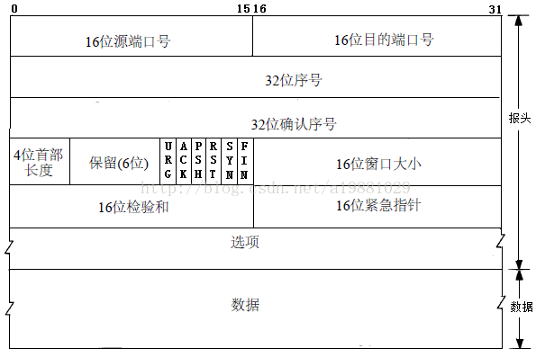
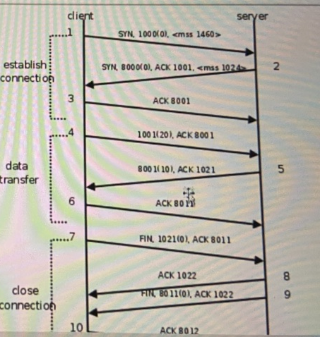
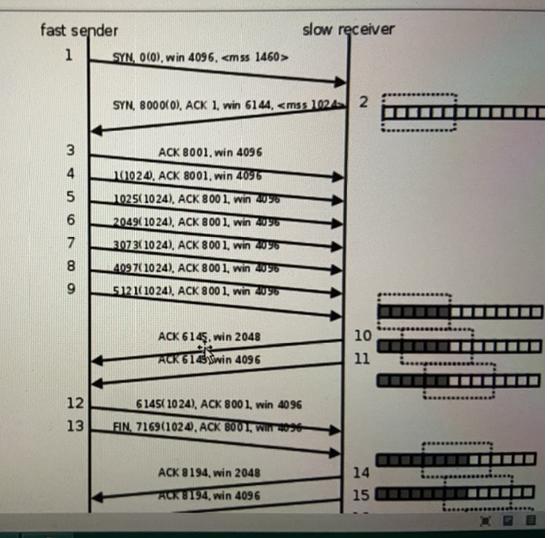
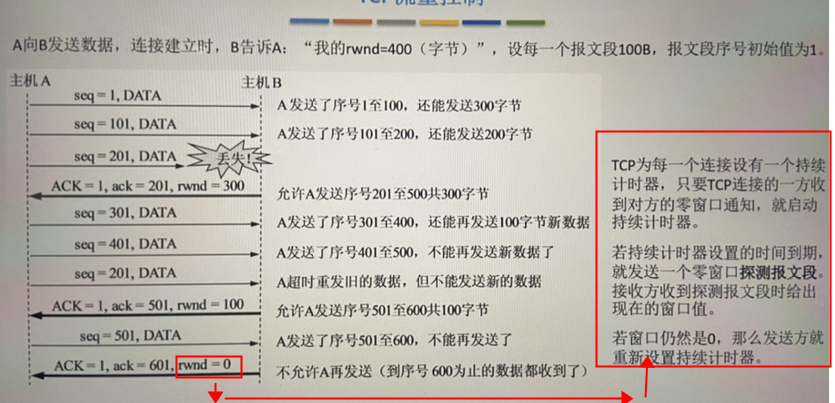
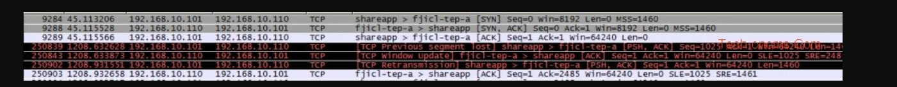
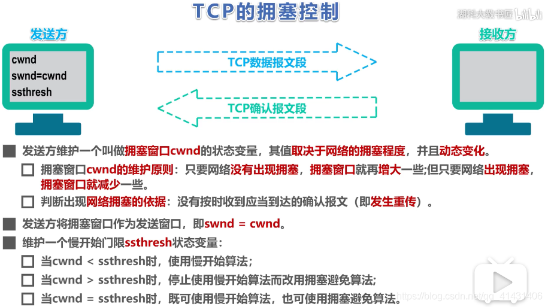
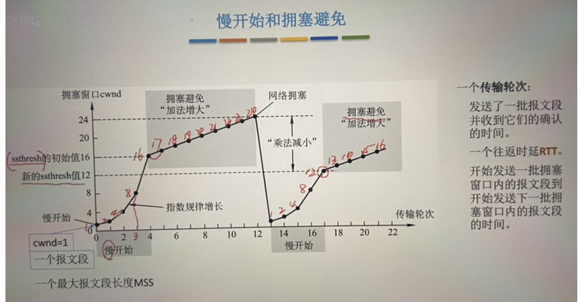
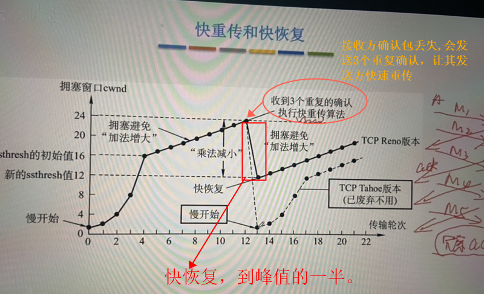
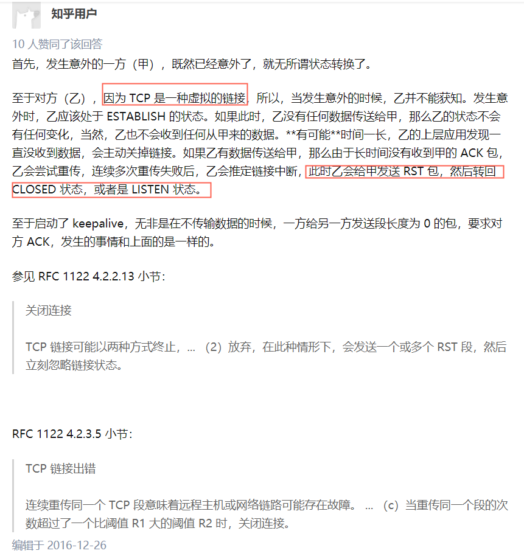

# Tcp 全过程

## 本质

- Tcp 是一个传输层协议。他是基于网络层ip协议之上的一个可靠协议。但是ip协议并不是可靠，比如发送数据时，不同的网络情况会导致到达ip层时序是不一样。也即是说。会导致乱序情况。为了上层避免处理麻烦，tcp层目标核心就是要建立一个可靠的协议。发送方发送数据都需要得到确认。
- **应答的报文不需要再次确认，只要应答报文到了目标端即可。大写ACK开头报文**
- **ACK的值为代表下一个报文发送方seq的起始值，也代表着该值前的数据被接受处理完毕，如syn seq ≡ x,则应答时ack ≡ x ＋1 ，代表x报文已被确认，下一个起始为 x +1，数据报文seq xx(100),应答报文ack的值为 xx + 100 ，这可以理解为xx 到 xx + 99 长度为 100，被确认则下一个起始位为xx + 100**
- **SYN、FIN 报文和数据发送报文都需要进行确认，ACK确认时标志位需要占用一个字节,发送数据时省略了标志位。**

- **报文格式：**

  

- **序列号**

  **TCP将每个字节的数据都进行了编号，这就是序列号,可理解为字节序列号。保证按序到达。确保不丢失**
  序列号的作用：
  a、**保证可靠性**（当接收到的数据总少了某个序号的数据时，能马上知道）
  b、保证数据的按序到达
  c、提高效率，可实现多次发送，一次确认
  d、去除重复数据 　　
  数据传输过程中的确认应答处理、重发控制以及重复控制等功能都可以通过序列号来实现

- **确认应答机制（ACK）**

  　　TCP通过确认应答机制实现可靠的数据传输。在TCP的首部中有一个标志位——ACK，此标志位表示确认号是否有效。接收方对于按序到达的数据会进行确认，当标志位ACK=1时确认首部的确认字段有效。进行确认时，确认字段值表示这个值之前的数据都已经按序到达了。而发送方如果收到了已发送的数据的确认报文，则继续传输下一部分数据；而如果等待了一定时间还没有收到确认报文就会启动重传机制。

- **超时重传机制** 

  　　第一种情况：数据包丢失。当数据发出后在一定的时间内未收到接收方的确认，发送方就会进行重传（通常是在发出报文段后设定一个特定的时间间隔，到点了还没有收到应答则进行重传）。

  　　第二种情况：确认包丢失。当接收方收到重复数据（通过序列号进行识别）的时就将其丢弃，重新发送ACK。

  　　重传时间的确定：报文段发出到确认中间有一个报文段的往返时间RTT，显然超时重传时间RTO会略大于这个RTT，TCP会根据网络情况动态的计算RTT，即RTO是不断变化的。在Linux中，超时以500ms为单位进行控制，每次判定超时重发的超时时间都是500ms的整数倍。其规律为：如果重发一次仍得不到应答，就等待2*500ms后再进行重传，如果仍然得不到应答就等待4*500ms后重传，依次类推，以指数形式递增，重传次数累计到一定次数后，TCP认为网络或对端主机出现异常，就会强行关闭连接。

- **流程**：



## 连接

### 三次握手

- 要确认客户端与服务端都要完成连接建立过程。Establish

  

  - 过程：
    - （SYN-SEND）客户端调用connect().内核生成随机的seq值。并加上syn 标志发送给服务端
    - （SYN-RCVD）服务端收到客户端的数据报文。syn seq=x值。为了表示服务端已经收到，需要确定一个应答机制。应答机制表示当前已接收多少数据的报文。syn 标志包含一个字节。故服务端收到的ack值即为 = x + 1.同时也生成一个 syn seq 给客户端
    - 客户端(ESTABLISHED) 客户端应答的报文后，说明服务端ack =xx.所有此前的发送的数据已被确认完毕了。可以再次进行发送。收到了服务端的syn ack 报文。说明了服务端也同意建立连接。故客户端建立连接。故需要发送同意报文给服务端（ACK应答报文.  seq 为 之前累计发送的字节数量，ack = y + 1,表示收到服务端的报文
    - 服务端(ESTABLISHED) ，当服务端受到该客户端的应答报文。即将好连接建立。无需再次应答。（固定流程）

## 数据发送

- tcp传输协议为什么可靠。因为双方通信发送的数据都需要进行被确认的过程。那么就会发生一个问题，发送方每次要等待上一次的数据被确认之后才能发送下一个。必然导致传输效率问题所以需要一种方式进行**流量控制**。于是很自然而然提出一种解决方法 滑动窗口确认机制进行。

### 滑动窗口机制：

- 双方在建立连接时，确定好窗口大小，窗口就是一个缓冲区。代表着接收方最多能缓存这么多数据。若超过窗口大小的报文没有被确认那么就意味着，发送方暂且休息会，等待窗口被释放在继续发送。

  

  - 1.表示发送方发送  同步标志的报文 + 自身窗口大小给接收方。
  - 2.接收方应答1的报文，并且向发送方 同步自身的 + 窗口大小。
  - 3.发送方应答报文 2 。（**只发送应答报文 不需要得到确认。以避免重复确认**）
  - 4~9.发送方陆陆续续发送了6144个字节数据。（6 * 1024）
  - 10 -11.为接收方处理报文。释放还有缓冲区的报文。
  - 12 发送方发送数据给服务端。

- 例二

  

  基于滑动窗口。怎么知道其中一条数据丢失了呢？

  - 发送端在一定时期内未收到报文确认，报文重发
  - 接收端检测到某一报文丢失，重复发送ACK报文(3个以上)，以促使发送端重发丢失报文。这就是快速重传机制。

  

  通常，**发送端会重传接收方未收到的报文，但不会重传已经被接收方收到但并未确认的包，然后接收方将收到的报文排序后进行一并确认，**

	### 拥塞控制

- 拥塞控制是tcp 根据网络的负载情况调整tcp 传输效率的方式。其根据不断的探测发送和接收情况调整窗口的大小。

  

- 慢开始和拥塞避免

  - 传输轮次。发送到接收的总时间。从图中可以看出到了某个点开始，发送报文数量与获取接收时间的比例，变得缓慢。
    - 8个报文时，返往周期是3.16个报文返往周期4， 24是12说明网络出现了拥堵。 16时一个周期能处理四个。24时却降为2.
  - 

- 快重传和快恢复

  

https://blog.csdn.net/qq_41431406/article/details/97926927

## 断开连接

### 四次挥手

- 
- （FIN_WAIT -1） 发送方发送请求关闭通知。
- （CLOSED_WAIT) 接收方收到消息后，状态更新为CLOSED-WAIT，
- 此时，接收方需要将剩下要发送的数据发给。做一些收费工作。比如（发送的数据需要处理完成）
- （LAST-ACK）处理完成之后，接收也需要发送FIN 标志。代表接收方已经处理完毕。等待关闭。
- （TIME-WAIT) 发送方收到接收方发来的关闭请求。代表着已经处理完所有事，可以挂掉了。（等待2msl 的时间就closed）
- ( CLOSED ) 接收方收到发送方的应答之后。也进入了CLOSED状态。

## 异常关闭

- 比如client 断电、死机、重启等还特么四次挥手。其实对于异常情况就是直接reset了。无关状态转换了。

  - **TCP/IP可选特性Keepalive（默认关闭）**
    Keepalive特性需要在 setsockopt 里面把 SO_KEEPALIVE 标志设置为1，才会打开。

    有3个参数，以linux为例，搜索keepalive相关的系统参数（sysctl -A |grep keepalive），通常会得到如下3个参数：
          net.ipv4.tcp_keepalive_intvl = 75              -- 间隔多少秒发一次嗅探包
          net.ipv4.tcp_keepalive_probes = 9           -- 嗅探包一共发几次
          net.ipv4.tcp_keepalive_time = 7200          -- TCP连接空闲多少秒后发嗅探包

    3个参数组合起来表示：

    ```html
    如果TCP连接2小时（7200秒）内没有数据传输，则发送嗅探包，每隔75秒发送一次，共重试9次。
    9次对方都没响应，则表明此连接已死。
    ```


- 一方检测到对方挂掉。会发送RST包。然后转回CLOSED或者LISTEN状态。TCP本身是一种虚拟连接。靠底层一大堆控制抽象出来的可靠协议。
- 

## 問題

- 数据必然会缓存起来，便于超时重装。如果堆积未被确认的消息过多，怎么释放空间呢？

- 可以看到时三次握手第二步时，server收到client的SYN包并回复SYN+ACK包后，server会把这条连接放入“半连接队列”。这边有个问题，假设这个client是恶意的，client只发SYN包，收到SYN+ACK后不回复，那在server方面，会一直存有这条“半连接”，client数量达到一定程序，serve就炸了。这就是所谓的SYN FLOOD攻击；那怎么防止这种情况呢？有下面几种方法：(来自RFC 4987)

  过滤
  增加积压
  减少SYN-RECEIVED定时
  复用古老的半开通TCP
  SYN缓存
  SYN Cookie
  混合方法
  防火墙和代理
