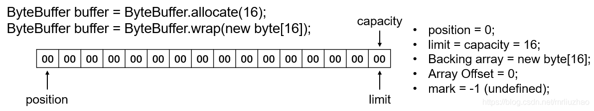
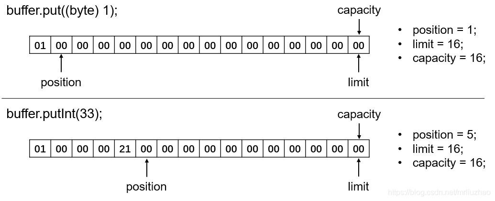
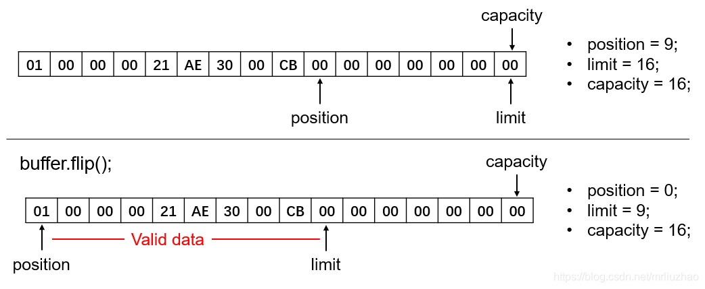
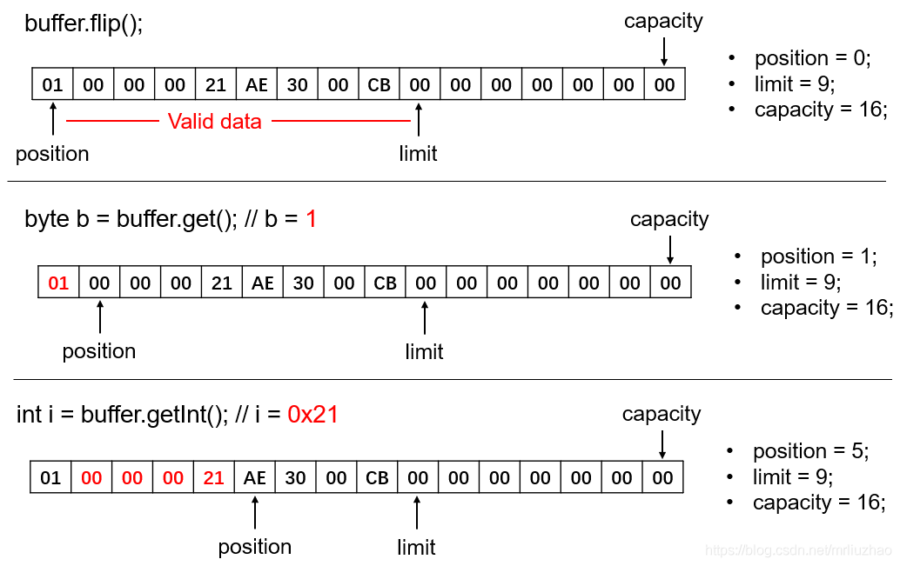

# 初始化
首先无论读写，均需要初始化一个ByteBuffer容器。如上所述，ByteBuffer其实就是对byte数组的一种封装，所以可以使用静态方法wrap(byte[] data)手动封装数组，也可以通过另一个静态的allocate(int size)方法初始化指定长度的ByteBuffer。初始化后，ByteBuffer的position就是0；其中的数据就是初始化为0的字节数组；limit = capacity = 字节数组的长度；用户还未自定义标记位置，所以mark = -1，即undefined状态。下图就表示初始化了一个容量为16个字节的ByteBuffer，其中每个字节用两位16进制数表示：



向ByteBuffer写数据
手动写入数据
可以手动通过put(byte b)或put(byte[] b)方法向ByteBuffer中添加一个字节或一个字节数组。ByteBuffer也方便地提供了几种写入基本类型的put方法：putChar(char val)、putShort(short val)、putInt(int val)、putFloat(float val)、putLong(long val)、putDouble(double val)。执行这些写入方法之后，就会以当前的position位置作为起始位置，写入对应长度的数据，并在写入完毕之后将position向后移动对应的长度。下图就表示了分别向ByteBuffer中写入1个字节的byte数据和4个字节的Integer数据的结果：




但是当想要写入的数据长度大于ByteBuffer当前剩余的长度时，则会抛出BufferOverflowException异常，剩余长度的定义即为limit与position之间的差值（即 limit - position）。如上述例子中，若再执行buffer.put(new byte[12]);就会抛出BufferOverflowException异常，因为剩余长度为11。可以通过调用ByteBuffer.remaining();查看该ByteBuffer当前的剩余可用长度。


从SocketChannel中读入数据至ByteBuffer
在实际应用中，往往是调用SocketChannel.read(ByteBuffer dst)，从SocketChannel中读入数据至指定的ByteBuffer中。由于ByteBuffer常常是非阻塞的，所以该方法的返回值即为实际读取到的字节长度。假设实际读取到的字节长度为 n，ByteBuffer剩余可用长度为 r，则二者的关系一定满足：0 <= n <= r。继续接上述的例子，假设调用read方法，从SocketChannel中读入了4个字节的数据，则buffer的情况如下：


从ByteBuffer中读数据
复位position
现在ByteBuffer容器中已经存有数据，那么现在就要从ByteBuffer中将这些数据取出来解析。由于position就是下一个读写操作的起始位置，故在读取数据后直接写出数据肯定是不正确的，要先把position复位到想要读取的位置。

首先看一个rewind()方法，该方法仅仅是简单粗暴地将position直接复原到0，limit不变。这样进行读取操作的话，就是从第一个字节开始读取了。如下图：


该方法虽然复位了position，可以从头开始读取数据，但是并未标记处有效数据的结束位置。如本例所述，ByteBuffer总容量为16字节，但实际上只读取了9个字节的数据，因此最后的7个字节是无效的数据。故rewind()方法常常用于字节数组的完整拷贝。

实际应用中更常用的是flip()方法，该方法不仅将position复位为0，同时也将limit的位置放置在了position之前所在的位置上，这样position和limit之间即为新读取到的有效数据。如下图：




读取数据
在将position复位之后，我们便可以从ByteBuffer中读取有效数据了。类似put()方法，ByteBuffer同样提供了一系列get方法，从position开始读取数据。get()方法读取1个字节，getChar()、getShort()、getInt()、getFloat()、getLong()、getDouble()则读取相应字节数的数据，并转换成对应的数据类型。如getInt()即为读取4个字节，返回一个Int。在调用这些方法读取数据之后，ByteBuffer还会将position向后移动读取的长度，以便继续调用get类方法读取之后的数据。

这一系列get方法也都有对应的接收一个int参数的重载方法，参数值表示从指定的位置读取对应长度的数据。如getDouble(2)则表示从下标为2的位置开始读取8个字节的数据，转换为double返回。不过实际应用中往往对指定位置的数据并不那么确定，所以带int参数的方法也不是很常用。get()方法则有两个重载方法：

- get(byte[] dst, int offset, int length)：表示尝试从 position 开始读取 length 长度的数据拷贝到 dst 目标数组 offset 到 offset + length 位置，相当于执行了

```java
 for (int i = off; i < off + len; i++)
	dst[i] = buffer.get();
```

- get(byte[] dst)：尝试读取 dst 目标数组长度的数据，拷贝至目标数组，相当于执行了

  ```java
  buffer.get(dst, 0, dst.length);
  ```

  此处应注意读取数据后，已读取的数据也不会被清零。下图即为从例子中连续读取1个字节的byte和4个字节的int数据：

此处同样要注意，当想要读取的数据长度大于ByteBuffer剩余的长度时，则会抛出 BufferUnderflowException 异常。如上例中，若再调用buffer.getLong()就会抛出 BufferUnderflowException 异常，因为 remaining 仅为4。


