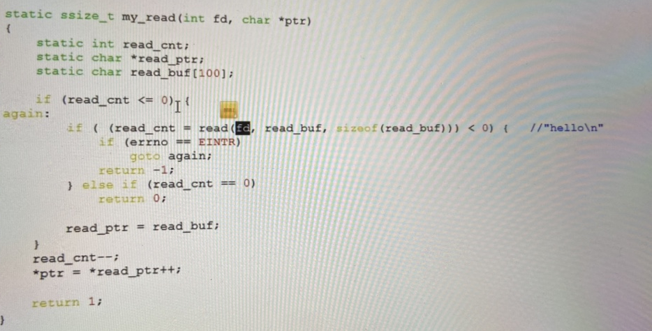
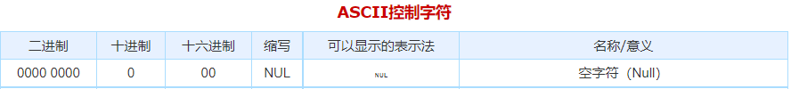
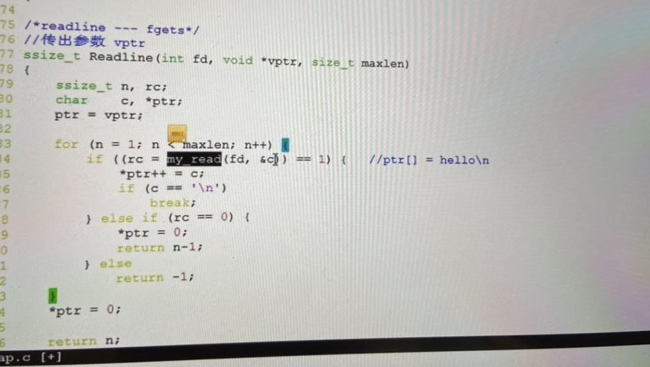
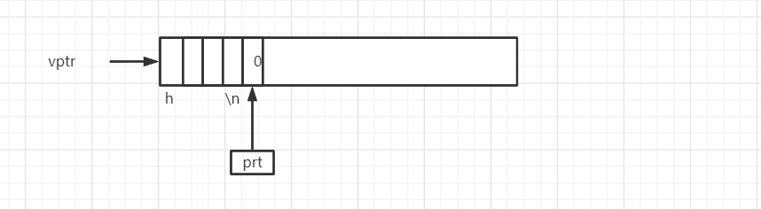

# Read 方法

- 操作系统只为我们提供了read 方法。

## NAME     [top](https://man7.org/linux/man-pages/man2/read.2.html#top_of_page)

```
       read - read from a file descriptor
```

## SYNOPSIS     [top](https://man7.org/linux/man-pages/man2/read.2.html#top_of_page)

```
       #include <unistd.h>

       ssize_t read(int fd, void *buf, size_t count);
```

## DESCRIPTION     [top](https://man7.org/linux/man-pages/man2/read.2.html#top_of_page)

```
       read() attempts to read up to count bytes from file descriptor fd
       into the buffer starting at buf.

       On files that support seeking, the read operation commences at
       the file offset, and the file offset is incremented by the number
       of bytes read.  If the file offset is at or past the end of file,
       no bytes are read, and read() returns zero.

       If count is zero, read() may detect the errors described below.
       In the absence of any errors, or if read() does not check for
       errors, a read() with a count of 0 returns zero and has no other
       effects.

       According to POSIX.1, if count is greater than SSIZE_MAX, the
       result is implementation-defined; see NOTES for the upper limit
       on Linux.
```


## 总结

read 只能读取若干个字节。并存取到buffer中。and the file offset by the number of bytes read.当read 返回说明已到达文件末尾。


## 按照行读取文件做法

- 因为底层只有一个read 方法。没有readline。那么我们如何按照行获取呢。

  - 实现一

    - 一个字节一个字节读。将数据写入到数组当中。当读取\n为输出。这样会多次read 系统调用。消耗比较大。

  - 实现二

    - 一次读取若干个字节。并输出到缓存中，记录好当前剩余多少位可读且，当前下一位指针等。封装成读取一个字节内容。流程按照上述。

      - **my_read 从文件描述符读取一个字符**
        - read_cnt 表示剩余多少字节可读 （static)
        - read_buf 表示一次read系统调用读取到的字节数
        - read_ptr 表示当前读取readbuf下一个元素位置的指针。

      

    - readline 从文件描述符读取一行字符

      - *vprt 读取指针值（以数组传参数过来）
      - *ptr 读取过程中不断获取下一个元素的值。并自增。
      - 最后*ptr  = 0。表示当前指针已读取完毕。（此时表示已读取完毕）
        - '\0'就是编号为0的字符NULL，C语言用这个字符作为字符串结束的标志 
        -  

      

​	

