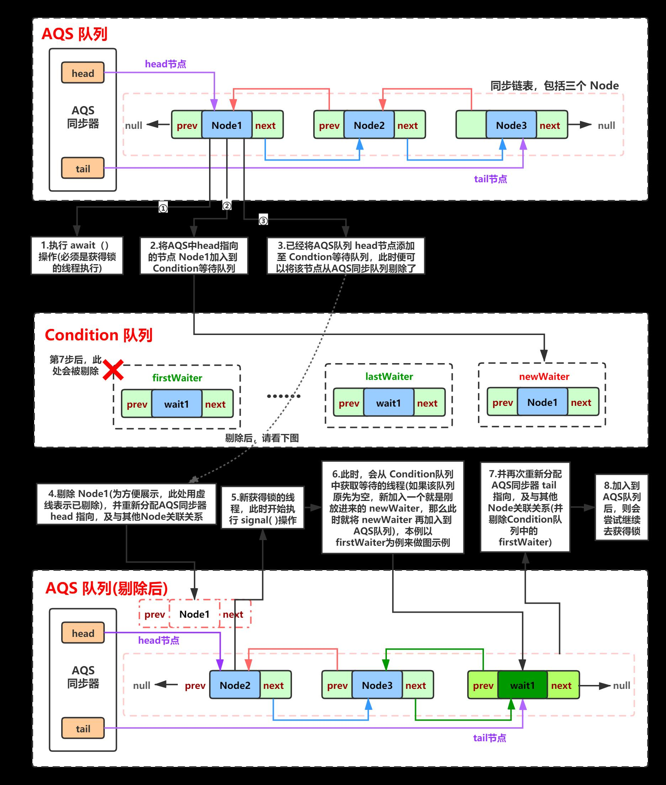

# JUC 源码

- 目标：学习源码思路，如何打造高性能容器（无锁、少竞争）

## CopyOnWriteArrayList

```java
public boolean add(E e) {
    final ReentrantLock lock = this.lock;
    lock.lock();
    try {
        Object[] elements = getArray();
        int len = elements.length;
        Object[] newElements = Arrays.copyOf(elements, len + 1);
        newElements[len] = e;
        setArray(newElements);
        return true;
    } finally {
        lock.unlock();
    }
}
public E get(int index) {
    return get(getArray(), index);
}
```

- 我擦。这个add性能能好吗,需要复制一份数据。

- get获取不加锁。

- 有个疑问：我Arraylist 只对add 加锁。不对read 加锁。不比其快吗。

  - 读写互斥问题:

    - 传统arraylist如果读取不加锁时。可能会存在问题。当一开始获取list长度之后。
    - 当数组发生了修改操作，将导致数据的越界问题，
    - 而使用COW则不会。因为在读取过程中forEach，删除了字段。list一开始获取为指向的旧数组的引用。
    - 当更新时。foreach 已经指向旧引用不变

    ```java
     public void forEach(Consumer<? super E> action) {
             if (action == null) throw new NullPointerException();
             Object[] elements = getArray();
             int len = elements.length;
             for (int i = 0; i < len; ++i) {
                 @SuppressWarnings("unchecked") E e = (E) elements[i];
                 action.accept(e);
             }
         }
    ```

- 总结：

  - cow 思想在读远大于写入时场景下最适合。不适合于大批量插入。

## Condition

- condition 是juc 用来代替wait()、notity().实现精准停止与唤醒

```java
private static Lock lock = new ReentrantLock();
    private static Condition conditionB = lock.newCondition();
    private static Condition conditionC = lock.newCondition();
    private static Condition conditionD = lock.newCondition();

    public static void main(String[] args) {
        // 多线程通知唤醒。
        // 精确通知、唤醒、条件唤醒、await释放锁。single唤醒时重新获得锁
        ConditionAwaitNotifyTest test = new ConditionAwaitNotifyTest();
        new Thread(()-> test.printA()).start();
        new Thread(()-> test.printB()).start();
        new Thread(()-> test.printC()).start();
        new Thread(()-> test.printD()).start();

    }

    public void printA(){
        try{
            Thread.sleep(1000);
            lock.lock();
            for (int i = 0; i < 10 ; i++) {
                System.out.println("AAAAAAAAAAAAA");
            }
            conditionB.signal();
        }catch (Exception e ){
            e.printStackTrace();
        }finally {
            lock.unlock();
            System.out.println("释放锁");
        }
    }

    public void printB()  {
        try{
//            Thread.sleep(1000);
            lock.lock();
            // 没人唤醒他。
            conditionB.await();
            for (int i = 0; i < 10 ; i++) {
                System.out.println("BBBBBBBBBBB");
            }
            conditionC.signal();
        } catch (Exception e) {
            e.printStackTrace();
        } finally {
            lock.unlock();
        }
    }

    public void printC() {
        try{
            lock.lock();
            conditionC.await();
            for (int i = 0; i < 100 ; i++) {
                System.out.println("CCCCCCCCCC");
            }
            conditionD.signal();
        } catch (InterruptedException e) {
            e.printStackTrace();
        } finally {
            lock.unlock();
        }
    }


    public void printD() {
        try{
            lock.lock();
            conditionD.await();
            for (int i = 0; i < 100 ; i++) {
                System.out.println("DDDDDDDDD");
            }
        } catch (InterruptedException e) {
            e.printStackTrace();
        } finally {
            lock.unlock();
        }
    }
```

- condition 实现原理
  - Condition队列：用于存储处于等待状态的队列；          AQS队列：用于存储即将要获得锁的线程。
  - await操作： 1.LockSupport.park 进行阻塞、挂起。2.放到condition 队列
  - signal操作：1.放到AQS队列后面。2.若符合唤醒条件则LockSupport.unpark
  - 

## Fair & No Fair 

- 通用的锁获取逻辑

```java
public final void acquire(int arg) {
    // 尝试获取锁
    if (!tryAcquire(arg) &&
        acquireQueued(addWaiter(Node.EXCLUSIVE), arg))
        selfInterrupt();
}
// 释放锁会将state 设为0.可以去竞争
protected final boolean tryRelease(int releases) {
    int c = getState() - releases;
    if (Thread.currentThread() != getExclusiveOwnerThread())
        throw new IllegalMonitorStateException();
    boolean free = false;
    if (c == 0) {
        free = true;
        setExclusiveOwnerThread(null);
    }
    setState(c);
    return free;
}

```

- Fair ReentrantLock Lock
- CAS + 对头判断（若对头则抢。否则则进队列。阻塞等待被唤醒）

```java
protected final boolean tryAcquire(int acquires) {
    final Thread current = Thread.currentThread();
    int c = getState();
    if (c == 0) {
        // 是否为对头
        if (!hasQueuedPredecessors() &&
            compareAndSetState(0, acquires)) {
            setExclusiveOwnerThread(current);
            return true;
        }
    }
    else if (current == getExclusiveOwnerThread()) {
        int nextc = c + acquires;
        if (nextc < 0)
            throw new Error("Maximum lock count exceeded");
        setState(nextc);
        return true;
    }
    return false;
}
```

- No Fair ReentrantLock Lock
- 非公平锁。每次获取时去抢一下。抢不到就进队列。效率会高效一点

```java
final void lock() {
    if (compareAndSetState(0, 1))
        setExclusiveOwnerThread(Thread.currentThread());
    else
        acquire(1);
}

protected final boolean tryAcquire(int acquires) {
    return nonfairTryAcquire(acquires);
}
final boolean nonfairTryAcquire(int acquires) {
    final Thread current = Thread.currentThread();
    int c = getState();
    if (c == 0) {
        if (compareAndSetState(0, acquires)) {
            setExclusiveOwnerThread(current);
            return true;
        }
    }
    else if (current == getExclusiveOwnerThread()) {
        int nextc = c + acquires;
        if (nextc < 0) // overflow
            throw new Error("Maximum lock count exceeded");
        setState(nextc);
        return true;
    }
    return false;
}
```

## LockSupport

- 可自行的唤醒某个队列。lockSupport.park()挂起某线程.LockSupport.unPark(Thread) 唤醒某线程

```java
public static void main(String[] args) {

    LockSupportTest solution = new LockSupportTest();

    Thread thread1 = new Thread(()->solution.test("AAA"));


    Thread thread2 = new Thread(()->solution.test("BBB"));

    thread1.start();
    thread2.start();


    LockSupport.unpark(thread1);
    LockSupport.unpark(thread2);

}
// LockSupport
public void test(String str){
    if(str.equals("AAA")){
        System.out.println(str);
        LockSupport.park();
        System.out.println(str + "notify");
    }else{
        System.out.println(str);
        LockSupport.park();
        System.out.println(str + "notify");
    }
}
```

## AQS

- 两大法宝

- CAS操作双向队列

- Lock Support 去阻塞或者去唤醒线程

  - park/unpark能够精准的对线程进行唤醒和等待。
  - linux上的实现是通过POSIX的线程API的等待、唤醒、互斥、条件来进行实现的
  - park在执行过程中首选看是否有许可，有许可就立马返回，而每次unpark都会给许可设置成有，这意味着，可以先执行
  - unpark，给予许可，再执行park立马自行，适用于producer快，而consumer还未完成的场景
  - **代替（wait、notity、notity-all操作）**

- AQS 源码 (AbstractQueuedSynchronizer)

  - 结构：

    - 内部维护一个双向链表。 node

      - 队列内部维护一个waitStatus 记录等待状态

        - 通过这些状态可以实现独占、共享、条件锁

        - ```java
          /** waitStatus value to indicate thread has cancelled */
          static final int CANCELLED =  1;
          /** waitStatus value to indicate successor's thread needs unparking */
          static final int SIGNAL    = -1;
          /** waitStatus value to indicate thread is waiting on condition */
          static final int CONDITION = -2;
          /**
           * waitStatus value to indicate the next acquireShared should
           * unconditionally propagate
          */
          static final int PROPAGATE = -3;
          ```

    - 同步状态标识 state

  - 常用的方法解析：

    - ```java
      public final void acquire(int arg) {    if (!tryAcquire(arg) &&        // 从队头获取若没有则阻塞        acquireQueued(addWaiter(Node.EXCLUSIVE), arg))        selfInterrupt();}
      ```

    - ```java
      final boolean acquireQueued(final Node node, int arg) {    boolean failed = true;    try {        boolean interrupted = false;        for (;;) {            final Node p = node.predecessor();            if (p == head && tryAcquire(arg)) {                setHead(node);                p.next = null; // help GC                failed = false;                return interrupted;            }            if (shouldParkAfterFailedAcquire(p, node) &&                // 使用Lock Support 进行挂起阻塞。                parkAndCheckInterrupt())                interrupted = true;        }    } finally {        if (failed)            // 取消获取，调整队列及其内部状态。            cancelAcquire(node);    }}
      ```

    - ```java
      public final boolean release(int arg) {    if (tryRelease(arg)) {        Node h = head;        if (h != null && h.waitStatus != 0)            // 调整队列及唤醒下一个节点。LockSupport.unlock            unparkSuccessor(h);        return true;    }    return false;}
      ```

    - 通知下一位

      ```java
      private void unparkSuccessor(Node node) {    /*         * If status is negative (i.e., possibly needing signal) try         * to clear in anticipation of signalling.  It is OK if this         * fails or if status is changed by waiting thread.         */    int ws = node.waitStatus;    if (ws < 0)        compareAndSetWaitStatus(node, ws, 0);    /*         * Thread to unpark is held in successor, which is normally         * just the next node.  But if cancelled or apparently null,         * traverse backwards from tail to find the actual         * non-cancelled successor.         */    Node s = node.next;    if (s == null || s.waitStatus > 0) {        s = null;        for (Node t = tail; t != null && t != node; t = t.prev)            if (t.waitStatus <= 0)                s = t;    }    if (s != null)        LockSupport.unpark(s.thread);}
      ```

      

  - 抽象行为（子类需事先）

    - AQS 抽象了 以下方法。作为子类实现。通过实现其形成不一样的特性。

      - ```java
        protected boolean tryAcquire(int arg); protected boolean tryRelease(int arg);protected int tryAcquireShared(int arg);protected boolean tryReleaseShared(int arg);protected boolean isHeldExclusively();
        ```


## ReadWriteLock
### Read Lock
- 获取共享锁。如果该锁被写锁抢占则。则失败。加入到队列尾部。等待被唤醒
- 公不公平则看是否进队尾。还是抢一下。
```java
public void lock() {
    sync.acquireShared(1);
}
public final void acquireShared(int arg) {
    if (tryAcquireShared(arg) < 0)
        doAcquireShared(arg);
}
// If write lock held by another thread, fail
// 
protected final int tryAcquireShared(int unused) {
    /*
     * Walkthrough:
     * 1. If write lock held by another thread, fail.
     * 2. Otherwise, this thread is eligible for
     *    lock wrt state, so ask if it should block
     *    because of queue policy. If not, try
     *    to grant by CASing state and updating count.
     *    Note that step does not check for reentrant
     *    acquires, which is postponed to full version
     *    to avoid having to check hold count in
     *    the more typical non-reentrant case.
     * 3. If step 2 fails either because thread
     *    apparently not eligible or CAS fails or count
     *    saturated, chain to version with full retry loop.
     */
    Thread current = Thread.currentThread();
    int c = getState();
    if (exclusiveCount(c) != 0 &&
        getExclusiveOwnerThread() != current)
        return -1;
    int r = sharedCount(c);
    if (!readerShouldBlock() &&
        r < MAX_COUNT &&
        compareAndSetState(c, c + SHARED_UNIT)) {
        if (r == 0) {
            firstReader = current;
            firstReaderHoldCount = 1;
        } else if (firstReader == current) {
            firstReaderHoldCount++;
        } else {
            HoldCounter rh = cachedHoldCounter;
            if (rh == null || rh.tid != getThreadId(current))
                cachedHoldCounter = rh = readHolds.get();
            else if (rh.count == 0)
                readHolds.set(rh);
            rh.count++;
        }
        return 1;
    }
    return fullTryAcquireShared(current);
}
```
### Write Lock
- write锁排队.需要等待read count或者write count 释放。
- 需要保证等待前面 read 任务执行完毕和write 任务执行完毕。才能获取到锁
```java
public final void acquire(int arg) {
    if (!tryAcquire(arg) &&
        acquireQueued(addWaiter(Node.EXCLUSIVE), arg))
        selfInterrupt();
}
protected final boolean tryAcquire(int acquires) {
    /*
     * Walkthrough:
     * 1. If read count nonzero or write count nonzero
     *    and owner is a different thread, fail.
     * 2. If count would saturate, fail. (This can only
     *    happen if count is already nonzero.)
     * 3. Otherwise, this thread is eligible for lock if
     *    it is either a reentrant acquire or
     *    queue policy allows it. If so, update state
     *    and set owner.
     */
    Thread current = Thread.currentThread();
    int c = getState();
    int w = exclusiveCount(c);
    if (c != 0) {
        // (Note: if c != 0 and w == 0 then shared count != 0)
        if (w == 0 || current != getExclusiveOwnerThread())
            return false;
        if (w + exclusiveCount(acquires) > MAX_COUNT)
            throw new Error("Maximum lock count exceeded");
        // Reentrant acquire
        setState(c + acquires);
        return true;
    }
    if (writerShouldBlock() ||
        !compareAndSetState(c, c + acquires))
        return false;
    setExclusiveOwnerThread(current);
    return true;
}
```