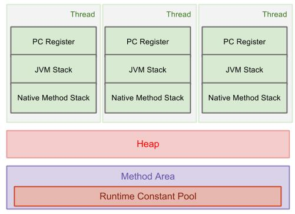
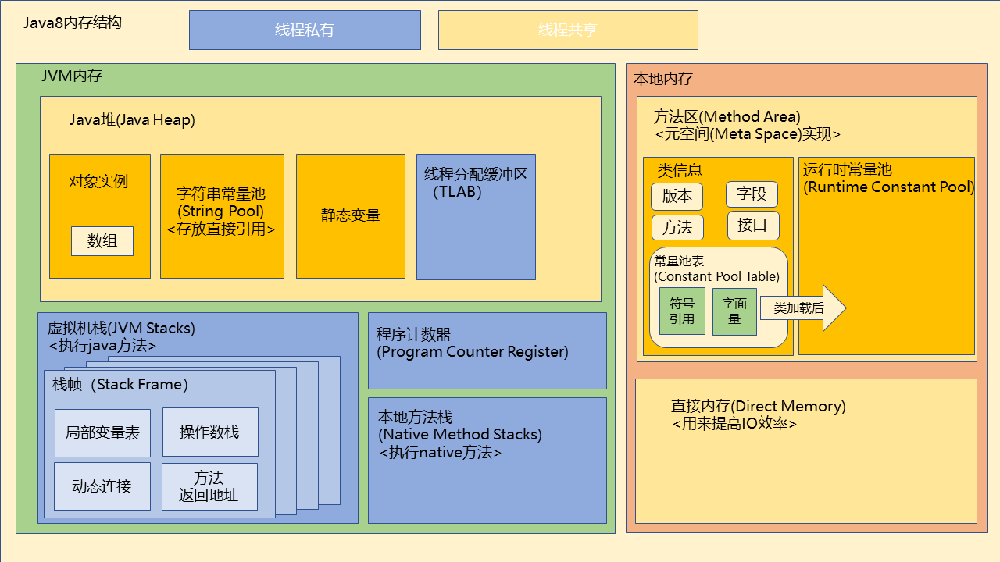

# JVM RunTime Area

## runtime area

- java runtime area 是java 运行时数据区域（用来描述java 运行时各个区域）

  

  

  - Constant Pool & String Pool
    - https://www.fatalerrors.org/a/thoroughly-understand-the-jvm-constant-pool.html

## Q&A

### String & new String & String.intern Difference

https://stackoverflow.com/questions/57414169/string-pool-do-string-always-exist-in-constant-pool

### new 一个数组。未赋值时占多少空间

- 8Byte经测试

- object[] 初始化长度未赋值时4byte.

### jvm 是按照连续分配对象的。而不是像操作系统内存中的页式管理

- jvm 为了方便管理与节省额外指针记录每个内存块的地址。采用段式进行存储。
- 运行效率方面等考虑使用段式存储。要求连续的空间。

### 各种逃逸问题

- 对象是否逃逸作为一种优化手段
- 常见方法逃逸和线程逃逸
  - 方法逃逸（局部方法未被外部引用，可以直接分配在栈上）节省空间
  - 线程逃逸（对象只有在本线程上使用，并未在其他线程在Sync块上。可以进行锁的消除。因为没有竞争）

### 压缩指针

// todo list
