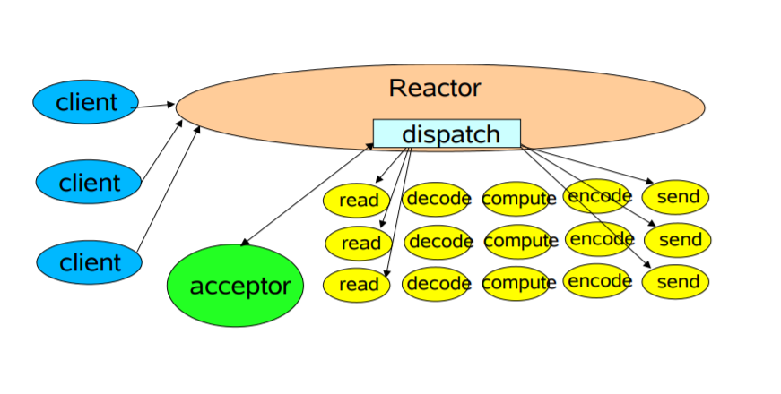
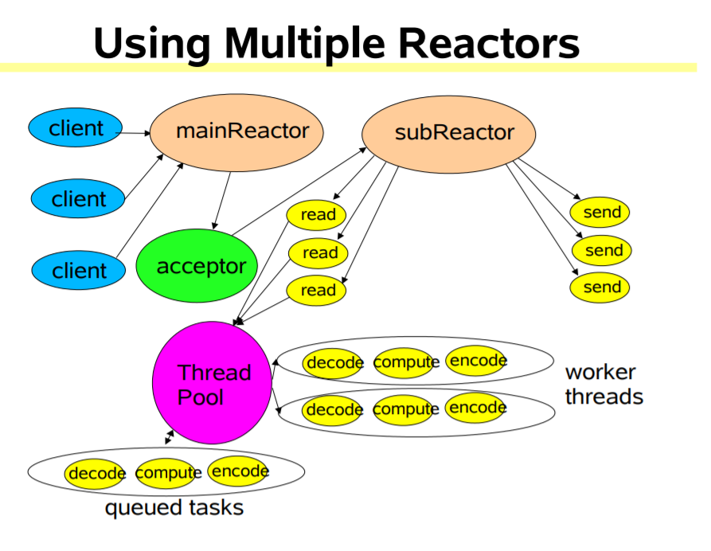
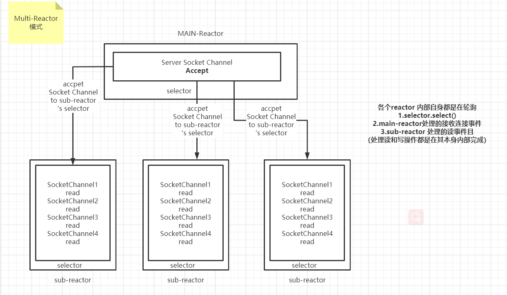

# JAVA NIO

- Reactors 架构（单线程可处理多个连接及读写操作。）

  
  - 问题1.可以 用多线程来处理Read()事件吗。
    - 答案是：不行的，因为同一个channel对象带有锁，如果将channel分发给多个线程处理（如：多个读事件过来并发处理）。存在线程安全。

- Mulit Rector 结构

- channel 是绑定到 selector当中。注册相关事件。

  ```java
  ServerSocketChannel channel = ServerSocketChannel.open();
              channel.socket().bind(new InetSocketAddress(port));
              channel.configureBlocking(false);
              channel.register(selector, SelectionKey.OP_ACCEPT);
  ```


## Multi Rectors

- Main Rector 处理Accpetor 连接事件。

- Sub Rector 处理channel之间的读事件。
  - sub Rector 接收各个socketchannel，并绑定到自身的selector当中。从而sub Rector 可以感知这些channel的读事件。然后再交给本身处理读题的任务。每个Sub Rector的所绑定的channel不一样。所以不存在线程安全问题。



- 逻辑模型（线程模型）

  

- 单一的singleReactor 结构处理并发问题

  - 假设main-reactor。单线程获取accpet。通过业务池处理read事件，并写入。
    - **当同时有多个read事件到达。业务池同时处理socketchannel 里面的数据时。必然会造成线程安全问题。需要加入同步锁进行控制。且写入也会造成同样问题。**