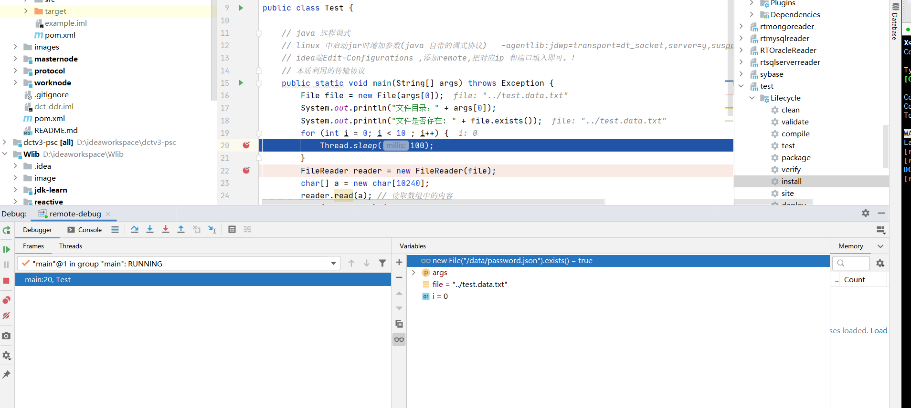

# JAVA 远程调式

## 问题

在一些测试环境下，且日志并没有记录完整的变量信息。特别依赖第三方组件时，有时难以定位问题，最快捷方便的时候就是使用远程调式。

## 原理

- 被监听端需要在java 启动命名中增加参数。(address 即为参数，server端为true)

  ```java
  -agentlib:jdwp=transport=dt_socket,server=y,suspend=n,address=8000
  ```

  You can change `suspend=n` to `suspend=y` to force your application to wait until you connect with IntelliJ before it starts up. This is helpful if the breakpoint you want to hit occurs on application startup.

  通过suspend 挂起，可以直到有客户端连接才开始使用。

- 监听段（Ideaj) 。依赖JDB 命令进行远程调试。所以其实际上并不是一个jvm的进程。（用来查看jvm内部信息的进程，指定断点位置）

  ```bash
  jdb -attach <ip>:8000#连接到远程的JVM中。
  ```

  （ideaJ配置模式 ）

  




- 可在Debug阶段,使用watch进行调试。