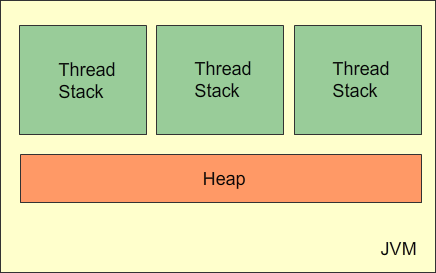
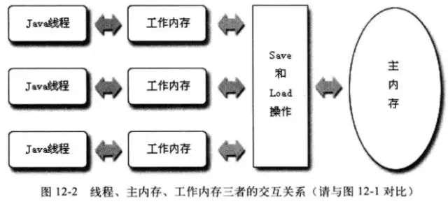
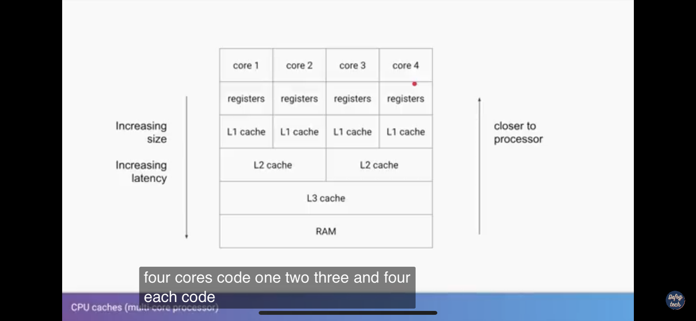
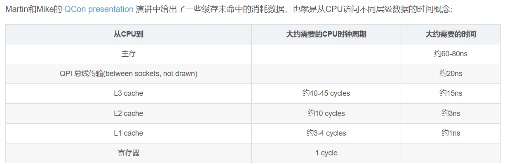
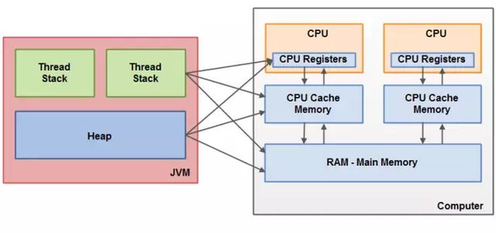
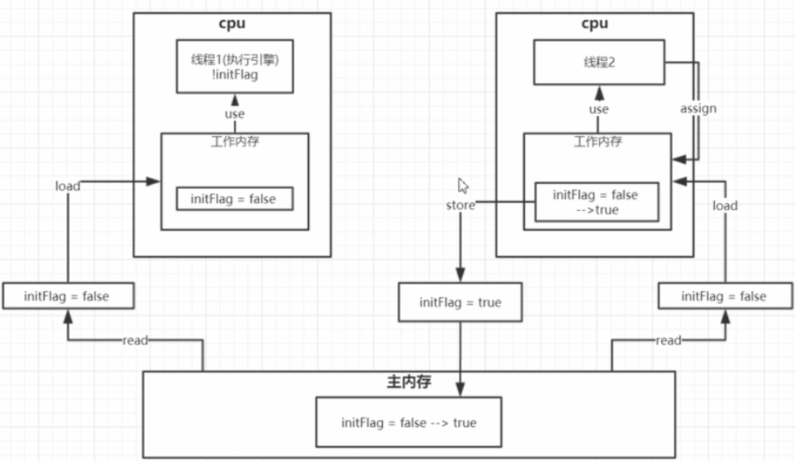
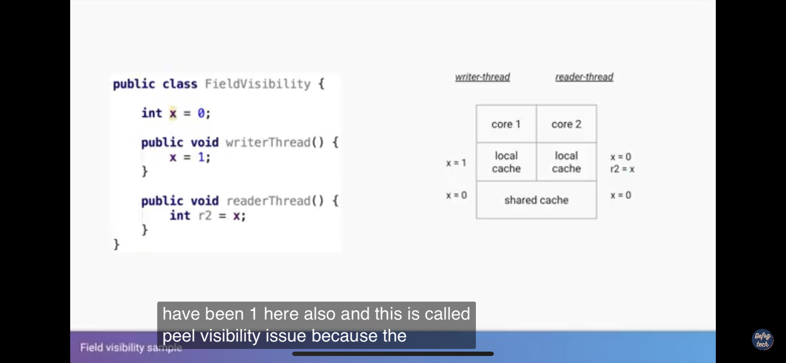
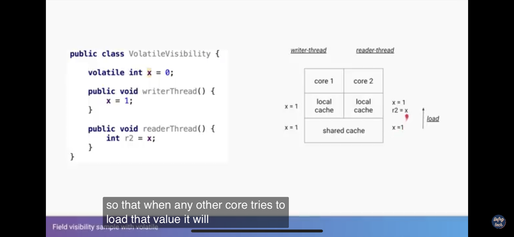
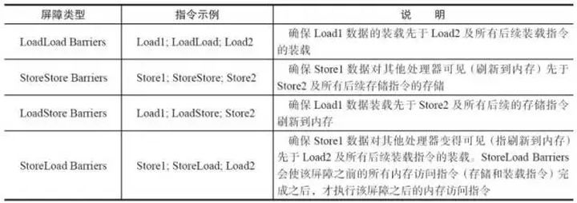
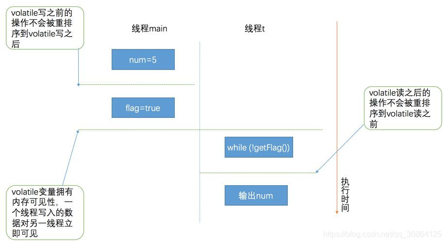

# JMM & Cpu cache

## JMM 内存模型（java memory model)

- 
- 

## Cpu 多核架构

- 

### 相关概念



- register: 
  - (寄存器) cpu操作的位数大小。现代CPU一般为64位处理器。访问速度：1cycle (一个cpu周期)

- L1 ~ L3 cache 
  - L1 :  一级缓存大约为64KB, 约3-4 cycles
  - L2 : 256KB ,  约10 cycles
  - L3 : 此层cache为各个CPU之间共享,约40-45 cycles

- 缓存行：
  - 缓存行是各级缓存的基本单位，一般为64B

- MESI：
  - 当不同CPU之间如果缓存同一份数据（L3)。那么当其中有个别cpu在写入时，在修改该缓存行对应的内容时。即其他cpu所处的缓存是旧值。这里涉及到了一个缓存行同步更新的问题。这是mesi 缓存一致性协议出现的目的。
  - 定义了相关的状态。
    - Moddify
    - Exclusive
    - Share
    - Invalid


## JMM 与硬件内存的桥接关联

- java内存模型与硬件内存架构之间存在差异。硬件内存架构没有区分线程栈和堆。对于硬件，所有的线程栈和堆都分布在主内存中。**部分线程栈和堆可能有时候会出现在CPU缓存中和CPU内部的寄存器中**。



从抽象的角度来看，JMM定义了线程和主内存之间的抽象关系：

- 线程之间的共享变量存储在主内存（Main Memory）中
- 每个线程都有一个私有的本地内存（Local Memory），**本地内存是JMM的一个抽象概念，并不真实存在，它涵盖了缓存、写缓冲区、寄存器以及其他的硬件和编译器优化。本地内存中存储了该线程以读/写共享变量的拷贝副本。**
- 从更低的层次来说，主内存就是硬件的内存，而为了获取更好的运行速度，**虚拟机及硬件系统可能会让工作内存优先存储于寄存器和高速缓存中。**
- Java内存模型中的线程的工作内存（working memory）**是cpu的寄存器和高速缓存的抽象描述**。而JVM的静态内存储模型（JVM内存模型）只是一种对内存的物理划分而已，它只局限在内存，而且只局限在JVM的内存。

## JMM 操作



- **lock（锁定）**：作用于主内存的变量，把一个变量标识为一条线程独占状态。
- **unlock（解锁）**：作用于主内存变量，把一个处于锁定状态的变量释放出来，释放后的变量才可以被其他线程锁定。
- **read（读取）**：作用于主内存变量，把一个变量值从主内存传输到线程的工作内存中，以便随后的load动作使用
- **load（载入）**：作用于工作内存的变量，它把read操作从主内存中得到的变量值放入工作内存的变量副本中。
- **use（使用）**：作用于工作内存的变量，把工作内存中的一个变量值传递给执行引擎，每当虚拟机遇到一个需要使用变量的值的字节码指令时将会执行这个操作。
- **assign（赋值）**：作用于工作内存的变量，它把一个从执行引擎接收到的值赋值给工作内存的变量，每当虚拟机遇到一个给变量赋值的字节码指令时执行这个操作。
- **store（存储）**：作用于工作内存的变量，把工作内存中的一个变量的值传送到主内存中，以便随后的write的操作。
- **write（写入）**：作用于主内存的变量，它把store操作从工作内存中一个变量的值传送到主内存的变量中。


- 由以上可知：
  - **synchronized** 很明显是根据 lock 和 unlock 进行操作的。独占锁：无法被其他线程锁定。当访问该对象时。需要等待锁被释放。


## Volatile

- Volatile 可见性实现：
  - 当cpu0 cpu1 同时有读取主内存变量。此时他们都处于SHARE状态。当有更新时.当某CPU更新时。会flush 到L3,然后通知其他cpu 更新同一个缓存行的状态。置为 Invaildate .
  - 
  - 

## 指令重排问题

- 为了加快运行效率。程序运行时会进行指令的重排序

  - **as-if-serial语义：**

    不管怎么重排序（编译器和处理器为了提高并行度），（单线程）程序的执行结果不能被改变。（编译器、runtime和处理器都必须遵守as-if-serial语义）

  - 

  - 也就是说代码不存在相关的依赖的顺序可能会被调换。

- 如何解决指令重排问题：

  - 内存屏障（memory barrier) 

    - 什么是屏障

      - 就是多个执行路径。当所有线程都到达该屏障点时，所有停下来。等待所有线程执行到达。才能执行下一步。这跟重排有什么关联呢。设置屏障点。以保证屏障点前的顺序。与屏障点后的顺序一致。
      - LoadLoad:
        - 在两个load 之前插入屏障。防止load2指令插入到load1
      - StoreStore
        - 两个store之前插入屏障。防止strore2的先行于store1
      - LoadStore
        - Load Strore之间插入屏障。防止Store先行于Load
      - StoreLoad
        - 遇上类似：
      - 

      - StoreLoad Barriers是一个“全能型”的屏障，它同时具有其他3个屏障的效果。现代的多处理器大多支持该屏障（其他类型的屏障不一定被所有处理器支持）。执行该屏障开销会很昂贵，因为当前处理器通常要把写缓冲区中的数据全部刷新到内存中（Buffer Fully Flush）。

  - **volatile** 

    - 可有解决指令重排序问题
      - **在每个volatile写操作前插入StoreStore屏障**，**在写操作后插入StoreLoad屏障**；
        **在每个volatile读操作前插入LoadLoad屏障**，**在读操作后插入LoadStore屏障**；

  - sync

    - 异步改串行。

- example:

  - ```java
    public class Reordering {
        private static volatile boolean flag;
        private static int num;
        public static void main(String[] args) {
            Thread t1 = new Thread(new Runnable() {
    
                @Override
                public void run() {
                    while (!flag) {
                        Thread.yield();
                    }
    
                    System.out.println(num);
                }
            });
            t1.start();
            num = 5;
            flag = true;
        }
    }
    ```

  - 分析：
    - Main线程
      - num 5;
      - flag = true;
    - t1:
      - while(!falg)
      - println(num)

  - 结论：
    - volatile写之前的操作不会重排序到volatile写之后
    - volatile读之后的操作不会重排序到volatile读之后
    - 前边是volatile写，后边是volatile读，这两个操作不能重排序。
    - 


- **单例 double check 为什么需要需要volatile** 

  - ```java
    public class SingleInstance{
        private static SingleInstance instance = null;
        private SingleInstance(){}
        public static SingleInstance getInstance(){
            if(instance == null){
                synchronized(SingleInstance.class){
                    if(instance == null){
                        instance = new SingleInstance();
                    }        
                }
            }
            return instance;    
        }
    }
    ```

  - 分析：

    - new 语句（复合操作）对应的指令
      - 1，给 instance 分配内存（allocate）
      - 2，调用 Someobject的构造函数来初始化成员变量 (init)
      - 3，将instance对象指向分配的内存空间  (赋值给引用， store)

    - 在jvm执行中。可能会将指令进行重排成 1 - 2 - 3。也有可能是 1 -3 -2。在单线程中 1 2 3 和 1 3 2都是没有问题的。 
      - 但是在多线程情况下。可能会出现问题。当T1执行 1 - 3 时，
      - 同一个时间点.T2.在最外层使用。将会出现那到的instance 是一个未初始化完成的对象。使用过程中有可能会出错。
    - 当加入volatile关键字时：
      - **因为volatile中的strore store屏障问题。此时instance 的赋值操作（Store)不能插入到其上面中即只能允许以 1 - 2 -3 的顺序执行。**
      - **所有线程都不会拿到处于中间状态的值 （instance ）。**

