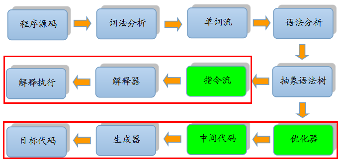
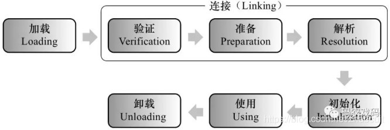

# jvm 运行java程序全过程

# 流程

- jvm 本质是个c/c++所写，然后经过编译后，得到的一个可执行文件。
- java 程序通过编译得到文件。
- jvm 通过解析加载 class 文件。
- jvm 找到main程序入口，最终执行 解析class文件中得到的相关指令。


## Java 编译过程

- C语言编译过程
  - 源码通过Gcc 编译成汇编文件 .s。
  - 再将该汇编文件转化机器码。
- javascript 语言
  - 解析js 语言，转化为相关指令。
  - 通过chrome 浏览器内核进行解析。最终执行。
- java 
  - 将源码转为class文件。
  - 通过jvm 进行解析执行。
  - 为了优化执行效率加入了JIT,将热点代码直接编译成机器码。（猜测是静态引入方式）

### 编译过程

- 大部分的程序代码从开始编译到最终转化成物理机的目标代码或虚拟机能执行的指令集之前，都会按照如下图所示的各个步骤进行：

  

其中绿色的模块可以选择性实现。

- 上图中间的那条分支是解释执行的过程（即一条字节码一条字节码地解释执行，如JavaScript），
- 而下面的那条分支就是传统编译原理中从源代码到目标机器代码的生成过程。

### 编译思路

- 在执行前先对程序源码进行词法解析和语法解析处理，把源码转化为抽象语法树。

对于一门具体语言的实现来说:

- 词法和语法分析乃至后面的优化器和目标代码生成器都可以选择独立于执行引擎，形成一个完整意义的编译器去实现，这类代表是C/C++语言。
- 也可以把抽象语法树或指令流之前的步骤实现一个半独立的编译器，这类代表是Java语言。
- 又或者可以把这些步骤和执行引擎全部集中在一起实现，如大多数的JavaScript执行器。

### javac 编译

- 这里也被称为前端编译
- 经历词法语法分析、填充符号表、语义分析、最终生成字节码。（字节码底层做了很多解析工作，对于jvm解析来说减轻许多操作）

### jit编译器

- **即时编译的产生：**

  **Java程序最初是仅仅通过解释器解释执行的，即对字节码逐条解释执行，这种方式的执行速度相对会比较慢，**

  尤其当某个方法或代码块运行的特别频繁时，这种方式的执行效率就显得很低。

  于是后来在虚拟机中引入了JIT编译器（即时编译器），当虚拟机发现某个方法或代码块运行特别频繁时，就会把这些代码认定为“Hot Spot Code”（热点代码），
  为了提高热点代码的执行效率，在运行时，虚拟机将会把这些代码编译成与本地平台相关的机器码，并进行各层次的优化，完成这项任务的正是JIT编译

  PS：区别是：即时编译生成机器相关的中间码，可重复执行缓存效率高。解释执行直接执行字节码，重复执行需要重复解释。

- **二者各有优势：**

  - 当程序需要迅速启动和执行时，解释器可以首先发挥作用，省去编译的时间，立即执行；
  - 当程序运行后，随着时间的推移，编译器逐渐会失去作用，把越来越多的代码编译成本地代码后，可以获取更高的执行效率。

  解释执行可以节约内存，而编译执行可以提升效率。

  **目前主流的HotSpot虚拟机中默认是采用解释器与其中一个编译器直接配合的方式工作。**


### 相关文档

https://www.cnblogs.com/straybirds/p/8513870.html


## JVM 加载类过程





- **加载**：

  -  **在加载阶段，虚拟机需要完成以下3件事情：**
    - 通过一个类的全限定名来获取定义此类的二进制字节流
    - 将这个字节流所代表的静态存储结构转化为方法区的运行时数据结构。
    - 在内存中生成一个代表这个类的java.lang.Class对象，作为**方法区**这个类的各种数据的访问入口。（方法区使用永久代实现）

- **连接阶段**：

  - 3.1 验证：**确保被加载的类的正确性**
    - 确保Class文件的字节流中包含的信息符合当前虚拟机的要求，并且不会危害虚拟机自身的安全。
      - 文件格式验证：验证字节流是否符合Class文件格式的规范，如：是否以模数0xCAFEBABE开头、主次版本号是否在当前虚拟机处理范围内等等。
      - 元数据验证：对字节码描述的信息进行语义分析，以保证其描述的信息符合Java语言规范的要求；如：这个类是否有父类，是否实现了父类的抽象方法，是否重写了父类的final方法，是否继承了被final修饰的类等等。
      - 字节码验证：通过数据流和控制流分析，确定程序语义是合法的、符合逻辑的，如：操作数栈的数据类型与指令代码序列能配合工作，保证方法中的类型转换有效等等。
      - 符号引用验证：确保解析动作能正确执行；如：通过符合引用能找到对应的类和方法，符号引用中类、属性、方法的访问性是否能被当前类访问等等。
      - 验证阶段是非常重要的，但不是必须的。可以采用-Xverify:none参数来关闭大部分的类验证措施。
      - **ps:(符号引用是指加载过程中，一些类的相关元信息如方法、常量等结构仍未在内存中进行创建，故真实的地址实际是未知的，所以以符号引用进行表示等初始化完成之后指向实际内存地址。)**

  -  3.2 准备：**为类的静态变量分配内存，并将其赋默认值**
    - 为类变量分配内存并设置类变量初始值，这些内存都将在方法区中分配。对于该阶段有以下几点需要注意：
      -  只对static修饰的静态变量进行内存分配、赋默认值（如0、0L、null、false等）。
        对final的静态字面值常量直接赋初值（赋初值不是赋默认值，如果不是字面值静态常量，那么会和静态变量一样赋默认值）。

  - 3.3 解析：将常量池中的符号引用替换为直接引用（内存地址）的过程

    - 符号引用就是一组符号来描述目标，可以是任何字面量。属于编译原理方面的概念如：包括类和接口的全限定名、字段的名称和描述符、方法的名称和描述符。

      直接引用就是直接指向目标的指针、相对偏移量或一个间接定位到目标的句柄。如指向方法区某个类的一个指针。

- **初始化**

  - 为类的静态变量赋初值，赋初值两种方式：

    - 定义静态变量时指定初始值。如 private static String x="123";
    - 在静态代码块里为静态变量赋值。如 static{ x="123"; } 

    - 注意：只有对类的主动使用才会导致类的初始化。
      - clinit 与 init 
        -   在编译生成class文件时，编译器会产生两个方法加于class文件中，一个是类的初始化方法clinit, 另一个是实例的初始化方法init。
        -   clinit指的是类构造器，主要作用是在类加载过程中的初始化阶段进行执行，执行内容包括静态变量初始化和静态块的执行。

    

### jvm 是怎么运行java程序

- 以一个普通类为例。

  ```java
  class Person{
      String name;
  }
  ```

- 执行类

  ```java
  public class Test {
      public static void main(String[] args) {
          Person person = new Person();
          person.setName("hello");
          System.out.println(person.getName());
      }
  }
  ```

- **执行命令**： java -cp D:\ideaworkspace\Wlib\jdk-learn\target\classes com.weifuchow.jdk.learn.jvm.TestStaticObjCinitOrder

- 那问题来了，**jvm 是怎么找到运行类的**？

  - 很明显，cp 也即是classpath. appclassloader 加载的对象。需要遍历整个文件夹找到所才能找到的Main入口。（这也是java启动慢的原因之一）。
  - 不难想象的到，猜测，jvm 也采用懒加载的模式。为了加快启动效率。不可能所有类都去加载解析，当类使用到的时候才会去加载。

  - Jar 包是通过 MANIFEST.MF 找到启动类。然后进行加载。

  - 故：当第一次加载的时候会比较慢。

  - Test bytecode 解析

    - ```html
       0 aconst_null
       1 astore_1
       2 new #2 <Person>
       5 dup
       6 invokespecial #3 <Person.<init> : ()V>
       9 astore_1
      10 getstatic #4 <java/lang/System.out : Ljava/io/PrintStream;>
      13 getstatic #5 <test/Human.TEST : Ljava/lang/String;>
      16 invokevirtual #6 <java/io/PrintStream.println : (Ljava/lang/String;)V>
      19 aload_1
      20 iconst_1
      21 invokevirtual #7 <Person.setAge : (I)V>
      24 getstatic #4 <java/lang/System.out : Ljava/io/PrintStream;>
      27 aload_1
      28 invokevirtual #8 <Person.getAge : ()I>
      31 invokevirtual #9 <java/io/PrintStream.println : (I)V>
      34 return
      
      ```

    - invokevirtual  方法调用

### 类的加载时机 ( 需要时才会进行初始化)

- 使用new实例化对象时，读取和设置类的静态变量、静态非字面值常量（静态字面值常量除外）时，调用静态方法时。
- 对内进行反射调用时。
- 当初始化一个类时，如果父类没有进行初始化，需要先初始化父类
- 启动程序所使用的main方法所在类
- 当使用1.7的动态语音支持时。
- **在JVM启动时，BootStrapLoader会加载一些JVM自身运行所需的class**
- **在JVM启动时，ExtClassLoader会加载指定目录下一些特殊的class**
- **在JVM启动时，AppClassLoader会加载classpath路径下的class，以及main函数所在的类的class文件**

- 注：(未被初始化不代表未被加载)
  - 通过子类引用父类的静态字段，只会触发父类的初始化，而不会触发子类的初始化。
  - 定义对象数组和集合，不会触发该类的初始化
  - 类A引用类B的static final常量不会导致类B初始化（注意静态常量必须是字面值常量，否则还是会触发B的初始化）
  - 通过类名获取Class对象，不会触发类的初始化。如System.out.println(Person.class);
  - **通过Class.forName加载指定类时，如果指定参数initialize为false时，也不会触发类初始化。**
  - **通过ClassLoader默认的loadClass方法，也不会触发初始化动作**


### jvm 运行时优化

- jvm 指向程序如果每一次都需要从class 字节码中解析相关的指令执行。无疑效率会不高。
- 后来java 引入了jit 编译器，当虚拟机发现热点代码时，会将这部分相关代码。编译成对应的机器码，并进行各层次的优化，完成这一项正是JIT编译器。

## 


