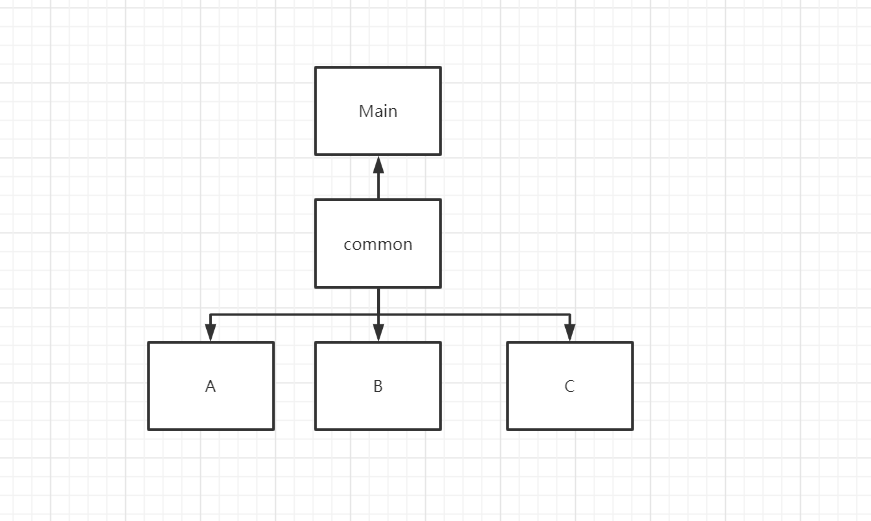

# 远程jar包依赖问题

## 项目依赖



## 测试1

- 条件
  - A使用common1.0包,并打成全包生成A.jar
  - B使用common1.1包，并打成全包B.jar
  - C使用common1.2包，并打成全包C.jar
  - Main使用Common1.2并打包成main-1.0.jar
- 命令

```java
java -jar main-1.2.jar D:/test/jardepence/w-A-1.0-SNAPSHOT-jar-with-dependencies.jar D:/test/jardepence/w-B-1.1-SNAPSHOT-jar-with-dependencies.jar D:/test/jardepence/w-C-1.1-SNAPSHOT-jar-with-dependencies.jar
```

- 结果
  - 执行成功。

- 结论：
  - 由于打成全包main时。会将common时进行加载。urlclassloader当找到相同的类（全类名）相同。

## 测试2

- 条件
  - A使用common1.0包,并打成全包生成A.jar
  - B使用common1.1包，并打成全包B.jar
  - C使用common1.2包，并打成全包C.jar
  - Main使用Common1.0并打包成main-1.0.jar

- 命令

  java -jar main-1.0.jar D:/test/jardepence/w-A-1.0-SNAPSHOT-jar-with-dependencies.jar D:/test/jardepence/w-B-1.1-SNAPSHOT-jar-with-dependencies.jar D:/test/jardepence/w-C-1.1-SNAPSHOT-jar-with-dependencies.jar

- 结果

  B、C执行失败。无法找到,使用1.0的common包无法找到执行组件内部方法。

- 结论：

  - 由于打成全包main时。会将1.0common时进行加载。systemClassloader当加载第一次同名同类的时，第二次不会进行重复加载。

  

  

  ## 测试3

  - 条件
    - Main classpath 使用 common-1.0 包。
    - Main urlclassloader加载common-1.2包

  - 结果

    - 两次执行都是使用common-1.0中的代码。

  - 结论：

    - 与上面一致不会重复加载该类。突然联想到类的加载机制。双亲委派机制

    - **他并不会直接从urlclassloader加载该类，也是从委派给最顶层加载器，如果没有则向下委派给下级加载器。由于本例中由于common包中的Module对象。已经被ApplicationClassloader加载了。所以了并不会从urlclassloader加载！**

## 测试4 

- 条件
  - Main 使用log4j2.
  - classloader 引用的jar包中使用了log4j.

- 结果
  - log4j2正常打印不会受其影响。因为classloader只加载到了该部门的包。slf实现类时一开始就从classpath中加载完成的。


## 双亲委派机制

- 类加载器的双亲委派模型:

　　双亲委派模型是一种组织类加载器之间关系的一种规范,他的工作原理是:**如果一个类加载器收到了类加载的请求,它不会自己去尝试加载这个类,而是把这个请求委派给父类加载器去完成,这样层层递进,最终所有的加载请求都被传到最顶层的启动类加载器中,只有当父类加载器无法完成这个加载请求(它的搜索范围内没有找到所需的类)时,才会交给子类加载器去尝试加载.**

- 从源码可以看出。
  - 他先从递归到父类去找。如果父类找不到就从BootStrapClassloader找（这也是核心类库不能被重新加载的原因）。
  - 直到递归结束条件,如果父类找不到。那就交给子类加载器去加载直到完成。如果没有则throw classnotfoundException。

```java
protected Class<?> loadClass(String name, boolean resolve)
        throws ClassNotFoundException
{
    synchronized (getClassLoadingLock(name)) {
        // First, check if the class has already been loaded
        Class<?> c = findLoadedClass(name);
        if (c == null) {
            long t0 = System.nanoTime();
            try {
                if (parent != null) {
                    c = parent.loadClass(name, false);
                } else {
                    c = findBootstrapClassOrNull(name);
                }
            } catch (ClassNotFoundException e) {
                // ClassNotFoundException thrown if class not found
                // from the non-null parent class loader
            }

            if (c == null) {
                // If still not found, then invoke findClass in order
                // to find the class.
                long t1 = System.nanoTime();
                c = findClass(name);

                // this is the defining class loader; record the stats
                sun.misc.PerfCounter.getParentDelegationTime().addTime(t1 - t0);
                sun.misc.PerfCounter.getFindClassTime().addElapsedTimeFrom(t1);
                sun.misc.PerfCounter.getFindClasses().increment();
            }
        }
        if (resolve) {
            resolveClass(c);
        }
        return c;
    }
}
```


- ClassLoader 树


**启动类加载器(Bootstrap ClassLoader):**

　　　　这个类加载器负责将\lib目录下的类库加载到虚拟机内存中,用来加载java的核心库,此类加载器并不继承于java.lang.ClassLoader,不能被java程序直接调用,代码是使用C++编写的.是虚拟机自身的一部分.（调用时返回为空）

**扩展类加载器(Extendsion ClassLoader):**

这个类加载器负责加载\lib\ext目录下的类库,用来加载java的扩展库,开发者可以直接使用这个类加载器.

**应用程序类加载器(Application ClassLoader):**

　　　　这个类加载器负责加载用户类路径(CLASSPATH)下的类库,一般我们编写的java类都是由这个类加载器加载,这个类加载器是CLassLoader中的getSystemClassLoader()方法的返回值,所以也称为系统类加载器.一般情况下这就是系统默认的类加载器.


## 总结

- 故psc中各个组件commons版本不统一的时候。只需要将main.jar更新置最新即可。无需改动组件，可兼容新旧版本的组件。


