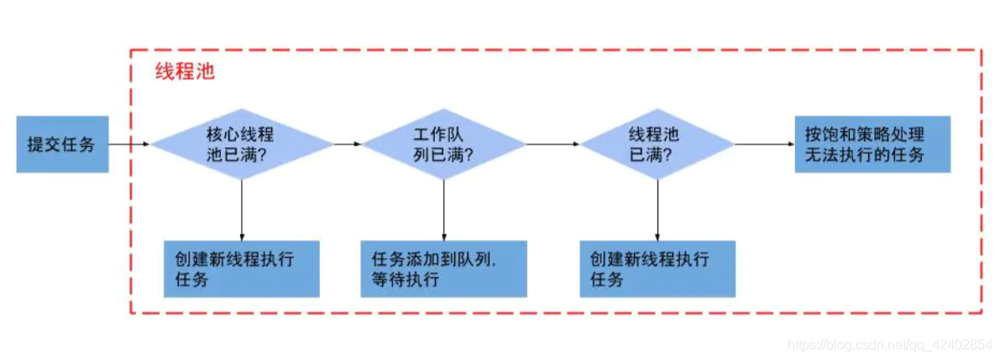

# 线程池

## 线程池对象

```java
 public ThreadPoolExecutor(int corePoolSize,
                              int maximumPoolSize,
                              long keepAliveTime,
                              TimeUnit unit,
                              BlockingQueue<Runnable> workQueue,					
                           	ThreadFactory factory,
                              RejectedExecutionHandler handler) {
        this(corePoolSize, maximumPoolSize, keepAliveTime, unit, workQueue,
             Executors.defaultThreadFactory(), handler);
    }
```

- 参数解析
  - corePoolSize 核心线程大小（核心线程不会被回收）
  - maximumPoolSize 最大线程 （最高的并发线程数）
  - keepAliveTime &TimeUnit (非核心线程允许最大的空闲之间，超过即会被回收。long nanos = unit.toNanos(timeout);queue.poll(keepAliveTime, TimeUnit.NANOSECONDS))  好家伙以纳秒执行
  - BlockingQueue 阻塞队列（长度大小关键）
  - ThreadFactory 线程工厂，负责创建线程。对线程进行命名方便问题排查分析
  - RejectedExecutionHandler 任务拒绝策略。当任务队列超过长度，并且已达到最大线程数时，执行拒绝策略

## 线程池源码分析

- 任务提交

  - ```java
    public void execute(Runnable command) {
            if (command == null)
                throw new NullPointerException();
            int c = ctl.get();
        	// 当前运行任务数量 小于 核心线程数
            if (workerCountOf(c) < corePoolSize) {
                if (addWorker(command, true))
                    return;
                c = ctl.get();
            }
        	// 当任务运行数量大于核心 且 队列能插进去
            if (isRunning(c) && workQueue.offer(command)) {
                int recheck = ctl.get();
                if (! isRunning(recheck) && remove(command))
                    reject(command);
                // 指的一提。这里workcountOf 指当前运行任务数。若当前没有执行的任务。则启动worker
                // 感觉有点累赘。
                else if (workerCountOf(recheck) == 0)
                    addWorker(null, false);
            }
        	
            else if (!addWorker(command, false))
                reject(command);
        }
    ```

    

- addWorker过程

  ```java
  private boolean addWorker(Runnable firstTask, boolean core) {
          retry:
      	// 状态检查
          for (;;) {
              int c = ctl.get();
              int rs = runStateOf(c);
  
              // Check if queue empty only if necessary.
              if (rs >= SHUTDOWN &&
                  ! (rs == SHUTDOWN &&
                     firstTask == null &&
                     ! workQueue.isEmpty()))
                  return false;
  
              for (;;) {
                  int wc = workerCountOf(c);
                  if (wc >= CAPACITY ||
                      wc >= (core ? corePoolSize : maximumPoolSize))
                      return false;
                  if (compareAndIncrementWorkerCount(c))
                      break retry;
                  c = ctl.get();  // Re-read ctl
                  if (runStateOf(c) != rs)
                      continue retry;
                  // else CAS failed due to workerCount change; retry inner loop
              }
          }
  
          boolean workerStarted = false;
          boolean workerAdded = false;
          Worker w = null;
          try {
              // 非核心线程为null
              w = new Worker(firstTask);
              final Thread t = w.thread;
              if (t != null) {
                  final ReentrantLock mainLock = this.mainLock;
                  // 枷锁
                  mainLock.lock();
                  try {
                      // Recheck while holding lock.
                      // Back out on ThreadFactory failure or if
                      // shut down before lock acquired.
                      int rs = runStateOf(ctl.get());
  
                      if (rs < SHUTDOWN ||
                          (rs == SHUTDOWN && firstTask == null)) {
                          if (t.isAlive()) // precheck that t is startable
                              throw new IllegalThreadStateException();
                          workers.add(w);
                          int s = workers.size();
                          if (s > largestPoolSize)
                              largestPoolSize = s;
                          workerAdded = true;
                      }
                  } finally {
                      mainLock.unlock();
                  }
                  if (workerAdded) {
                      
                      t.start();
                      workerStarted = true;
                  }
              }
          } finally {
              if (! workerStarted)
                  addWorkerFailed(w);
          }
          return workerStarted;
      }
  ```

  

- work执行过程

  - work创建

    ```java
    public Worker(Runnable firstTask) {
        setState(-1); // inhibit interrupts until runWorker
        this.firstTask = firstTask;
        this.thread = getThreadFactory().newThread(this);
    }
    ```

  - 运行过程

    ```java
    public void run() {
        runWorker(this);
    }
    
    ```

    ````java
    final void runWorker(Worker w) {
        Thread wt = Thread.currentThread();
        Runnable task = w.firstTask;
        w.firstTask = null;
        w.unlock(); // allow interrupts
        boolean completedAbruptly = true;
        try {
            // getTask(获取任务)
            while (task != null || (task = getTask()) != null) {
                w.lock();
                // If pool is stopping, ensure thread is interrupted;
                // if not, ensure thread is not interrupted.  This
                // requires a recheck in second case to deal with
                // shutdownNow race while clearing interrupt
                if ((runStateAtLeast(ctl.get(), STOP) ||
                     (Thread.interrupted() &&
                      runStateAtLeast(ctl.get(), STOP))) &&
                    !wt.isInterrupted())
                    wt.interrupt();
                try {
                    beforeExecute(wt, task);
                    Throwable thrown = null;
                    try {
                        task.run();
                    } catch (RuntimeException x) {
                        thrown = x; throw x;
                    } catch (Error x) {
                        thrown = x; throw x;
                    } catch (Throwable x) {
                        thrown = x; throw new Error(x);
                    } finally {
                        afterExecute(task, thrown);
                    }
                } finally {
                    // 任务运行完置空
                    task = null;
                    w.completedTasks++;
                    w.unlock();
                }
            }
            completedAbruptly = false;
        } finally {
            processWorkerExit(w, completedAbruptly);
        }
    }
    ````

    ```java
    private Runnable getTask() {
            boolean timedOut = false; // Did the last poll() time out?
    
            for (;;) {
                int c = ctl.get();
                int rs = runStateOf(c);
    
                // Check if queue empty only if necessary.
                if (rs >= SHUTDOWN && (rs >= STOP || workQueue.isEmpty())) {
                    decrementWorkerCount();
                    return null;
                }
    
                int wc = workerCountOf(c);
    
                // Are workers subject to culling?
                boolean timed = allowCoreThreadTimeOut || wc > corePoolSize;
    
                if ((wc > maximumPoolSize || (timed && timedOut))
                    && (wc > 1 || workQueue.isEmpty())) {
                    if (compareAndDecrementWorkerCount(c))
                        return null;
                    continue;
                }
    
                try {
                    // 非核心线程执行poll 超时返回null.线程执行结束，等待回收
                    // 核心线程执行take.阻塞直到任务来临
                    Runnable r = timed ?
                        workQueue.poll(keepAliveTime, TimeUnit.NANOSECONDS) :
                        workQueue.take();
                    if (r != null)
                        return r;
                    timedOut = true;
                } catch (InterruptedException retry) {
                    timedOut = false;
                }
            }
        }
    ```

  


## 实验

```java
public static void main(String[] args) {
        // 4个核心线程，最大线程8，keepAliveTime&TimeUnit:额外的线程空闲多少秒就会被回收，（使用queue.poll(time,unit)实现）
        // 阻塞队列,线程工厂
        // 前置worker 过程：worker 通过task是否为空，判断是否为核心线程。若在task不为空。直接执行task.若为空。则从队列里面获取queue.poll(time,unit)。并执行
        // 预测执行过程：1.先创建4个核心线程，并创建worker。核心线程满了之后，
        //              2.【若队列不满，放入队列之中】
        //3.若队列已满，（若运行的线程并未超过最大线程，则代表之前的任务再这个时刻可能已经执行完毕。有空余出来，创建worker。若已满最大线程。则执行拒绝策略）

        // 任务每次执行需要消耗20s,假设1s内全部进入开始执行。此时4个核心线程在跑。100个任务在队列，100-4 = 96,仍然未完。
        // 队列未满时，并不会开启非核心线程Why
        testPoolByTaskTimes(100,100);
    	/**
    	10:06:07.335 [AsyncJDBCCommonScript-1] [INFO ] com.weifuchow.jdk.learn.threads.ThreadPool:60 --- 0 this thread execute prepare 
10:06:07.335 [AsyncJDBCCommonScript-3] [INFO ] com.weifuchow.jdk.learn.threads.ThreadPool:60 --- 2 this thread execute prepare 
10:06:07.335 [AsyncJDBCCommonScript-2] [INFO ] com.weifuchow.jdk.learn.threads.ThreadPool:60 --- 1 this thread execute prepare 
10:06:07.335 [AsyncJDBCCommonScript-4] [INFO ] com.weifuchow.jdk.learn.threads.ThreadPool:60 --- 3 this thread execute prepare 
    	*/

        // 任务每次执行需要消耗20s,假设1s内全部进入开始执行。此时4个核心线程在跑。100个任务在队列，剩余4个任务将创建worker(非核心线程），0,1,2,3,104,105,106,107,此时达到最大线程数，且队列已满
        // 达到临界点
        testPoolByTaskTimes(108,100);
    	/**
    	10:01:16.816 [AsyncJDBCCommonScript-4] [INFO ] com.weifuchow.jdk.learn.threads.ThreadPool:60 --- 3 this thread execute prepare 
10:01:16.816 [AsyncJDBCCommonScript-7] [INFO ] com.weifuchow.jdk.learn.threads.ThreadPool:60 --- 106 this thread execute prepare 
10:01:16.816 [AsyncJDBCCommonScript-1] [INFO ] com.weifuchow.jdk.learn.threads.ThreadPool:60 --- 0 this thread execute prepare 
10:01:16.816 [AsyncJDBCCommonScript-5] [INFO ] com.weifuchow.jdk.learn.threads.ThreadPool:60 --- 104 this thread execute prepare 
10:01:16.816 [AsyncJDBCCommonScript-6] [INFO ] com.weifuchow.jdk.learn.threads.ThreadPool:60 --- 105 this thread execute prepare 
10:01:16.816 [AsyncJDBCCommonScript-8] [INFO ] com.weifuchow.jdk.learn.threads.ThreadPool:60 --- 107 this thread execute prepare 
10:01:16.816 [AsyncJDBCCommonScript-3] [INFO ] com.weifuchow.jdk.learn.threads.ThreadPool:60 --- 2 this thread execute prepare 
10:01:16.816 [AsyncJDBCCommonScript-2] [INFO ] com.weifuchow.jdk.learn.threads.ThreadPool:60 --- 1 this thread execute prepare 
    	*/

        // 任务每次执行需要消耗20s,假设1s内全部进入开始执行。此时4个核心线程在跑。100个任务在队列，剩余4个任务将创建worker(非核心线程），0,1,2,3,104,105,106,107,此时达到最大线程数，且队列已满
        // 下一个任务 108时，则执行拒绝策略
        testPoolByTaskTimes(109,100);
		/**
		10:06:43.824 [AsyncJDBCCommonScript-8] [INFO ] com.weifuchow.jdk.learn.threads.ThreadPool:60 --- 107 this thread execute prepare 
10:06:43.824 [AsyncJDBCCommonScript-1] [INFO ] com.weifuchow.jdk.learn.threads.ThreadPool:60 --- 0 this thread execute prepare 
10:06:43.824 [AsyncJDBCCommonScript-4] [INFO ] com.weifuchow.jdk.learn.threads.ThreadPool:60 --- 3 this thread execute prepare 
10:06:43.824 [AsyncJDBCCommonScript-7] [INFO ] com.weifuchow.jdk.learn.threads.ThreadPool:60 --- 106 this thread execute prepare 
10:06:43.824 [AsyncJDBCCommonScript-5] [INFO ] com.weifuchow.jdk.learn.threads.ThreadPool:60 --- 104 this thread execute prepare 
10:06:43.824 [AsyncJDBCCommonScript-6] [INFO ] com.weifuchow.jdk.learn.threads.ThreadPool:60 --- 105 this thread execute prepare 
10:06:43.824 [AsyncJDBCCommonScript-3] [INFO ] com.weifuchow.jdk.learn.threads.ThreadPool:60 --- 2 this thread execute prepare 
10:06:43.824 [AsyncJDBCCommonScript-2] [INFO ] com.weifuchow.jdk.learn.threads.ThreadPool:60 --- 1 this thread execute prepare 
10:06:43.824 [main] [ERROR] com.weifuchow.jdk.learn.threads.ThreadPool:76 --- 109 execute error
java.util.concurrent.RejectedExecutionException: Task java.util.concurrent.FutureTask@491cc5c9 rejected from java.util.concurrent.ThreadPoolExecutor@74ad1f1f[Running, pool size = 8, active threads = 8, queued tasks = 100, completed tasks = 0]
	at java.util.concurrent.ThreadPoolExecutor$AbortPolicy.rejectedExecution(ThreadPoolExecutor.java:2047) ~[?:1.8.0_131]
	at java.util.concurrent.ThreadPoolExecutor.reject(ThreadPoolExecutor.java:823) ~[?:1.8.0_131]
	at java.util.concurrent.ThreadPoolExecutor.execute(ThreadPoolExecutor.java:1369) ~[?:1.8.0_131]
	at java.util.concurrent.AbstractExecutorService.submit(AbstractExecutorService.java:112) ~[?:1.8.0_131]
	at com.weifuchow.jdk.learn.threads.ThreadPool.testPoolByTaskTimes(ThreadPool.java:57) [classes/:?]
	at com.weifuchow.jdk.learn.threads.ThreadPool.main(ThreadPool.java:37) [classes/:?]
		*/

    }


    public static void testPoolByTaskTimes(int worktimes,int queueSize){
        AtomicInteger counter = new AtomicInteger();
        ExecutorService executorService = new ThreadPoolExecutor(4, 8, 2, TimeUnit.SECONDS,
            new LinkedBlockingQueue<>(queueSize),
            new ThreadFactory() {
                @Override
                public Thread newThread(Runnable r) {
                    return new Thread(r,"AsyncJDBCCommonScript-"+counter.incrementAndGet());
                }
        });

        for (int i = 0; i < worktimes; i++) {
            try{
                int finalI = i;
                executorService.submit(new Runnable() {
                    @Override
                    public void run() {
                        logger.info("this thread execute prepare ");
                        try {
                            Thread.sleep(200000);
                        } catch (InterruptedException e) {
                            e.printStackTrace();
                        }
                        logger.info("this thread execute complete");

                    }

                    @Override
                    public String toString() {
                        return "task-" + finalI;
                    }
                });
            }catch (Exception e){
                logger.error((i + 1) + " execute error",e);
            }

        }
    }
```


## 线程池执行过程




- 注意以前搞反了：
  - 这里不是线程池满了才进队列，而是从队列里面轮询到工程线程执行
  - **也即是说。额外的线程开辟必须要等待队列满了才进行开辟。否则一直是采用核心线程。**


## 总结：

jdk threadpoolService 有点垃圾有点坑。会导致中间的任务饥饿。若队列一直不满，则不会开辟额外的线程进行处理。**则恰好应该是jdk**

**threadpoolService 的设计思路。额外的线程需要等待队列满了才进行开辟。否则一直使用核心线程。核心线程从队列里面轮询数据，**


