# linux 套接字函数相关api

- https://man7.org/linux/man-pages/man2/select.2.html

## select

```c
int select(int nfds, fd_set *restrict readfds,
                  fd_set *restrict writefds, fd_set *restrict exceptfds,
                  struct timeval *restrict timeout);
```

- fd_set 操作的相关api

```c
void FD_CLR(int fd, fd_set *set);
int  FD_ISSET(int fd, fd_set *set);
void FD_SET(int fd, fd_set *set);
void FD_ZERO(fd_set *set);
```

- 流程
  - fdset 本质是一个bitmap 位图，会将fd对应的值参入到bitmap中的key。默认值为0，当有数据时，会将其置位1.
  - fdset 是一个传入传出的对象。当select 调用结束，会更新fdset 中 fd 对应key中的值，表示已就绪。
  - 遍历集合的每一个文件描述符，确认是否该fd中有是否已就绪（FD_ISSET）
  - 然后进行对应的处理比如（read、accpet等等）
- 缺陷
  - 只返回就绪事件总数，但不确定是哪一个文件描述符，哪一个事件。需要进行多次遍历才能确定。
  - 需要自身维护好对应的fd数组。

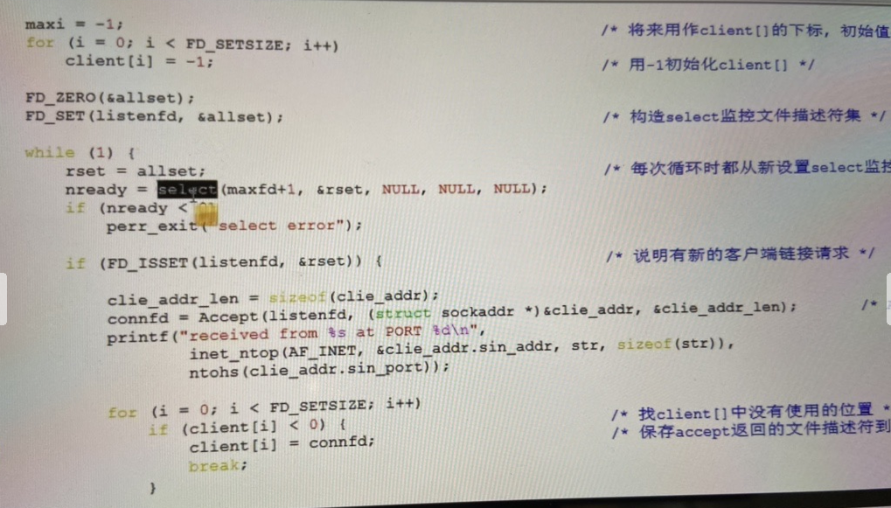

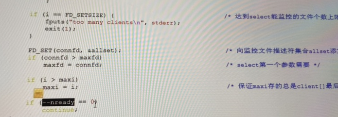

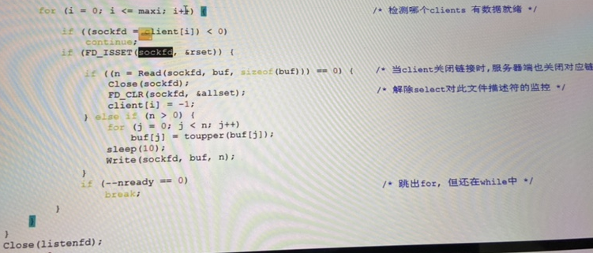

## poll

- poll, ppoll - wait for some event on a file descriptor

```c
int poll(struct pollfd *fds, nfds_t nfds, int timeout);
```

- 解析：

  - *fds 是一个结构体数组。包含fd 和 接收事件，当有事件就绪时，内核会修改revent 值。

    ```c
    struct pollfd {
    	int   fd;         /* file descriptor */
    	short events;     /* requested events */
    	short revents;    /* returned events */
    };
    ```

  - nfds_t  数组大小。
  - timeout 等待时间。

- 流程

  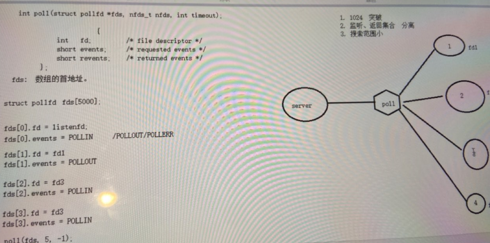

  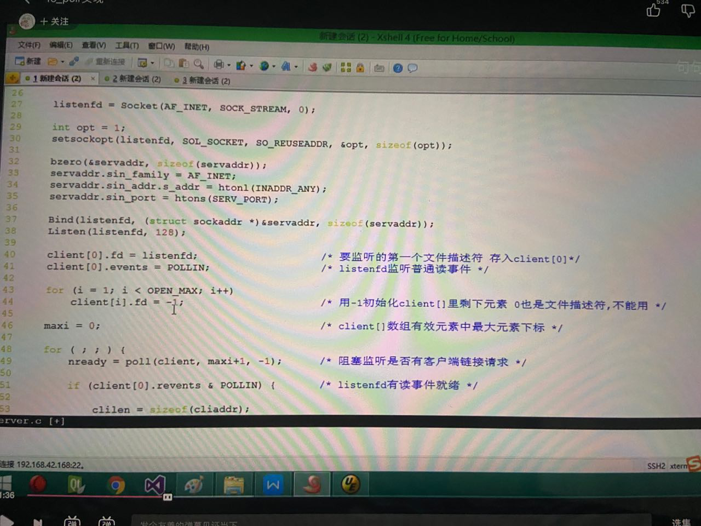

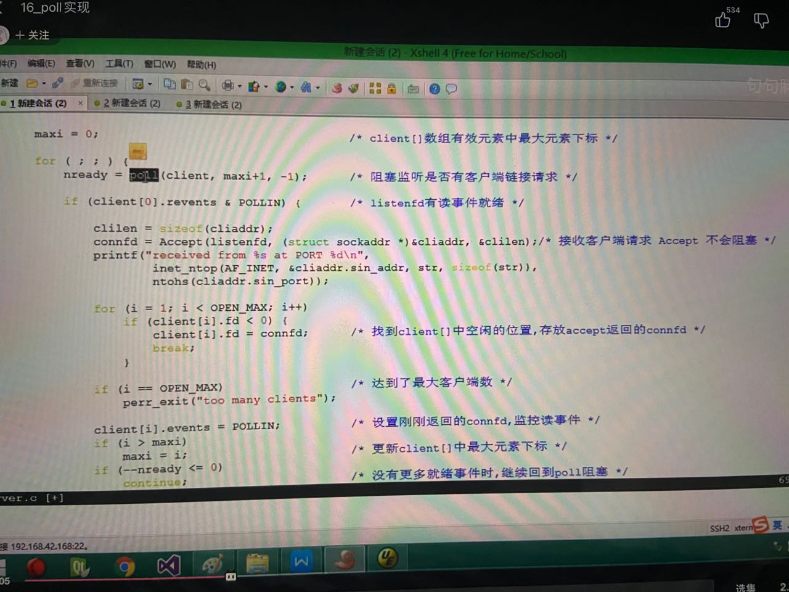

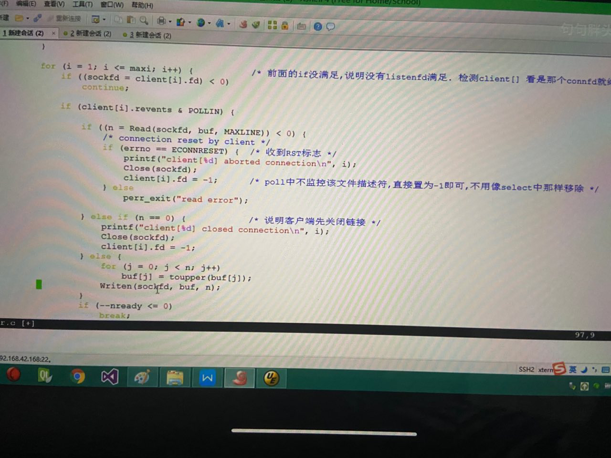

- 缺陷
  - 每次都需要从数组中遍历所有的fd中检查就绪事件。（无法彻底解决select 的问题）。

## epoll

- https://man7.org/linux/man-pages/man7/epoll.7.html#top_of_page

- 简介
  - 核心：利用事件通知功能

  ```html
  epoll - I/O event notification facility
  // *ptr 注册监听事件。
  typedef union epoll_data {
      void        *ptr;
      int          fd;
      uint32_t     u32;
      uint64_t     u64;
  } epoll_data_t;
  
  struct epoll_event {
      uint32_t     events;      /* Epoll events */
      epoll_data_t data;        /* User data variable */
  };
  ```

  

- 流程：

  - epoll_create(int size) ,节点数，创建了红黑树的一个跟节点。（为什么使用红黑树（二叉平衡排序树的一种实现）对于查询和插入有高效的复杂度。数据按照红黑树排序，那么对找文件描述符fd,更新文件描述符的就绪事件有很高效的作用。
  - epoll_ctl(epfd,int op,int fd,epoll_event),向红黑树上注册一个节点。并向其注册监听事件。
    - op 有 EPOLL_CTL_ADD,EPOLL_CTL_DEL,EPOLL_CTL_MOD
  - epoll_wait(epfd,epoll_events,maxevents,timeout)
    - epoll_events 为传出数组，即这里面的内容就绪事件的集合。无需手动判断。（这里看出为什么使用红黑树，内核需要高速的获取哪个fd变成就绪的，而这种情况无疑是最好的。上面的epoll_ctl也需要在红黑树上进行操作）
  - 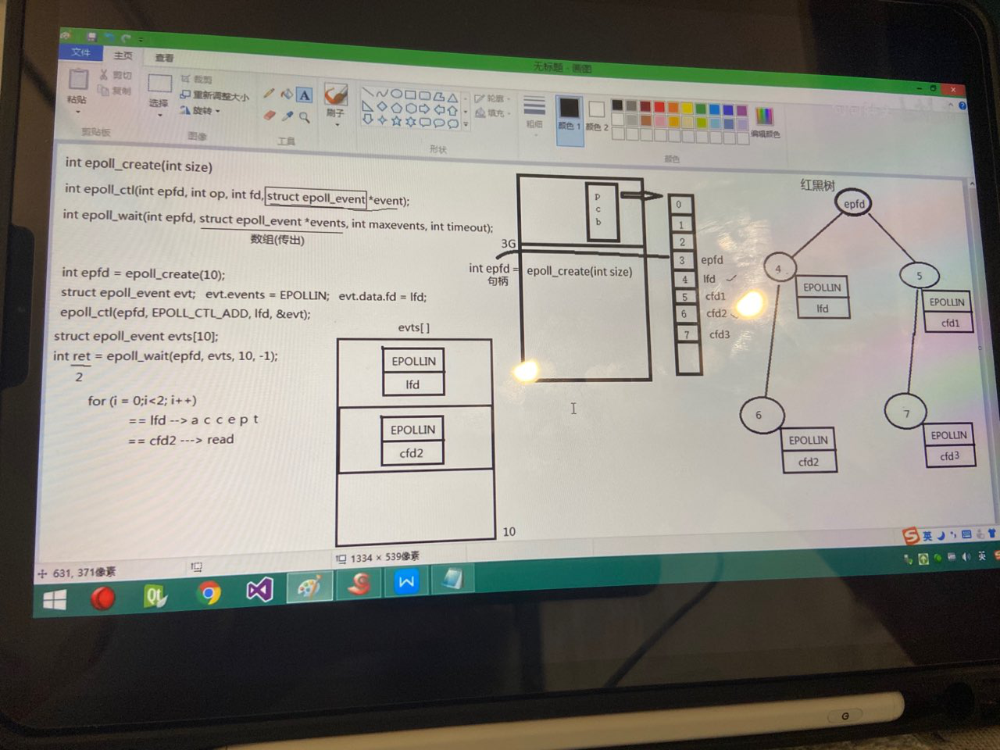

  - 使用Reactive 反应堆模式

    - 回调处理

      - 结构体设置 （call_back)

        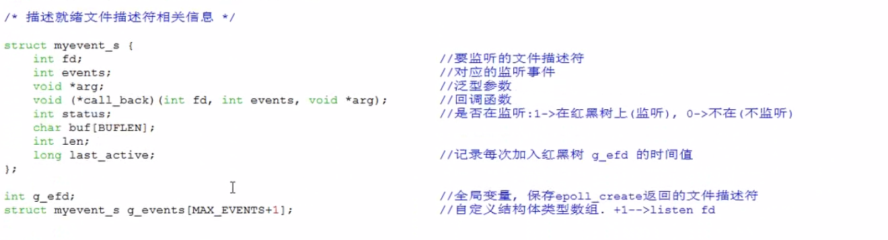

      - accpet方法

        accpect.接收链接。注册到poll中，并注册回收事件。

        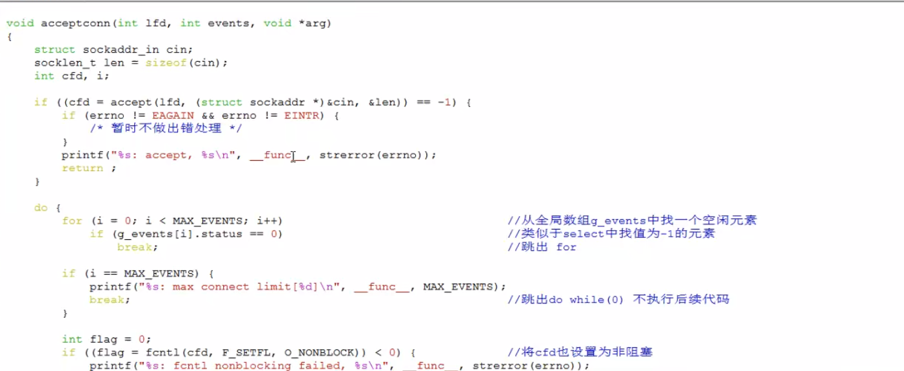

      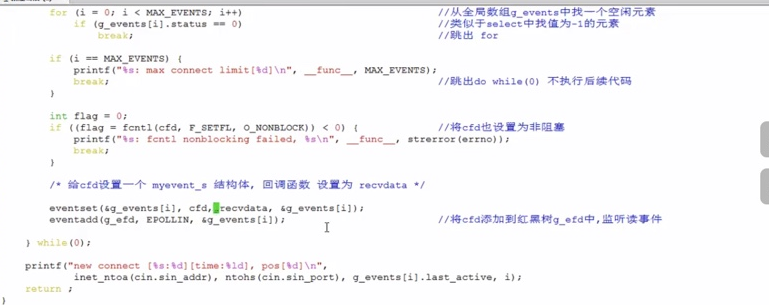
      - 设置回调函数，即相关参数。

        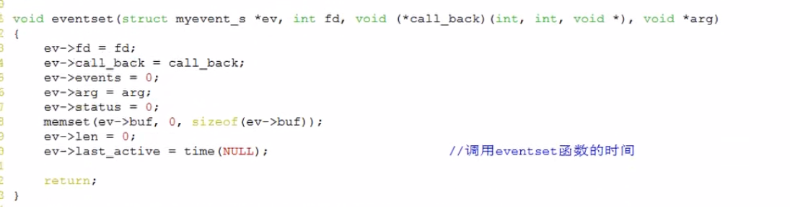

      - 将该fd注册到epoll

        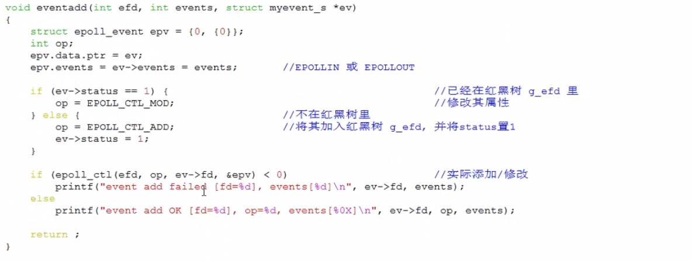

      - 接收数据方法

        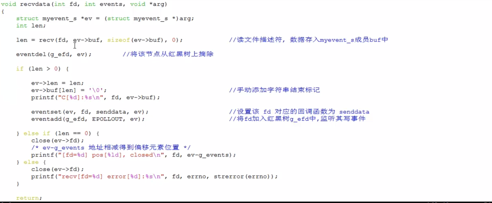

      - cfd读取事件就绪

        拿到其ptr.并调用。完成事件回调。

        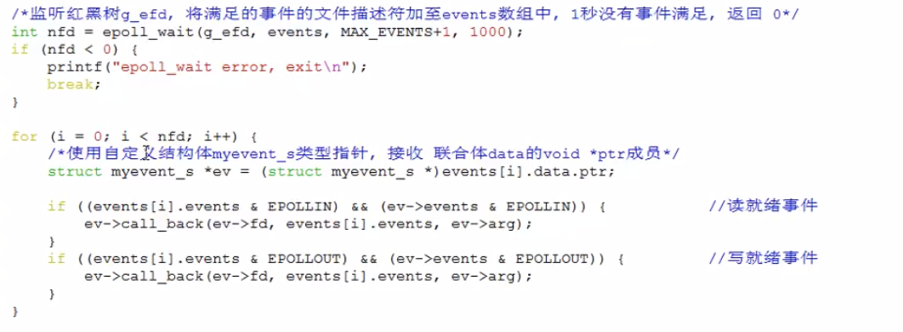

      - 发送数据

        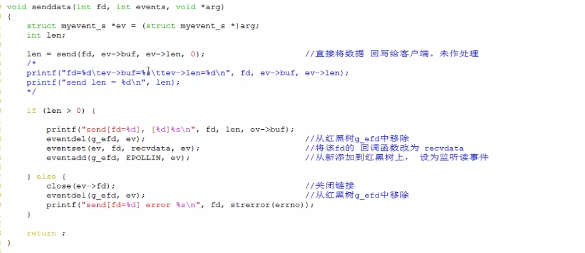

 ### epoll 几种模式

- Level-triggered（水平触发）

  - 只要缓冲区数据没有接收完毕的话。会一直触发。

- Edge-triggered (边缘触发)

  - 数据只有到达缓冲区时在会触发。

- 为了兼顾效率。ET模式需要搭配。(**最高效率**)

  - ```html
    a) with nonblocking file descriptors; and
    
    b) by waiting for an event only after read(2) or write(2) return
    EAGAIN
    ```

    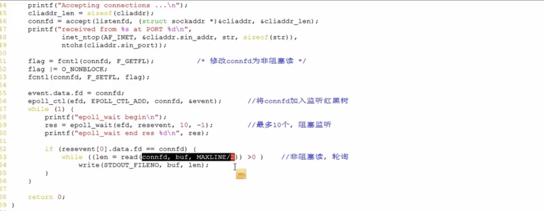

  - 如何设置非阻塞的fd.

    - flag = fcntl(connfd,F_GETFL);
    - flag != O_NONBLOCK;
    - fcntl(connfd,FSETFL,flag);
    - fcntl 设置文件描述符的访问模式。

    - https://man7.org/linux/man-pages/man2/fcntl.2.html

## 问题

- 为什么需要监听写时间

  - 只是因为TCP 滑动窗口限制，但接收方接收过慢，会发送当前窗口给发送方，让其根据调整进行发送。

  - ```html
    Writing is now possible, though a write larger than the available space in a socket or pipe will still block (unless O_NONBLOCK is set )
    ```

- 接收端在什么时候返回ACK
  - 接收端在read阶段。内核在伺机发送ACK 给发送方。
