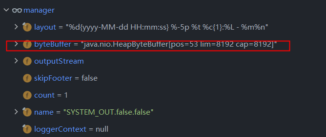
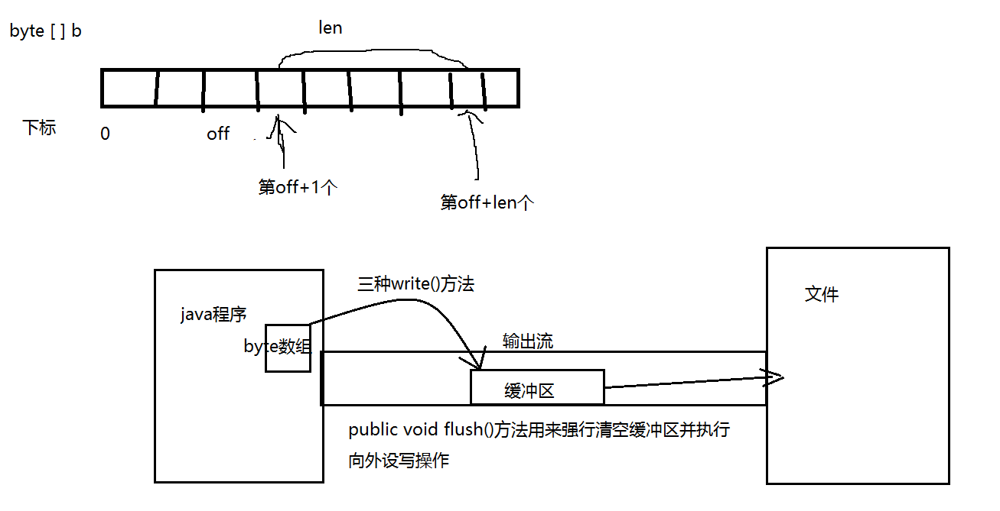

# ConsoleAppender

## log4j2

- logger.info 执行过程

- 调用栈过程

  ```java
  directEncodeEvent:199, AbstractOutputStreamAppender (org.apache.logging.log4j.core.appender)
  tryAppend:190, AbstractOutputStreamAppender (org.apache.logging.log4j.core.appender)
  append:181, AbstractOutputStreamAppender (org.apache.logging.log4j.core.appender)
  tryCallAppender:156, AppenderControl (org.apache.logging.log4j.core.config)
  callAppender0:129, AppenderControl (org.apache.logging.log4j.core.config)
  callAppenderPreventRecursion:120, AppenderControl (org.apache.logging.log4j.core.config)
  callAppender:84, AppenderControl (org.apache.logging.log4j.core.config)
  callAppenders:543, LoggerConfig (org.apache.logging.log4j.core.config)
  processLogEvent:502, LoggerConfig (org.apache.logging.log4j.core.config)
  log:485, LoggerConfig (org.apache.logging.log4j.core.config)
  log:460, LoggerConfig (org.apache.logging.log4j.core.config)
  log:82, AwaitCompletionReliabilityStrategy (org.apache.logging.log4j.core.config)
  log:161, Logger (org.apache.logging.log4j.core)
  tryLogMessage:2198, AbstractLogger (org.apache.logging.log4j.spi)
  logMessageTrackRecursion:2152, AbstractLogger (org.apache.logging.log4j.spi)
  logMessageSafely:2135, AbstractLogger (org.apache.logging.log4j.spi)
  logMessage:2016, AbstractLogger (org.apache.logging.log4j.spi)
  logIfEnabled:1875, AbstractLogger (org.apache.logging.log4j.spi)
  trace:59, Log4jLogger (org.apache.logging.slf4j)
  main:17, Test2 (com.weifuchow.log.comparsion.log4j2)
  ```

  - ```java
    protected void directEncodeEvent(final LogEvent event) {
        getLayout().encode(event, manager);
        if (this.immediateFlush || event.isEndOfBatch()) {
            manager.flush();
        }
    }
    ```

  - manager

    


- ​	实际内部使用也是outputStream.write()

  > ```java
  > protected synchronized void writeToDestination(final byte[] bytes, final int offset, final int length) {
  >     try {
  >         getOutputStream().write(bytes, offset, length);
  >     } catch (final IOException ex) {
  >         throw new AppenderLoggingException("Error writing to stream " + getName(), ex);
  >     }
  > }
  > ```
  >
  > 

  

### 总结

- 数据先暂时缓存bytebuffer。

- 如果配置了immediateFlush 相当是同步的。每次都会输出的outputstream并flush.
  - writeToDestination 有锁。
- 如果没有。等待环形队列满了才输出。
- 注：ConsoleAppender 默认是immediateFlush  是为 true的。

- -DLog4jContextSelector=org.apache.logging.log4j.core.async.AsyncLoggerContextSelector
  - 使用全异步输出。
  - lmax disruptor 异步写入，消费


## log4j

- logger.info执行过程

- 调用栈

  - > ```
    > flush:59, QuietWriter (org.apache.log4j.helpers)
    > subAppend:324, WriterAppender (org.apache.log4j)
    > append:162, WriterAppender (org.apache.log4j)
    > doAppend:251, AppenderSkeleton (org.apache.log4j)
    > appendLoopOnAppenders:66, AppenderAttachableImpl (org.apache.log4j.helpers)
    > callAppenders:206, Category (org.apache.log4j)
    > forcedLog:391, Category (org.apache.log4j)
    > log:856, Category (org.apache.log4j)
    > info:304, Log4jLoggerAdapter (org.slf4j.impl)
    > main:16, Main (com.weifuchow.log.comparsion.log4j)
    > ```

  - subAppend

    - ```java
      protected void subAppend(LoggingEvent event) {
          this.qw.write(this.layout.format(event));
          if (this.layout.ignoresThrowable()) {
              String[] s = event.getThrowableStrRep();
              if (s != null) {
                  int len = s.length;
      
                  for(int i = 0; i < len; ++i) {
                      this.qw.write(s[i]);
                      this.qw.write(Layout.LINE_SEP);
                  }
              }
          }
      
          if (this.shouldFlush(event)) {
              this.qw.flush();
          }
      
      }
      ```

    - flush

      ```java
      public void flush() {
          try {
              this.out.flush();
          } catch (Exception var2) {
              this.errorHandler.error("Failed to flush writer,", var2, 2);
          }
      
      }
      ```

    - write过程都是加锁的

      ```JAVA
      public void write(String str, int off, int len) throws IOException {
          synchronized (lock) {
              char cbuf[];
              if (len <= WRITE_BUFFER_SIZE) {
                  if (writeBuffer == null) {
                      writeBuffer = new char[WRITE_BUFFER_SIZE];
                  }
                  cbuf = writeBuffer;
              } else {    // Don't permanently allocate very large buffers.
                  cbuf = new char[len];
              }
              str.getChars(off, (off + len), cbuf, 0);
              write(cbuf, 0, len);
          }
      }
      ```

      

### 总结

-  与log4j2类似。都是输出到outstream.然后flush


## logBack

- logger.info 执行栈

- > ```java
  > flush:47, ConsoleTarget$1 (ch.qos.logback.core.joran.spi)
  > writeBytes:201, OutputStreamAppender (ch.qos.logback.core)
  > subAppend:231, OutputStreamAppender (ch.qos.logback.core)
  > append:102, OutputStreamAppender (ch.qos.logback.core)
  > doAppend:84, UnsynchronizedAppenderBase (ch.qos.logback.core)
  > appendLoopOnAppenders:51, AppenderAttachableImpl (ch.qos.logback.core.spi)
  > appendLoopOnAppenders:270, Logger (ch.qos.logback.classic)
  > callAppenders:257, Logger (ch.qos.logback.classic)
  > buildLoggingEventAndAppend:421, Logger (ch.qos.logback.classic)
  > filterAndLog_0_Or3Plus:383, Logger (ch.qos.logback.classic)
  > info:579, Logger (ch.qos.logback.classic)
  > main:17, Main (com.weifuchow.log.comparsion.logback)
  > ```

- writeBytes

  ```java
  private void writeBytes(byte[] byteArray) throws IOException {
      if(byteArray == null || byteArray.length == 0)
          return;
  
      lock.lock();
      try {
          this.outputStream.write(byteArray);
          if (immediateFlush) {
              this.outputStream.flush();
          }
      } finally {
          lock.unlock();
      }
  }
  ```

- write

  ```java
  public void write(byte buf[], int off, int len) {
      try {
          synchronized (this) {
              ensureOpen();
              out.write(buf, off, len);
              if (autoFlush)
                  out.flush();
          }
      }
      catch (InterruptedIOException x) {
          Thread.currentThread().interrupt();
      }
      catch (IOException x) {
          trouble = true;
      }
  }
  ```

### 总结

- ConsoleAppender 默认都是immediateFlush.都是使用System.out 也即printStream.都会有锁。差别不大。

  

