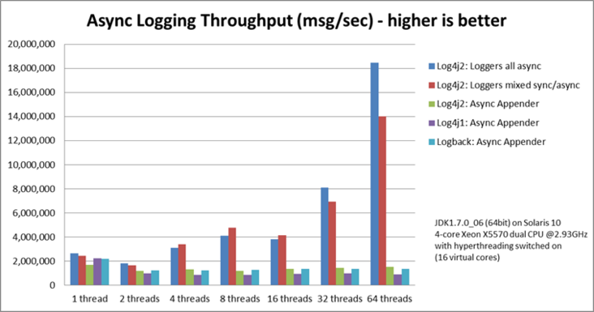
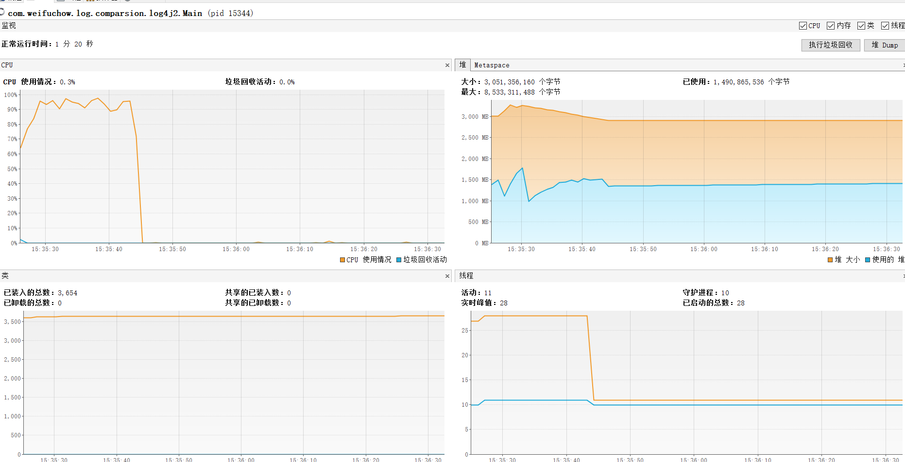
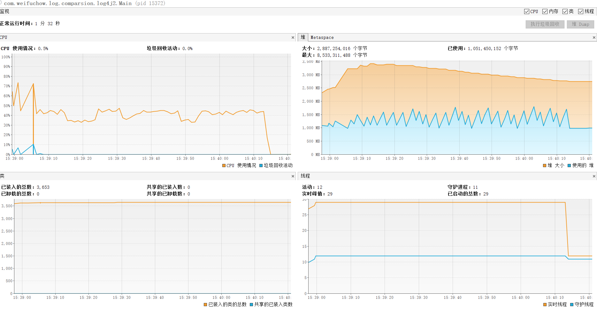
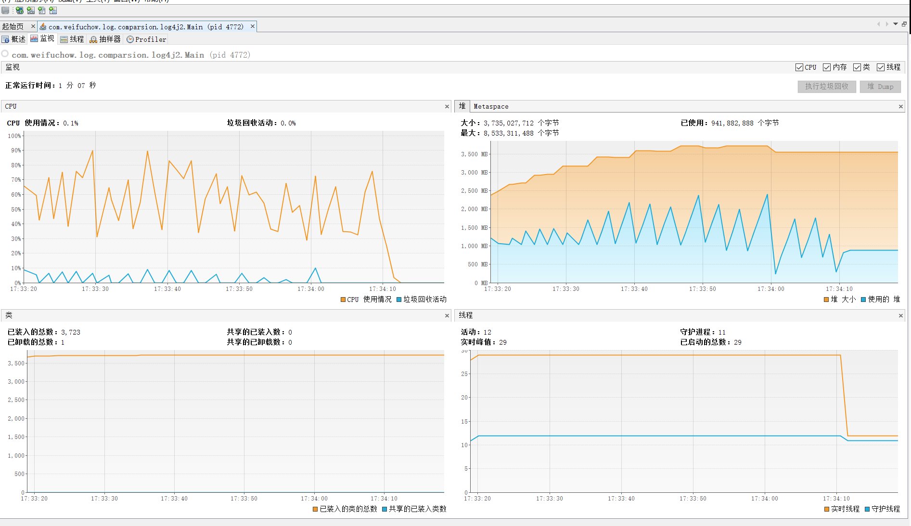

#  log4j2转化

## 背景

- 当前 组件，日志格式并不统一

- 且当前使用的日志均为console日志。这并不是异步的。实际掉的是system.out.println.这个方法相当是有锁的。会对性能造成比较大的影响，实际生产环境不允许使用console.

  ```java
  public void println(String x) {
          synchronized (this) {
              print(x);
              newLine();
          }
      }
  ```

  

## 统一日志框架

- 应该选取什么日志框架作为统一标准。为此我觉得仍需要测试以进行验证。



- 基准测试

  - 只记录文件写入

  | 日志框架 | appender                | 16T  | counter  | TPS              |
  | -------- | ----------------------- | ---- | -------- | ---------------- |
  | log4j    | FileAppender            | √    | 10247680 | 81627.67         |
  | logback  | FileAppender            | √    | 10247680 | 62792.33         |
  | log4j2   | RollingRandomAccessFile | √    | 10247680 | 205344.77        |
  | logback  | With  DisruptorAppender | √    | 10247680 | 617292(会丢数据) |

  - 

- log4j2 immediateFlush= false

  > 
  >
  > **-- Timers ----------------------------------------------------------------------**
  > **-timer-test**
  >              **count = 10485760**
  >          **mean rate = 337259.37 calls/second**
  >      **1-minute rate = 159747.53 calls/second**
  >      **5-minute rate = 60456.27 calls/second**
  >     **15-minute rate = 41360.30 calls/second**
  >                **min = 0.01 milliseconds**
  >                **max = 3.06 milliseconds**
  >               **mean = 0.02 milliseconds**
  >             **stddev = 0.14 milliseconds**
  >             **median = 0.01 milliseconds**
  >               **75% <= 0.01 milliseconds**
  >               **95% <= 0.01 milliseconds**
  >               **98% <= 0.02 milliseconds**
  >               **99% <= 0.02 milliseconds**
  >             **99.9% <= 2.63 milliseconds**
  >
  > **total size  = 1077 * 1048576 = 1.129316352GB,total time =  31099 ms**

- log4j2 immediateFlush= true 

  > 
  >
  > **-timer-test**
  >              **count = 10485760**
  >          **mean rate = 125597.08 calls/second**
  >      **1-minute rate = 101132.81 calls/second**
  >      **5-minute rate = 34554.02 calls/second**
  >     **15-minute rate = 16489.14 calls/second**
  >                **min = 0.01 milliseconds**
  >                **max = 0.97 milliseconds**
  >               **mean = 0.11 milliseconds**
  >             **stddev = 0.10 milliseconds**
  >             **median = 0.08 milliseconds**
  >               **75% <= 0.19 milliseconds**
  >               **95% <= 0.25 milliseconds**
  >               **98% <= 0.32 milliseconds**
  >               **99% <= 0.39 milliseconds**
  >             **99.9% <= 0.97 milliseconds**
  >
  > **total size  = 1077 * 1048576 = 1.129316352GB,total time =  83493 ms**

- log4j2 写入文件 with -DLog4jContextSelector=org.apache.logging.log4j.core.async.AsyncLoggerContextSelector

  > 
  >
  > **-- Timers ----------------------------------------------------------------------**
  > **-timer-test**
  >              **count = 10485760**
  >          **mean rate = 178494.91 calls/second**
  >      **1-minute rate = 117972.15 calls/second**
  >      **5-minute rate = 41372.94 calls/second**
  >     **15-minute rate = 23748.56 calls/second**
  >                **min = 0.01 milliseconds**
  >                **max = 0.96 milliseconds**
  >               **mean = 0.01 milliseconds**
  >             **stddev = 0.03 milliseconds**
  >             **median = 0.01 milliseconds**
  >               **75% <= 0.01 milliseconds**
  >               **95% <= 0.03 milliseconds**
  >               **98% <= 0.04 milliseconds**
  >               **99% <= 0.04 milliseconds**
  >             **99.9% <= 0.63 milliseconds**
  >
  > **total size  = 1077 * 1048576 = 1.129316352GB,total time =  58754 ms**

##  标准日志配置文件

```xml
<?xml version="1.0" encoding="UTF-8"?>
<!--设置log4j2的自身log级别为warn -->
<configuration status="warn">

    <Properties>
        <Property name="LOG_PATTERN">%d{yyyy-MM-dd HH:mm:ss} %d{UNIX_MILLIS} %-5p %t %c{1}:%L - %m%n</Property>
        <Property name="LOG_HOME">D:/logs</Property>
        <Property name="LOG_APP">log4j</Property>
    </Properties>

    <appenders>
        <ScriptAppenderSelector name="ConsoleOrFile">
            <Script language="groovy"><![CDATA[
                if (System.getProperty("isProd", 'false').equalsIgnoreCase('true')) {
                    return "File"
                } else {
                    return "Console"
                }
            ]]></Script>
            <AppenderSet>

                <Console name="Console" target="SYSTEM_OUT">
                    <PatternLayout pattern="${LOG_PATTERN}"/>
                </Console>

                <RollingRandomAccessFile name="File" fileName="${LOG_HOME}/${LOG_APP}.log"
                                         filePattern="${LOG_HOME}/${LOG_APP}/${LOG_APP}-%d{yyyy-MM-dd}.log.gz"
                                         immediateFlush="true" append="true">
                    <PatternLayout>
                        <Pattern>${LOG_PATTERN}</Pattern>
                    </PatternLayout>
                    <Policies>
                        <TimeBasedTriggeringPolicy interval="1" modulate="true"/>
                    </Policies>

                    <DefaultRolloverStrategy>
                        <Delete basePath="${LOG_HOME}/${LOG_APP}" maxDepth="2">
                            <IfFileName glob="${LOG_APP}-*.log.gz"/>
                            <IfLastModified age="7d"/>
                        </Delete>
                    </DefaultRolloverStrategy>
                </RollingRandomAccessFile>

            </AppenderSet>
        </ScriptAppenderSelector>
    </appenders>
    <loggers>
        <!--  限定某些类输出debug级别日志以上的日志。
         	<Logger name="org.springframework" level="debug" additivity="false">
      			<AppenderRef ref="ConsoleOrFile"/>
         	</Logger>
        -->
        <Root level="info" includeLocation="true">
            <AppenderRef ref="ConsoleOrFile" />
        </Root>
    </loggers>

</configuration>
```

- 统一日志格式${LOG_PATTERN}

- 说明日志文件将会输出到${LOG_HOME}/${LOG_APP}.log 中

- 当运行时间超过一天，会进行翻转。将原来的${LOG_APP}.log 数据抽离当天日志到并压缩成${LOG_HOME}/${LOG_APP}/${LOG_APP}-%d{yyyy-MM-dd}.log.gz 

- 检索${LOG_HOME}/${LOG_APP}/${LOG_APP}-%d{yyyy-MM-dd}.log.gz ，若发现 超过上次修改时间 7天的，则删除改文件。

- **另外：当需要对某些类进行特定级别的日志过滤的话。**

  ```xml
  <Logger name="org.springframework" level="debug" additivity="false">
        			<AppenderRef ref="ConsoleOrFile"/>
  </Logger
  ```

  

## 标准启动参数

- 生产环境
  - java  -DisProd=true -DLog4jContextSelector=org.apache.logging.log4j.core.async.AsyncLoggerContextSelector -jar xx

## 生产文件输出效率

> **Timers ----------------------------------------------------------------------**
> **-timer-test**
>              **count = 10485760**
>          **mean rate = 179676.25 calls/second**
>      **1-minute rate = 118453.24 calls/second**
>      **5-minute rate = 40862.92 calls/second**
>     **15-minute rate = 22962.95 calls/second**
>                **min = 0.01 milliseconds**
>                **max = 31.85 milliseconds**
>               **mean = 0.13 milliseconds**
>             **stddev = 1.51 milliseconds**
>             **median = 0.01 milliseconds**
>               **75% <= 0.01 milliseconds**
>               **95% <= 0.03 milliseconds**
>               **98% <= 0.04 milliseconds**
>               **99% <= 0.15 milliseconds**
>             **99.9% <= 31.85 milliseconds**
>
> **total size  = 1077 * 1048576 = 1.129316352GB,total time =  58367 ms**


## Maven 依赖

```xml
<!-- slf4j -->
<dependency>
    <groupId>org.slf4j</groupId>
    <artifactId>slf4j-api</artifactId>
    <version>1.7.25</version>
</dependency>

 <dependency>
     <groupId>org.apache.logging.log4j</groupId>
     <artifactId>log4j-slf4j-impl</artifactId>
     <version>2.13.3</version>
</dependency>

<dependency>
    <groupId>com.lmax</groupId>
    <artifactId>disruptor</artifactId>
    <version>3.3.4</version>
</dependency>

<dependency>
    <groupId>org.codehaus.groovy</groupId>
    <artifactId>groovy-jsr223</artifactId>
    <version>2.5.8</version>
</dependency>
```


## app3生产启动参数配置

- java -DisProd=true  -DLog4jContextSelector=org.apache.logging.log4j.core.async.AsyncLoggerContextSelector -DtaskId=mysql2oracle  -jar main.jar

  

## filebeat 采集

```yml
filebeat.inputs:
- type: log
  enabled: true
  paths:
    - /opt/3.0/app4/logs/*.log
  fields:
    type: "app4-log"
  multiline.pattern: ^([1-2][0-9][0-9][0-9]-[0-1]{0,1}[0-9]-[0-3]{0,1}[0-9])\s(20|21|22|23|[0-1]\d):[0-5]\d:[0-5]\d
  multiline.negate: true
  multiline.match: after
  exclude_lines: ^\D

- type: log
  enabled: true
  paths:
    - /opt/3.0/app2/logs/*.log
  fields:
    type: "app2"

- type: log
  enabled: true
  paths:
    - /opt/3.0/app1/logs/*.log
  fields:
    type: "app1"
  multiline.pattern: ^([1-2][0-9][0-9][0-9]-[0-1]{0,1}[0-9]-[0-3]{0,1}[0-9])\s(20|21|22|23|[0-1]\d):[0-5]\d:[0-5]\d
  multiline.negate: true
  multiline.match: after
  exclude_lines: ^\D

- type: log
  enabled: true
  paths:
    - /opt/3.0/app2/_app3/logs/*.log
  fields:
    type: "app3"
  multiline.pattern: ^([1-2][0-9][0-9][0-9]-[0-1]{0,1}[0-9]-[0-3]{0,1}[0-9])\s(20|21|22|23|[0-1]\d):[0-5]\d:[0-5]\d
  multiline.negate: true
  multiline.match: after
  exclude_lines: ^\D

#==================== Elasticsearch template setting ==========================
setup.ilm.enabled: false  ## 这个必须要配置成false，否则自定义index就不会生效
setup.template.enabled: false  ## 关掉filebeat默认的es模板
setup.template.name: ""
setup.template.overwrite: true ## 表示我们自定义的模板和index会覆盖默认的
setup.template.pattern: "-*"
#============================== Kibana =====================================
setup.kibana:
  # Kibana Host
  # IPv6 addresses should always be defined as: https://[2001:db8::1]:5601
  host: "xx:5601"
#-------------------------- Elasticsearch output ------------------------------
output.elasticsearch:
  # Array of hosts to connect to.
  hosts: ["xx:9200"]
  index: "-%{[fields.type]}-%{+yyyy.MM.dd}"
  pipelines:
    - pipeline: ""
      when.equals:
        fields.type: "app2"
    - pipeline: ""
      when.equals:
        fields.type: "app1"
    - pipeline: ""
      when.equals:
        fields.type: "app3"
    - pipeline: ""
      when.equals:
        fields.type: "app4-log"
# Configure processors to enhance or manipulate events generated by the beat.
processors:
  - add_host_metadata: ~
  - add_cloud_metadata: ~
#================================ Logging =====================================
logging.level: info
```

## 启动

- nohup ./filebeat -e -c filebeat.yml > logs/filebeat.log &

## ES pipeline 预处理

> ```java
> PUT  _ingest/pipeline/
> {
>   "description" : " log pipeline",
>   "processors": [
>     {
>       "grok": {
>         "field": "message",
>         "patterns": ["(?<date>%{TIMESTAMP_ISO8601}) (?<level>%{LOGLEVEL}) {1,2}(?<thread>.*?) (?<class>.*?) - (?<content>[\\s\\S]*)"],
>         "ignore_failure": true
>       }
>     },
>     {
>       "date": {
>         "field": "date",
>         "target_field": "log_time",
>         "formats": ["yyyy-MM-dd HH:mm:ss"],
>         "timezone": "Asia/Shanghai",
>         "ignore_failure": true
>       }
>     },
>     {
>       "remove": {
>         "field": "message"
>       }
>     }
>   ]
> }   
> ```