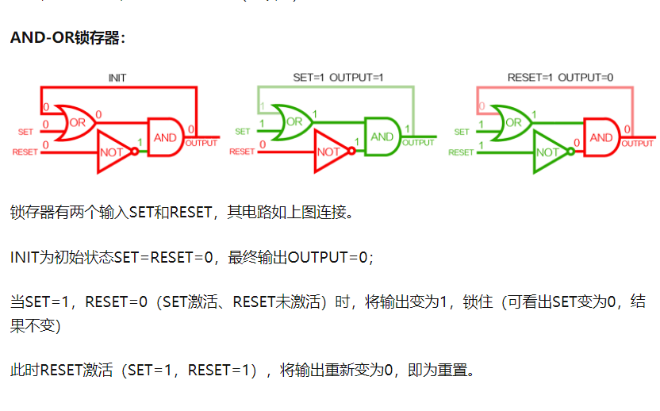

# 存储器设计

- 计算机如何存储1bit数据。

  - 

  - 使用锁存器结构
    - 初始阶段皆为0.此时想写入1。set设为1。reset=0,output 也输出1。无论set怎么改变也改变不了output。锁住1的记录。
    - 当set重新写入。set = 0,reset = 1.则output 为0.无论怎么改变都无法改为0. 
    - 读取。当set,reset = 0 即可实现读取上次结果过程。