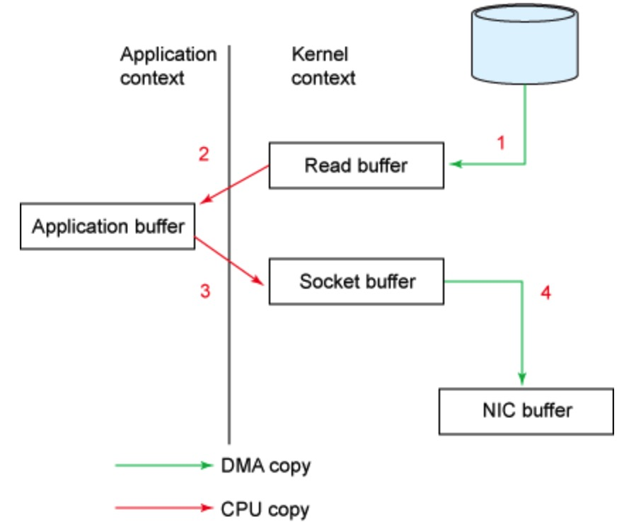
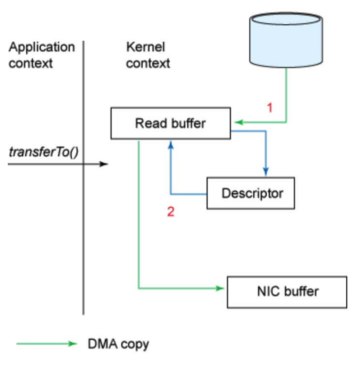
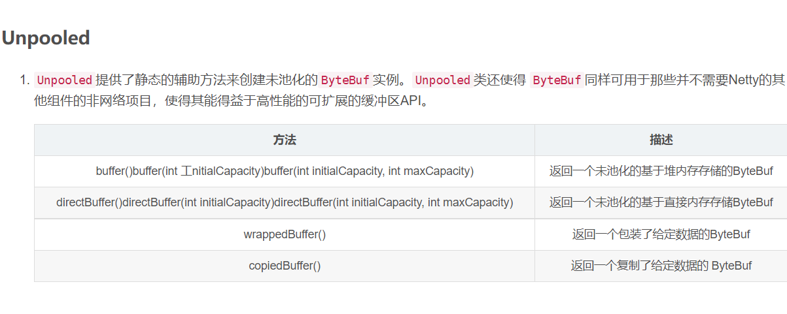

# Netty 

## netty 原理

- reactor 模式

## netty 内存管理

https://www.cnblogs.com/lighten/p/8990509.html

- 堆外内核缓冲区

- 堆外内存ByteBuf
- 池化内存ByteBuf
  - 为了避免线程安全问题。每一个线程的threadlocal中存储了对象。并非唯一


### [Where is the memory of direct buffer allocated by netty, kernel space or user space?](https://stackoverflow.com/questions/49174987/where-is-the-memory-of-direct-buffer-allocated-by-netty-kernel-space-or-user-sp)

- 堆外内存也是在User space
- 堆外内存核心原因
  - 所有系统调用（例如读写套接字和文件）仅使用**本机内存**。他们不能使用堆。这意味着虽然您可以从堆复制到本机内存/从本机内存复制，但避免这种复制可以提高效率。


## 问题

- TCP/IP 基于可靠传输层协议。当channel.send(Data) 是立刻返回。还是待接收方返回ACK再返回呢。ACK细节在深入结合TCP。
  - 如果以对方返回的操作系统返回ACK包为准的。则时效性可能会有所丢失。因为ack有可能是在确认了发送方好几个包才进行返回通知。且不能带有相应的业务处理。
- 接送方的ACK.会不会拼接在 发送内容上。以减少不必要的传输
  - 会。发送包内容时可以附带已经确认的信息及滑动窗口大小。

- Netty ZERO-COPY的地方在哪里?
  - https://binglau7.github.io/2018/12/10/Netty%E4%B8%8EZero-Copy/

  - 零拷贝一般大众所知是 Linux 中一种用于减少在文件（网络）读写过程中用户态与内核态互相切换，内核态数据需要 copy 到用户态的优化手段。在 Java 的中是以 `FileChannel.transferTo` 来体现。（底层使用了sendFile，文件到kernel buffer 再通过dma到 nic buffer）数据从内核态-直接到(NIC buffer)网卡的buffer。（减少了内核态-用户态-socketBufferr）之间的copy。因为冯诺依曼结构：必须要复制到内核态到—NIC Buffer。不能

    - before
      - read&send
      - 
    - File.Transferto
      - 

  - ByteBuf 提供多种组合切分操作。（不复制里面对象，多个指针引用，采用相关索引访问而已,软件层面）

    - https://blog.csdn.net/usagoole/article/details/88024517

    - 

    - 场景：

      - ```java
        // copy  twice times
        ByteBuf allBuf = Unpooled.buffer(header.readableBytes() + body.readableBytes());
            allBuf.writeBytes(header);
            allBuf.writeBytes(body);
        ```

      - ```java
        // zero copy
        ByteBuf header = Unpooled.buffer(10);
            ByteBuf body = Unpooled.buffer(10);
            CompositeByteBuf compositeByteBuf = Unpooled.compositeBuffer();
            //其中第一个参数是 true, 表示当添加新的 ByteBuf 时, 自动递增
            //CompositeByteBuf 的 writeIndex
          compositeByteBuf.addComponents(true, header, body);
        
        ```

      - 

  - 另外一个就是传统的优化。对文件传输的优化。Netty 的零拷贝分为两种。一种是使用 FileReigon 封装了 `FileChannel.transferTo` 操作使得网络读写性能得到优化；
- Netty 优势
  - nio
  - zero copy
  - 强大的协议封装。