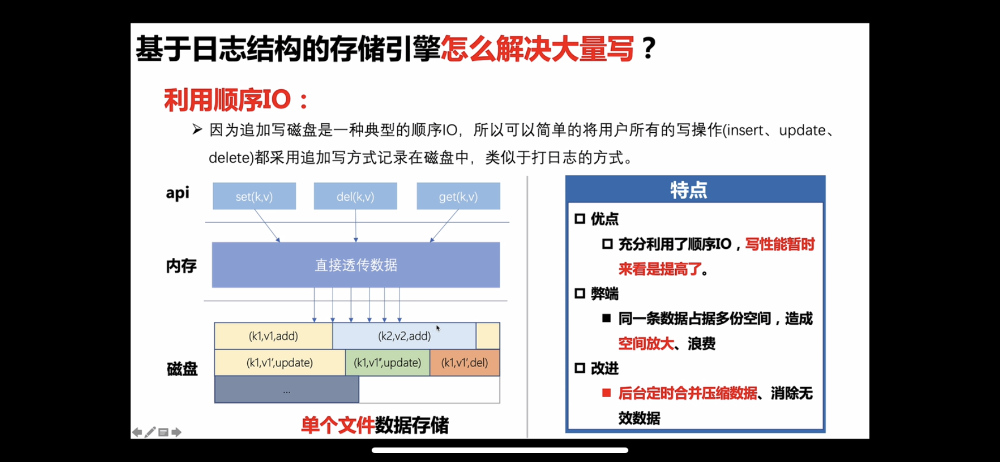
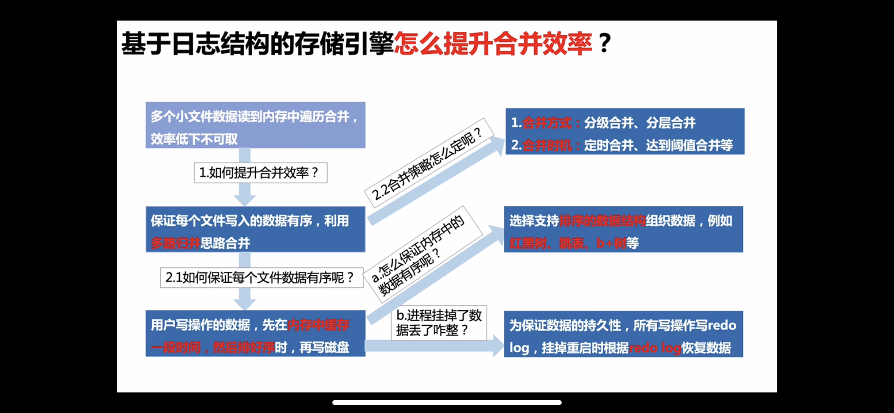
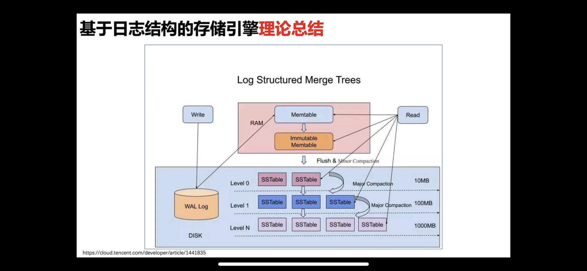
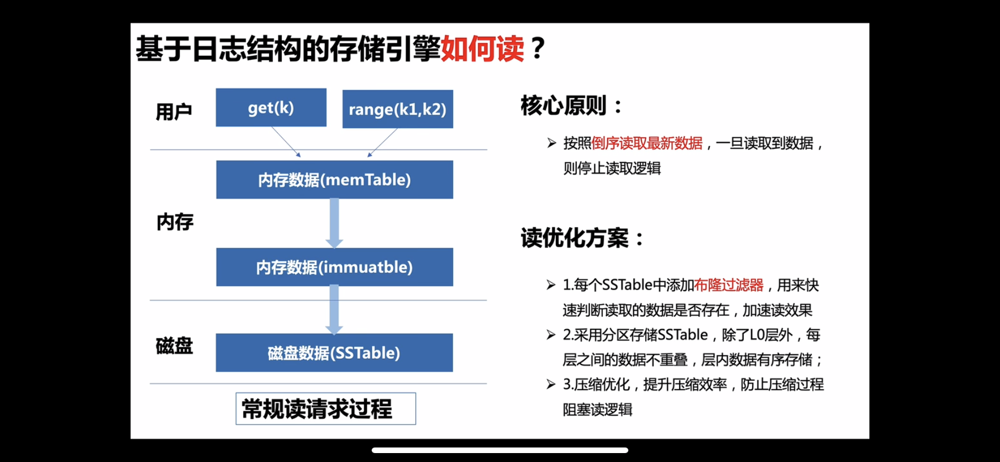
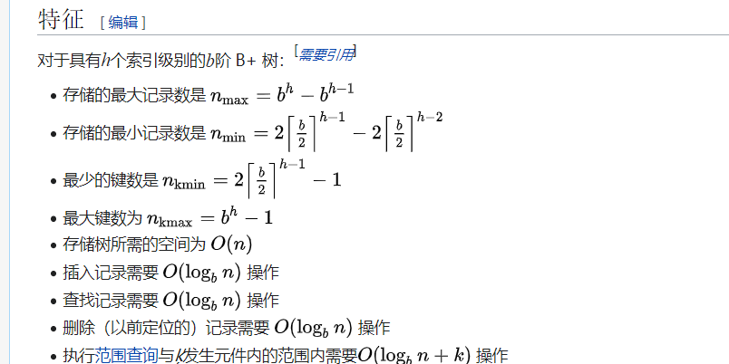
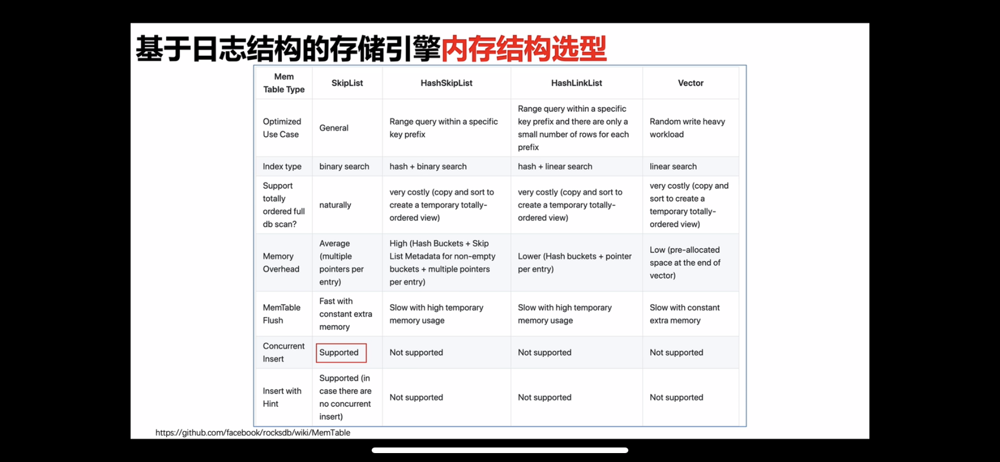

# LSM树存储引擎

## OverView

- 背景
  - 为了可以解决大批量数据高效写入，少量读的场景（相对于写）所引入了新的数据结构。LSM ( log-structured merge-tree )
    - 
  - 其过程如下：
    - 插入过程：
      - 在内存维护一个有序结构，当达到一定阈值就写入的磁盘文件中。即为SST（顺序IO)。
      - 开启一个定期线程：合并多个磁盘文件。（利用归并排序思想【构建一个新的文件，谁小插谁，最后未插完的，补完即可】。
      - 补充（可以按照层级进行合并。最终维护层单独的一个磁盘文件或个的磁盘文件（未合并））
        - 合并策略
          - 
    - 读取过程：
      - 先在内存查找所需要的数据，若无从各级的磁盘文件中查询。
      - 读取不稳定
  - 示意图：
    - 

## LSM、B Plus 树 性能分析

### 插入

- LSM树，
  - 实际对客户端操作Insert来说。只需要记录一次在内存当中即可。所以O(1)。
- B plus Tree
  - B+树大都作为以页式存储引擎的数据结构。其插入式先更新对应脏页。当数据需要插入时。可能需要设计到多个页的调整。比如（插入一个中间值、删除中间值。都会涉及多个页之间的平衡问题）

### 读取

- LSM树	
  - 读取不稳定。数据需要一级一级从上到下进行读取。
  - 为了加快不存在的记录读取效率。引入布隆过滤器（快速排除不存在的记录 not 100%)
  - 所有层级都是有序的。所以都可以利用二分进行读取。
  - 示意图：
    - 
- B  plus 树：
  - B+ 树，因为数据都在叶子节点上。查询效率是稳定的。IO次数等于树的深度。查询复杂度为 logbN(以b为深度低N)
  - 

## LSM 的实现

### 内存结构的选择

- 

## 应用场景

- 在许多OLAP(面向分析的数据库中)几乎都使用LSM作为主要存储的结构。

  - 主要原因是高效的写入。及相对弱的写入。
  - 但是只是B+树。在关系型数据库当中也难以达到分析的要求。**适用场景就只适用海量的key value 吗，（level db） **。
  - 所以在关系型数据库（可以叫**数仓**），还有一项很重要的优化手段。（**列存**，每一列对应成一个文件。）(**Click house**)
  - **使用列存的好处是**：
    - **针对列的查询可以极大的减少IO的次数 （如查询某一列的平均值。该列的文件大小。相比于行存小的多。且在业内仍需要对该列的数据进行抽取计算。）**
    - **高效的压缩。（同一种数据结构，压缩简单的多。算法也很高效。如哈夫曼树之类）**
  - 环处也很明显：
    - **多列查询时，IO的次数反而更多了。**

  

