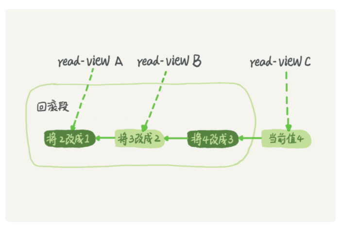
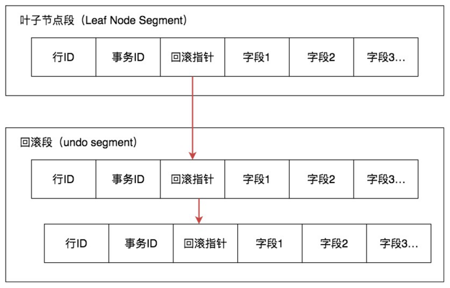
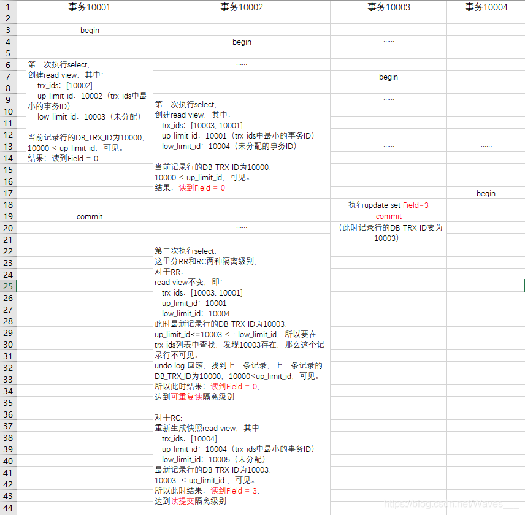
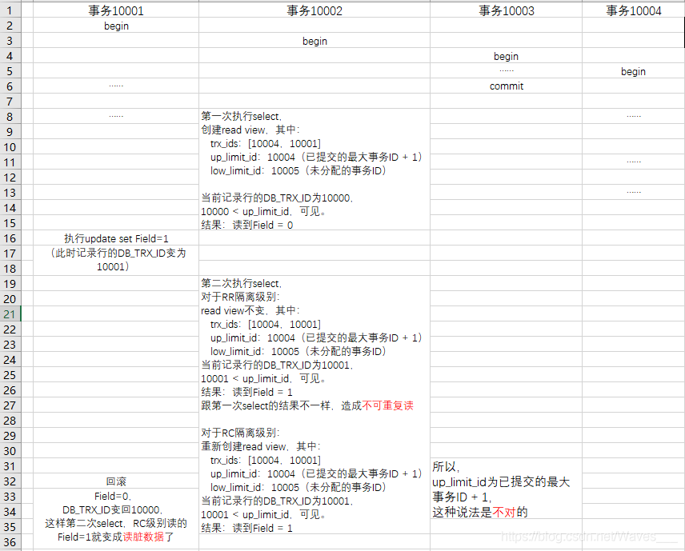
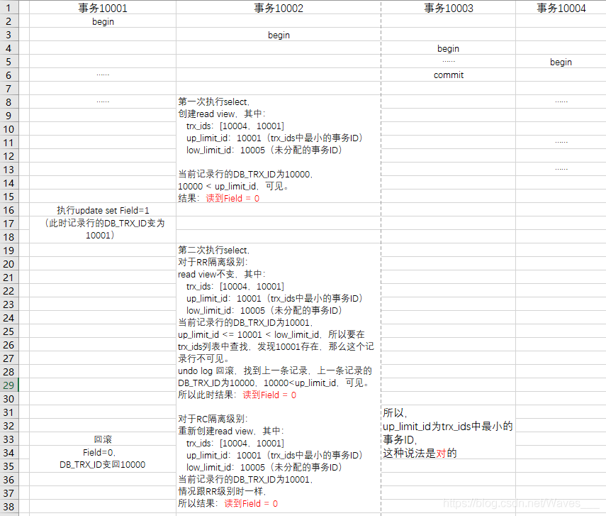

# MVCC (Multi Version Concurrency  Control)

- Multi Version Concurrency  control (多版本并发控制)

  - 背景：
    - 主要为了解决mysql 多个事务之间如何隔离等问题，比如读已提交。（另一个事务看不到其已提交的内容。）
    - 减少lock 的开销，并发效率
    - **读写不互斥。写写互斥。（写入一条时要确保原子性）**
  - 背后实现原理：
    - 很自然的想到。既然mysql 能够对每个事务读取的结构返回不一样。那么其内部一定是通过保存多个版本的数据进行控制。
  
  

## 实现方式

- 本质：通过形成各个版本链。通过的**Read view（通过这个列表来判断记录的某个版本是否对当前事务可见）**选择对应的记录，避免锁之间的开销，提高并发性。

  - 假设一个值从 1 被按顺序改成了 2、3、4，在回滚日志里面就会有类似下面的记录。

    - 当前值是 4，但是在查询这条记录的时候，不同时刻启动的事务会有不同的 read-view。如图中看到的，在视图 A、B、C 里面，这一个记录的值分别是 1、2、4，同一条记录在系统中可以存在多个版本，就是数据库的多版本并发控制（MVCC）。对于 read-view A，要得到 1，就必须将当前值依次执行图中所有的回滚操作得到。
  
  - 
  
  - ##### 查询（SELECT）
  
    - InnoDB 会根据以下两个条件检查每行记录：
      - InnoDB只查找版本早于当前事务版本的数据行（也就是，行的系统版本号小于或等于事务的系统版本号），这样可以**确保事务读取的行，要么是在事务开始前已经存在的，要么是事务自身插入或者修改过的**。
      - 行的删除版本要么未定义，要么大于当前事务版本号。这可以确保**事务读取到的行，在事务开始之前未被删除**。
      - 只有符合上述两个条件的记录，才能返回作为查询结果。

​				

​	

## Read View

- low_limit_id: **目前出现过的最大的事务ID+1**，即下一个将被分配的事务ID
- up_limit_id:   **活跃事务列表trx_ids中最小的事务ID，如果trx_ids为空，则up_limit_id 为 low_limit_id**
- trx_ids：Read View创建时其他**未提交**的活跃事务ID列表。意思就是创建Read View时，**将当前未提交事务ID记录下来，后续即使它们修改了记录行的值，对于当前事务也是不可见的。**

- **example**

  

- **example 2**
  - **（证明“up_limit_id为已提交的最大事务ID + 1”是错误的）**
  - 

- **example 3**

  - **（跟例子2一样的情况，不过up_limit_id变为trx_ids中最小的事务ID）：**

    

- 补充

  - 原纪录record 最后 commit trxId = 10000 field = 0. id = 1

  - (T1,T2,T3 为时间点)

  - | 事务Id       | T1       | T2                | T3            | T4            | T5     |
    | ------------ | -------- | ----------------- | ------------- | ------------- | ------ |
    | 事务A(10001) | 开启事务 | update field  = 2 | 提交          |               |        |
    | 事务B(10002) | 开启事务 |                   | 读取 (id = 1) | 读取 (id = 1) | commit |

  - 分析事务B

    - T3 读取

      - RC  (read commit) && RR (read repeat) , 第一次select 结果一致。
        - read view
          - trx_ids(10001)
          - up_limit_id(10001)
          - low_limit_id(10003)（出现过最大事务+1）
        - 当前第一行记录为 trxid = 10001, field = 2,id = 1
        - 判断过程：
          - **up_limit_id <= 10001< low_limit_id 满足这个条件，且在trx_ids 中存在这个 trx_id。记录不可见。回滚**
          - **up_limit_id > 10000 满足这个条件。可见 。 查询到fidle = 0** 

    - T4 读取

      - RR 

        - read view (同一份) 与上面一致。

      - RC

        - read view
          - **trx_ids( 为空)**
          - **low_limit_id (10003)**
          - **up_limit_id (trx_ids 为空，up_limit = low_limit) (10003)**
        - 当前第一行记录为 trxid = 10001, field = 2,id = 1
        - 判断过程：
          - **uplimit > 10001.满足条件。可见。查询到field = 2。**

        

## 总结

**多版本并发控制（MVCC）** 在一定程度上实现了**读写并发**，它只在 **可重复读（REPEATABLE READ）** 和 **提交读（READ COMMITTED）** 两个隔离级别下工作。其他两个隔离级别都和 MVCC 不兼容，因为 **未提交读（READ UNCOMMITTED）**，总是读取最新的数据行，而不是符合当前事务版本的数据行。而 **可串行化（SERIALIZABLE）** 则会对所有读取的行都加锁。

