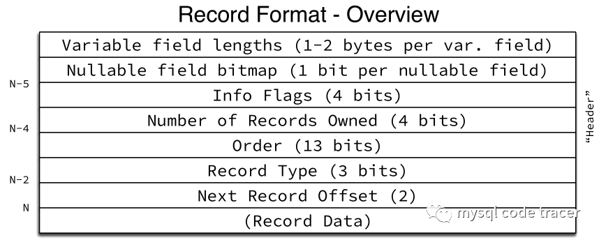

# Mysql 架构

## 概述

- mysql 完整流程包含Client 、Server 、Storage engine 这三个模块。
- Client
  - 最常见的JDBC client 。访问server 发起请求。
- Server
  - 服务器实现，包含一些连接管理、权限管理、SQL解析（词法分析、语法分析、优化器、执行器等）
- Storage engine
  - 存储引擎，Mysql 将存储引擎抽象为独立模块，就像一个接口一样定义操作标准。
  - 内部包含多种实现，甚至可以自定义实现。
  - 其中默认最常用的为INNODB,MYISAM, MEMORY 等等。

## Client

## Server

## INNODB Storage engine 

- 架构图

  

### 问题

#### 什么是聚集索引和二级索引

- 聚集索引 （Clustered index)

  - 每个`InnoDB`表都有一个称为聚集索引的特殊索引，用于存储行数据。通常，聚集索引与主键同义。

  - When you define a `PRIMARY KEY` on a table, `InnoDB` uses it as the clustered index. A primary key should be defined for each table. If there is no logical unique and non-null column or set of columns to use a the primary key, add an auto-increment column. Auto-increment column values are unique and are added automatically as new rows are inserted.

    当你在表上定义一个主键时，InnoDB使用它作为聚集索引。应该为每个表定义一个主键。如果没有逻辑唯一的非空列或一组列可以使用主键，则添加一个自动递增列。自动递增列值是惟一的，并在插入新行时自动添加。

  - If you do not define a `PRIMARY KEY` for a table, `InnoDB` uses the first `UNIQUE` index with all key columns defined as `NOT NULL` as the clustered index.

    如果你没有为一个表定义一个PRIMARY KEY, InnoDB会使用第一个UNIQUE索引作为聚集索引，并且所有的键列都定义为not NULL。

  - If a table has no `PRIMARY KEY` or suitable `UNIQUE` index, `InnoDB` generates a hidden clustered index named `GEN_CLUST_INDEX` on a synthetic column that contains row ID values. The rows are ordered by the row ID that `InnoDB` assigns. The row ID is a 6-byte field that increases monotonically as new rows are inserted. Thus, the rows ordered by the row ID are physically in order of insertion.

  - 如果一个表没有PRIMARY KEY或合适的UNIQUE索引，InnoDB会在包含行ID值的合成列上生成一个名为GEN_CLUST_INDEX的隐藏聚集索引。这些行按照InnoDB分配的行ID排序。行ID是一个6字节字段，在插入新行时单调增加。因此，按行ID排序的行在物理上是按插入顺序排列的。

- 二级索引

  - 聚集索引以外的索引称为二级索引。在 中`InnoDB`，二级索引中的每条记录都包含该行的主键列，以及为二级索引指定的列。 `InnoDB`使用此主键值搜索聚集索引中的行。

    如果主键很长，二级索引会占用更多的空间，所以主键短是有利的。

#### 什么是undo log

- 撤消日志是与单个读写事务相关联的撤消日志记录的集合。撤消日志记录包含有关如何撤消事务对[聚集索引](https://dev.mysql.com/doc/refman/5.7/en/glossary.html#glos_clustered_index) 记录的最新更改的信息。如果另一个事务需要查看原始数据作为一致性读取操作的一部分，则未修改的数据将从撤消日志记录中检索。撤消日志存在于 [撤消日志段中](https://dev.mysql.com/doc/refman/5.7/en/glossary.html#glos_undo_log_segment)，而[撤消日志段](https://dev.mysql.com/doc/refman/5.7/en/glossary.html#glos_undo_log_segment)包含在 [回滚段中](https://dev.mysql.com/doc/refman/5.7/en/glossary.html#glos_rollback_segment)。回滚段驻留在 [系统表空间](https://dev.mysql.com/doc/refman/5.7/en/glossary.html#glos_system_tablespace)、[撤消表空间](https://dev.mysql.com/doc/refman/5.7/en/glossary.html#glos_undo_tablespace)和[临时表空间中](https://dev.mysql.com/doc/refman/5.7/en/glossary.html#glos_temporary_tablespace)。

- mysql 行 页 段  idb文件介绍

  - https://dev.mysql.com/doc/refman/5.7/en/innodb-file-space.html

  - 数据库行：存储数据的地方，存在几种模式，默认 dynamic 可变长度 和压缩相关等等。

  - 数据页：innodb stroage engine 最小的操作IO的单位。

    - 数据页：对于 4KB、8KB、16KB 和 32KB[`innodb_page_size`](https://dev.mysql.com/doc/refman/5.7/en/innodb-parameters.html#sysvar_innodb_page_size)设置，最大行长度略小于**数据库页**面的一半 。例如，对于默认的 16KB`InnoDB`页面大小，最大行长度略小于 8KB 。对于 64KB 页面，最大行长度略小于 16KB。

    - *动态和压缩行格式*

      选择可变长度列用于外部关闭页面存储时，`InnoDB`在行中本地存储20字节的指针，并将其余部分用于溢出页面。请参阅[第 14.11 节，“InnoDB 行格式”](https://dev.mysql.com/doc/refman/5.7/en/innodb-row-format.html)。

    - [`LONGBLOB`](https://dev.mysql.com/doc/refman/5.7/en/blob.html)和 [`LONGTEXT`](https://dev.mysql.com/doc/refman/5.7/en/blob.html)列必须小于 4GB，并且总行长（包括 [`BLOB`](https://dev.mysql.com/doc/refman/5.7/en/blob.html)和 [`TEXT`](https://dev.mysql.com/doc/refman/5.7/en/blob.html)列）必须小于 4GB。
    - 为什么默认是4KB.因为内存中使用页管理。每页4KB.以便减少内存碎片。
      - 

  - 数据段：由多个连续的页组成。

  - 数据库文件（idb):由数据页组成

#### **innodb page 结构**

- 结构图

  

  - **FileHeader**

    - 最重要FIL_PAGE_PREV、FIL_PAGE_NEXT

    

    - ##### innodb存储页类型

    - 

  - **Page header 记录页状态**

    

  - #### 虚拟最大最小记录(Infimum and Supremum Records)

    最大记录是这个数据页中逻辑上最大的记录，所有用户的记录都小于它。最小记录是数据页上最小的记录，所有用户记录都大于它。他们在数据页被创建的时候创建，而且不能被删除。引入他们主要是方便页内操作。

  - #### 用户记录

    用户所有插入的记录都存放在这里，默认情况下记录跟记录之间没有间隙，但是如果重用了已删除记录的空间，就会导致空间碎片。每个记录都有指向下一个记录的指针，但是没有指向上一个记录的指针。记录按照主键顺序排序。即，用户可以从数据页最小记录开始遍历，直到最大的记录，这包括了所有正常的记录和所有被delete-marked记录，但是不会访问到被删除的记录(PAGE_FREE)。

  - #### Free Space

    从PAGEHEAPTOP开始，到最后一个数据目录，这之间的空间就是空闲空间，都被重置为0，当用户需要插入记录时候，首先在被删除的记录的空间中查找，如果没有找到合适的空间，就从这里分配。空间分配给记录后，需要递增PAGENRECS和PAGENHEAP。

  - #### Page Directory

    用户的记录是从低地址向高地址扩展，而数据目录则相反。在数据页被初始化的时候，就会在数据页最后(当然在checksum之前)创建两个数据目录，分别指向最大和最小记录。之后插入新的数据的时候，需要维护这个目录，例如必要的时候增加目录的个数。每个数据目录占用两个字节，存储对应记录的页内偏移量。假设目录N，这个目录N管理目录N-1(不包括)和目录N之间的记录，我们称目录N own 这些记录。在目录N指向的记录中，会有字段记录own记录的数量。由此可见，目录own的记录不能太多，因为太多的话，即意味着目录太过稀疏，不能很好的提高查询效率，但同时也不能own太少，这会导致目录数量变多，占用过多的空间。在InnoDB的实现中，目录own的记录数量在4-8之间，包括4和8，平均是6个记录。如果超过这个数量，就需要重新均衡目录的数量。目录的增加和删除可能需要进行内存拷贝，但是由于目录占用的总体空间很小，开销可以忽略不计。

  - **File Trailer**
    这个部分处于数据页最后的位置，只有8个字节。低地址的四个字节存储checksum的值，高地址的四个字节存储FILPAGELSN的低位四字节。注意这里的checksum的值不一定与FILPAGESPACEORCHKSUM的相同，这个依赖不同的checksum计算方法。

    找到一张比较不错的page结构图

#### **行记录格式**

**Record Header**

从这个图中可以看到，一条记录的Record Header至少为5字节，对Record Header长度取决于边长字段及字段是否可为空 简言之，记住几条关键规则 一条记录的record header，至少是5字节 对record header影响最大的是变长列数量，及其是否允许为NULL的属性

- **关于变长列**
  - 每个变长列，如果列长度 <128 字节，则需要额外1字节
  - 每个变长列，如果列长度 >=128 字节，则需要额外2字节
  - 如果没有任何变长列，则无需这额外的1-2字节
  - 变长类型为char/varchar/text/blob等
  - 同学们可能会诧异，char为什么也当做变长类型了？这是因为，当字符集非latin1时，最大存储长度可能会超过255字节，例如 char(65) utf8mb4 最长就可以存储260字节，此时在record header中需要用2字节来表示其长度，因此也被当做变长类型了

- **关于列允许为NULL**
  - 每个列如果允许为NULL，则增加 1bit，不足8bit也需要额外1字节
  - 例如只有2个列允许为NULL，只需要2bit来表示，但也需要占用1字节
  - P.S，在InnoDB的存储结构里，从tablespace到segment，再到extent、page，还是file层面，总有各种必要的header或trailer信息需要消耗额外的字节数，不像MyISAM那么简单。

#### 数据page结构

##### 主键非叶子节点

- Record Header，根据主键类型不同占用字节数不同，例如一个int主键，Record Header为5字节，另外需要考虑变长类型、是否为空
- 聚集索引key的长度，比如int为4字节
- 指向子节点指针，固定4字节

##### 主键叶子节点

- Record Header，根据主键类型不同占用字节数不同，例如一个int主键，Record Header为5字节，另外需要考虑变长类型、是否为空
- 聚集索引key的长度，比如int为4字节
- 事务ID，固定6字节
- 回滚段指针，固定7字节
- 其他列占用空间

##### 二级索引非叶子节点

- Record Header，根据主键类型不同占用字节数不同，例如一个int主键，Record Header为5字节，另外需要考虑变长类型、是否为空
- 二级索引列长度
- 主键索引列长度
- 指向子节点指针，固定4字节

##### 二级索引叶子节点

- Record Header，根据主键类型不同占用字节数不同，例如一个int主键，Record Header为5字节，另外需要考虑变长类型、是否为空
- 二级索引key大小
- 主键索引列长度

#### 什么是Double Write buffer (双写缓存区)

- 在innoDB 找到适当位置写入文件时之前，将先将页面写入该缓冲区，一个状态副本集。注：如果支持原子写入的设备中，会自动禁用该特性。

- 双写缓冲区是一个存储区域，在 `InnoDB`将页面写入`InnoDB`数据文件中的适当位置之前，从缓冲池中写入页面 。如果在页面写入过程中存在操作系统、存储子系统或意外的[**mysqld**](https://dev.mysql.com/doc/refman/5.7/en/mysqld.html)进程退出，则 `InnoDB`可以在崩溃恢复期间从双写缓冲区中找到该页面的良好副本。

- 在大多数情况下，默认情况下启用双写缓冲区。要禁用双写缓冲区，请设置 [`innodb_doublewrite`](https://dev.mysql.com/doc/refman/5.7/en/innodb-parameters.html#sysvar_innodb_doublewrite)为 0。

  如果系统表空间文件（“ ibdata 文件”）位于支持原子写入的 Fusion-io 设备上，则会自动禁用双写缓冲，并对所有数据文件使用 Fusion-io 原子写入。由于双写缓冲区设置是全局的，因此对于驻留在非 Fusion-io 硬件上的数据文件，双写缓冲也被禁用。此功能仅在 Fusion-io 硬件上受支持，并且仅在 Linux 上为 Fusion-io NVMFS 启用。要充分利用此功能，建议[`innodb_flush_method`](https://dev.mysql.com/doc/refman/5.7/en/innodb-parameters.html#sysvar_innodb_flush_method)设置 `O_DIRECT`。

#### redo Log

- 重做日志是一种基于磁盘的数据结构，用于在崩溃恢复期间纠正不完整事务写入的数据。在正常操作期间，重做日志对由 SQL 语句或低级 API 调用产生的更改表数据的请求进行编码。在初始化期间和接受连接之前，会自动重放在意外关闭之前未完成更新数据文件的修改。有关重做日志在崩溃恢复中的作用的信息，请参阅 [第 14.19.2 节，“InnoDB 恢复”](https://dev.mysql.com/doc/refman/5.7/en/innodb-recovery.html)。

  默认情况下，重做日志在磁盘上由两个名为`ib_logfile0`和 的 文件物理表示`ib_logfile1`。MySQL 以循环方式写入重做日志文件。重做日志中的数据根据受影响的记录进行编码；这些数据统称为重做。通过重做日志的数据通道由不断增加的[LSN](https://dev.mysql.com/doc/refman/5.7/en/glossary.html#glos_lsn)值表示。

- 粗略的理解（后面研究下完善 //todo）：

  - 说白这些日志是对应插入过程的一个记录。这些必然保存相关一些状态信息，要对应这些状态一致才能算提交成功：
    - 如 redo log 多了对应的记录，而binlog 中没有。则意味着存在没有提交的事物。

  - 

- 更正：
  - redo log主要目的是用顺序IO来记录事务日志。wal 提前记录。等待合适的时候再随机写入磁盘文件中。以便减少IO的次数。（记录物理操作，修改了哪一页）
  - binlog （记录逻辑操作日志,意味着操作必须成功的，可能当前未成功，但是未来一定成功）
    - 两者都会记录好事务TXID
    - 当redo log 记录下要修改的页记录为prepare状态。此时crash.因为binlog未记录，记录将会回滚。
    - 当commit时，binlog此时记录了该逻辑操作。此时redo log 也有对应的prepare记录。重启时进行重新刷盘。最终完成更新。
  - 总结：
  - redolog和binlog具有关联行
  - 在恢复数据时，redolog用于恢复主机故障时的未更新的物理数据，binlog用于备份操作，每个阶段的log操作都是记录在磁盘的
  - 在恢复数据时，redolog 状态为commit则说明binlog也成功，直接恢复数据；如果redolog是prepare，则需要查询对应的binlog事务是否成功，决定是回滚还是执行。（以binlog 的为准）

