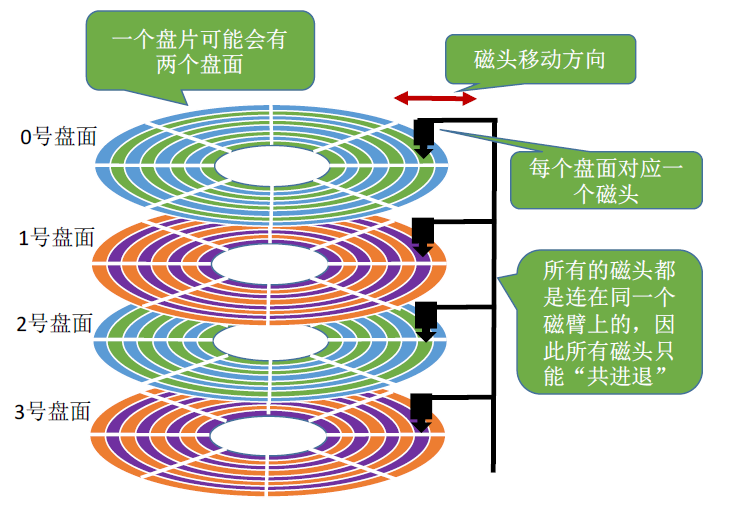

# 数据库存储结构之B+树

## 前置知识

- 磁盘如何读写数据？

  - 磁盘读写数据需要转到磁臂，定位到盘面 、磁道、扇区，扫描到该区域中。

    - 
    - 

  - ##### 磁道、扇区

    ​	每个盘片被划分为一个个磁道，每个磁道又划分为一个个扇区。如下图：

  - 每次扫描单位为(扇区)块 512Byte (现在新式硬盘 4KB )

  - 磁盘操作时间

    - 寻道（时间）：磁头移动定位到指定磁道
    - 旋转延迟（时间）：等待指定扇区从磁头下旋转经过
    - 数据传输（时间）：数据在磁盘与内存之间的实际传输

  - 文件记录中记录文件所包含的

- 内存是如何管理数据的？
  - 内存是一种高效存储系统，但是断电会丢失。
  - 只是一大堆晶体管组成。其最小单位为B字节
  - 操作系统更好管理内存，将其按照页为单位进行管理。一般为4KB。
  - 拓展：
    - 一个32Bit操作系统最多能管理多少内存？
      - 操作系统32Bit代表指令最多能含有32位，
      - 32位最多能寻址的空间最多为2的 32次方（4GB)
- 文件系统
  - 文件系统的读写过程
    - 当用户进程从文件读取 1 个字节大小的数据时，文件系统则需要获取字节所在的数据块，再返回数据块对应的用户进程所需的数据部分。
    - 当用户进程把 1 个字节大小的数据写进文件时，文件系统则找到需要写入数据的数据块的位置，然后修改数据块中对应的部分，最后再把数据块写回磁盘。
  - 
  - 文件系统随机访问和

## 如何高效的做到数据库存储和查询

- 高效衡量的指标（时间复杂度）
  - 查询时间
  - 插入修改删除时间
  - 磁盘IO时间

- 对于规模较小的数据100w以内

  - 假设平均一条记录 200 Bytes
  - 那么内存需要维护  200 * 1000000 ~ = 200MB。
  - 分析：数据量不大完全可以走内存的形式。无需磁盘IO消耗。最快直接的方式。
    - 数据插入
      - 在内存维护一个链表，当数据插入，修改，更新时，只要找到该待插入节点的指针即可实现O(1)
    - 数据检索
      - 如果不维护一个数据结构去辅助查询。那么只能暴力循环链表的所有节点O(n).
      - 为了辅助查询。RBT 是一个不错的选择。
      - RBT 是近似平衡的二叉排序树（最高深度差是2n) 
        - 查询O(logn) 
        - 更新O(logn)
        - 他相比AVL(平衡二叉树)来说更新更快，因为高度差1实在太苛刻，故对于这种也有一部分更新压力的节点，RBT是一个更优的选择。
      - 既然引入了一个辅助的结构，那么他在必然带来一定的空间
        - 每个节点大小。每个节点引用指针占6Byte + 索引值（假设8个字节）= 14Byte  
        - 14MB.

- 对于规模较大的数据千万级甚至以上如何保证高效的存储和查询

  - 假设平均一条记录 200 Bytes
  - 那么内存需要维护  200 * 10000000 ~= 2GB。

  - 维护索引也需要占用超过140MB.
  - 如果总数据量过亿（那么超过存储数据的压力将会超过20GB, + 1.4GB 索引）
  - 显然面对大数量级时无法内存无法满足。
  - 故现在我们需要把数据及其索引结构存储在数据库当中。
  - 目前面临的问题主要由：
    - 1.如何高效的存储数据（**如何利用磁盘的特性实现高效写入及减少IO次数**）
      - 1.如何高效的插入数据
      - 2.如何高效支持更新数据、删除数据
    - 2.如何高效的查询数据
    - 如何权衡 1 和2 中、读写效率，适合更加普遍场景的存储结构。分析如下
      - 方案一：
        - 维护一个有序线性表结构
          - 读取：
            - 利用二分可以查找可以快速定位的相关的位置进行读取O(logn)
          - 插入：
            - 定位插入位置需要logn，但是最差的情况需要移动元素。n
            - 如果利用链表，移动元素开销不大。但是查询时需要额外的指针。记录中间位置，跳表。
      - 方案二：
        - BST、RBT、AVL、B、B+
          - 读取：
            - BST最差的情况会导致退化成链表。O(n)
            - RBT、AVL能保持在O(logn)
            - B、B+ 是一个多级二叉树 也能在O(logn上)
          - 写入：
            - BST 最差O(n)
            - RBT、AVL,RBT在更新时能保持较高的效率。但都能维持在O(logn)
            - B、B+ 多级二叉树，更新时也需要进行调整比RBT、AVL更少。
      - 通过方案一和方案二我们从中得出B、B+是更好的做法。但两者谁更优呢
        - B、B+树都是一个多叉树，每一个节点内部是有序。及指向左右叉的指针
        - 每个节点至少有两个关键字。
        - 以B树为例
          - B树中非叶子节点也是存储记录本身信息。所以只要找到节点本身。那么就直接返回了。
          - 而B+树中非叶子节点只存储索引数据，只有到达叶子节点才能找到对应的记录。
        - 通过这两个特性：
          - 如果同等数量级的话。那么B树的深度会比B+树高。导致B查询效率会较低。
          - 也就是说B+说非叶子节点能存储越多数据。
          - B+树查询效率是稳定的。B树则不是。
          - 另外，结合操作系统以页作为内存管理的基本单位为据的话
            - 可以将数据整体划分成一个个页。而每一个页存储若干条记录。这样的好处时，
            - 只需要修改对应的页记录即可。没对应的页记录减少也必然意味着IO次数的减少。
        - 故综上所述：**B+树是一个最好的选择。其实B树是B+树的小变体。目的在非叶子节点上存储更多的数据，加快查询效率。而B树中节点数据实际与B+树的节点数据是一样的。都是关键词+记录本身。其IO次数稳定。查询复杂度为（logb n)  **

## 扩展 what BST、AVL、RBT、B、B+

- BST

  - binary sort tree
  - 任何一棵树满足，根节点大于左子树任一节点，根节点小于右子树任一节点。
  - 二叉搜索树。
    - 但顺序或者逆序时退化为链表

- AVL

  - 自平衡二叉树
  - **AVL树**（Adelson-Velsky and Landis Tree）是[计算机科学](https://zh.wikipedia.org/wiki/计算机科学)中最早被发明的[自平衡二叉查找树](https://zh.wikipedia.org/wiki/自平衡二叉查找树)。在AVL树中，任一节点对应的两棵子树的最大高度差为1，因此它也被称为**高度平衡树**。查找、插入和删除在平均和最坏情况下的[时间复杂度](https://zh.wikipedia.org/wiki/时间复杂度)都是{\displaystyle O(\log {n})}。增加和删除元素的操作则可能需要借由一次或多次[树旋转](https://zh.wikipedia.org/wiki/树旋转)，以实现树的重新平衡。AVL树得名于它的发明者[G. M. Adelson-Velsky](https://zh.wikipedia.org/wiki/格奥尔吉·阿杰尔松-韦利斯基)和[Evgenii Landis](https://zh.wikipedia.org/w/index.php?title=Evgenii_Landis&action=edit&redlink=1)，他们在1962年的论文《An algorithm for the organization of information》中公开了这一数据结构。

- RBT

  - Read black tree

  - **红黑树**（英语：Red–black tree）是一种[自平衡二叉查找树](https://zh.wikipedia.org/wiki/自平衡二叉查找树)，是在[计算机科学](https://zh.wikipedia.org/wiki/计算机科学)中用到的一种[数据结构](https://zh.wikipedia.org/wiki/数据结构)，典型用途是实现[关联数组](https://zh.wikipedia.org/wiki/关联数组)。它在1972年由[鲁道夫·贝尔](https://zh.wikipedia.org/wiki/鲁道夫·贝尔)发明，被称为"**对称二叉B树**"，它现代的名字源于Leo J. Guibas和[罗伯特·塞奇威克](https://zh.wikipedia.org/wiki/罗伯特·塞奇威克)于[1978年](https://zh.wikipedia.org/wiki/1978年)写的一篇论文。红黑树的结构复杂，但它的操作有着良好的最坏情况[运行时间](https://zh.wikipedia.org/wiki/算法分析)，并且在实践中高效：它可以在[{\displaystyle {\text{O}}(\log n)}](https://zh.wikipedia.org/wiki/大O符号)时间内完成查找、插入和删除，这里的{\displaystyle n}是树中元素的数目。
  - 

- B树

  - 在计算机科学中，B树（英语：B-tree）是一种自平衡的树，能够保持数据有序。这种数据结构能够让查找数据、顺序访问、插入数据及删除的动作，都在对数时间内完成。B树，概括来说是一个一般化的二叉查找树（binary search tree）一个节点可以拥有2个以上的子节点。与自平衡二叉查找树不同，B树适用于读写相对大的数据块的存储系统，例如磁盘。B树减少定位记录时所经历的中间过程，从而加快存取速度。B树这种数据结构可以用来描述外部存储。这种数据结构常被应用在数据库和文件系统的实现上。
  - 

- B+树

  - 最大化每个节点内部数量。减少树高度，占据完整倍数的磁盘块大小或者近似。
  - 
  - 

## 拓展固态硬盘和机械硬盘效率

- 固态硬盘因为采用专门的存储芯片，所以随机读取写入效率会比较高。因为只需要电路寻址。
- 机械硬盘随机读取写入这意味着每一次写入和读取都需要定位到扇区中。（磁臂将会转来转去，导致利用率下降）所以随机效率会低于顺序读取（不需要过多移动磁臂，假设数据都在顺序磁道内。读完这个读下一个）

