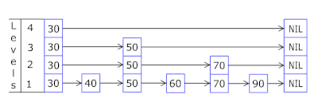

# Skip Linked List

## Over view

- 在计算机科学中，跳跃列表是一种数据结构。它使得包含n个元素的有序序列的查找和插入操作的平均时间复杂度都是{\displaystyle O(\log n)}O(\log n)，优于数组的{\displaystyle O(n)}O(n)复杂度。
- 快速的查询效果是通过维护一个多层次的链表实现的，且与前一层（下面一层）链表元素的数量相比，每一层链表中的元素的数量更少（见右下角示意图）。一开始时，算法在最稀疏的层次进行搜索，直至需要查找的元素在该层两个相邻的元素中间。这时，算法将跳转到下一个层次，重复刚才的搜索，直到找到需要查找的元素为止。跳过的元素的方法可以是随机性选择[2]或确定性选择[3]，其中前者更为常见。
- 


## 描述

跳跃列表是按层建造的。底层是一个普通的有序[链表](https://zh.wikipedia.org/wiki/链表)。每个更高层都充当下面列表的“快速通道”，这里在第{\displaystyle i}层中的元素按某个固定的概率{\displaystyle p}（通常为{\displaystyle {\frac {1}{2}}}或{\displaystyle {\frac {1}{4}}}）出现在第{\displaystyle i+1} 层中。每个元素平均出现在{\displaystyle {\frac {1}{1-p}}}个列表中，而最高层的元素（通常是在跳跃列表前端的一个特殊的头元素）在{\displaystyle \log _{1/p}n}个列表中出现。

在查找目标元素时，从顶层列表、头元素起步。算法沿着每层链表搜索，直至找到一个大于或等于目标的元素，或者到达当前层列表末尾。如果该元素等于目标元素，则表明该元素已被找到；如果该元素大于目标元素或已到达链表末尾，则退回到当前层的上一个元素，然后转入下一层进行搜索。每层链表中预期的查找步数最多为{\displaystyle {\frac {1}{p}}}，而层数为{\displaystyle \log _{1/p}n}，所以查找的总体步数为{\displaystyle -{\frac {\log _{p}n}{p}}}，由于{\displaystyle p}是常数，查找操作总体的[时间复杂度](https://zh.wikipedia.org/wiki/时间复杂度)为{\displaystyle {\mathcal {O}}(\log n)\,}。而通过选择不同{\displaystyle p}值，就可以在查找代价和存储代价之间获取平衡。

跳跃列表不像[平衡树](https://zh.wikipedia.org/wiki/平衡树)等数据结构那样提供对最坏情况的性能保证：由于用来建造跳跃列表采用随机选取元素进入更高层的方法，在小概率情况下会生成一个不平衡的跳跃列表（最坏情况例如最底层仅有一个元素进入了更高层，此时跳跃列表的查找与普通列表一致）。但是在实际中它通常工作良好，随机化平衡方案也比平衡二叉查找树等数据结构中使用的确定性平衡方案容易实现。跳跃列表在[并行计算](https://zh.wikipedia.org/wiki/并行计算)中也很有用：插入可以在跳跃列表不同的部分并行地进行，而不用对数据结构进行全局的重新平衡。


## 示意图


- 往跳跃列表中插入一个元素



## 文章

https://www.jianshu.com/p/9d8296562806

- 补充

  - 选择跳表时

    - 我们当插入元素、删除元素时我们也必须要构建好想应的索引。有一种比较好的概率方法。每插入一个节点时。1/2几率 返回 1 作为一级索引。1/4几率返回2作为二级索引。等等。通过随机的方式去构建索引

      - 注意：当返回大于2时，及下层也需要建立索引。节点也需要建立该索引。所以无论建立几级索引也必有一级索引。索引的插入过程与节点插入类似。
        - 通过上层索引可以搜索下来。O(Logn)
      - **元素插入到单链表的时间复杂度为 O(1)**，我们索引的高度最多为 logn，当插入一个元素 x 时，最坏的情况就是元素 x 需要插入到每层索引中，所以插入数据到各层索引中，**最坏时间复杂度是O(logn)搜索节点插入的时候已经找好的索引插入的位置，**。

    - ```java
      private int randomLevel() {
        int level = 1;
        // 当 level < MAX_LEVEL，且随机数小于设定的晋升概率时，level + 1
        while (Math.random() < SKIPLIST_P && level < MAX_LEVEL)
          level += 1;
        return level;
      }
      ```

    - 

  - 随机选择索引

    - **随机选 n/2 个元素做为一级索引、随机选 n/4 个元素做为二级索引、随机选 n/8 个元素做为三级索引，依次类推，一直到最顶层索引**

  - 红黑树，BST,B树 范围搜索
    - logn 找到第一个值 left。但是后续需要将记录串起来。直到找到right值。加入left和right一个最小一个最大。则要遍历所有节点

