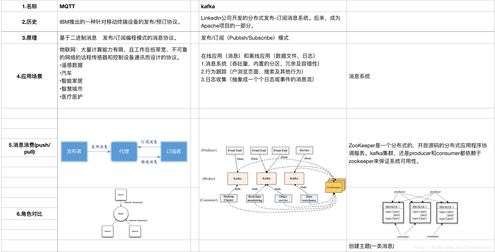
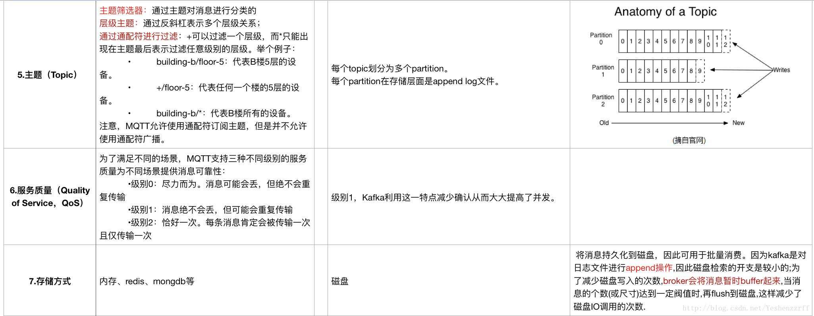
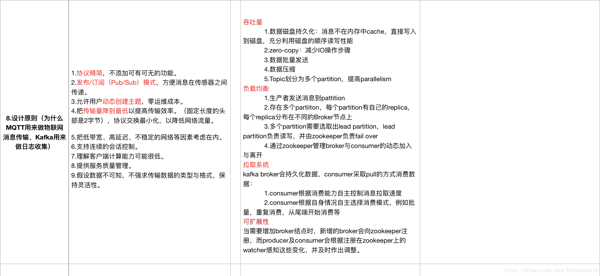
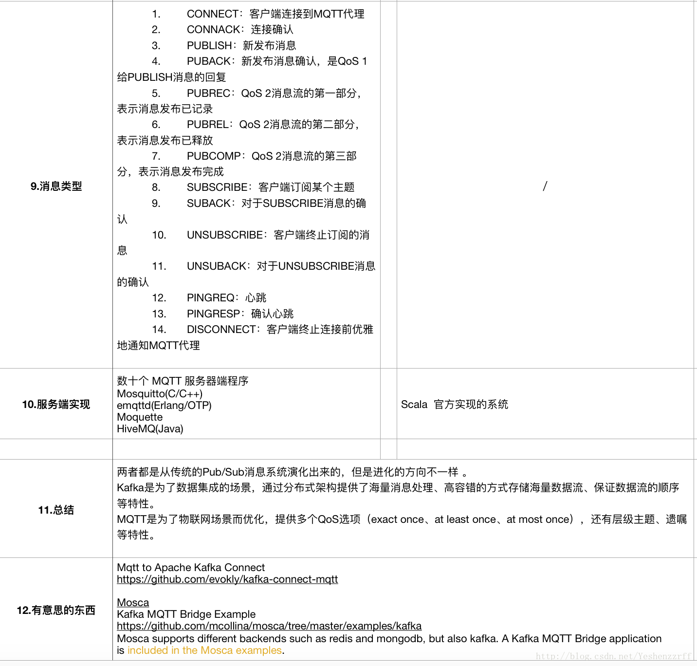
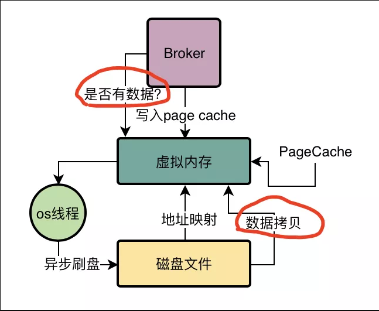

# Kafka

## Overview

- 什么是kafka
  - We designed Kafka to be able to act as a unified platform for handling all the real-time data feeds [a large company might have](https://kafka.apache.org/documentation/#introduction). To do this we had to think through a fairly broad set of use cases.
  - Kafka是最初由Linkedin公司开发，是一个**低延迟、容错、分布式、分区的、多副本的**、多订阅者，基于**zookeeper**协调的分布式日志系统（也可以当做MQ系统），常见可以用于web/nginx日志、访问日志，消息服务等等，Linkedin于2010年贡献给了Apache基金会并成为顶级开源项目。

- kafka 是消息队列吗？
  - 回答这个问题时候。我们需要知道**什么是消息队列**。这是一个很广泛的概念。Message Queue 。
    - 所谓消息队列（**本质就是一个生产者消费者模型**），可以分为两个部分。一个是数据的生产者，一个是数据的消费者。
    - 1.但里面会涉及并发控制（在多个线程写入时，顺序是否要保持一致）java 各种queue，
    - 2.在分布式的情况下，是通过监听获取还是主动获取等。
- kafka 与 mqtt
  - 现在所说的Mq 大都是基于MQTT的实现者。
  - MQTT（Message Queuing **Telemetry** Transport，消息队列遥测传输协议）
    - **Feature**
      - （1）精简，不添加可有可无的功能；
      - （2）发布/订阅（Pub/Sub）模式，方便消息在传感器之间传递；
      - （3）允许用户动态创建主题，零运维成本；
      - （4）把传输量降到最低以提高传输效率；
      - （5）把低带宽、高延迟、不稳定的网络等因素考虑在内；
      - （6）支持连续的会话控制；
      - （7）理解客户端计算能力可能很低；
      - （8）提供服务质量管理；
        - **"至多一次"**，消息发布完全依赖底层TCP/IP网络。会发生消息丢失或重复。这一级别可用于如下情况，环境传感器数据，丢失一次读记录无所谓，因为不久后还会有第二次发送。这一种方式主要普通APP的推送，倘若你的智能设备在消息推送时未联网，推送过去没收到，再次联网也就收不到了。
        - **"至少一次"**，确保消息到达，但消息重复可能会发生。
        - **"只有一次"**，确保消息到达一次。在一些要求比较严格的计费系统中，可以使用此级别。在计费系统中，消息重复或丢失会导致不正确的结果。这种最高质量的消息发布服务还可以用于即时通讯类的APP的推送，确保用户收到且只会收到一次。
      - （9）假设数据不可知，不强求传输数据的类型与格式，保持灵活性
    - **协议原理**：
      - **MQTT 角色划分**
        - 发布者（Publish) 消息产生者
        - 代理（Broker) 容器服务器本身
        - 订阅者（Subscribe)  消息消费者
      - **MQTT传输的消息分为：主题（Topic）和负载（payload）两部分：**
        - （1）**Topic**，可以理解为消息的类型，订阅者订阅（Subscribe）后，就会收到该主题的消息内容（payload）；
        - （2）**payload**，可以理解为消息的内容，是指订阅者具体要使用的内容。
        - 补充：消息传递模式可分为：
          - 点对点。（一个消息对应一个消费者）
          - topic 订阅模式。（多消费者）
      - **MQTT client Feature**
        - 客户端包含（Publish、Subscribe)两种角色。可根据需求进行角色划分。
      - **MQTT Server Feature**
        - 维护客户端列表。
        - 读取消息内容，根据类型转发到不同客户端。
- **kafka 与 mqtt**
  - kafka 在一定程度实现了 mqtt 协议的标准。但两者侧重点不一致。kafka 有一部分比较重要的核心实现分布式持久化保存数据为目的。而mqtt 这部分是未做要求。
  - **在主要使用功能层面抽象可以是一致的。MQTT 是基于发布/订阅范式的消息协议，而Apache Kafka 的生产、消费的流程也是属于发布/订阅范式的**
  - 摘自网络对比
    - 
    - 
    - 
    - 

## Kafka 


## kafka 分布式实现


## Q&A

- kafka 消息保证
  - ack 设置
  - kafka的语义非常直接，当发送消息的时候，我们有一个消息被"提交"到日志中的概念，一旦一个发送的消息被提交，只要消息写入的分区有一个broker存活，消息就不会丢失。
  - 生产者支持使用类事务语义向多个topic分区发送消息的能力：**要么所有消息成功写入所有分区，要么不写入任何分区**。这个特性的主要使用场景就是为了kafka topic的"恰好一次"处理。

- 0.Why kafka so faster

  - **Kafka 速度的秘诀在于，它把所有的消息都变成一个批量的文件，并且进行合理的批量压缩，减少网络 IO 损耗，通过 mmap 提高 I/O 速度，写入数据的时候由于单个 Partion 是末尾添加所以速度最优；读取数据的时候配合 sendfile 直接暴力输出。**

  - **顺序写IO + MMAP** (文件)。批量Flush（利用mmap,充分使用pagecache 刷新磁盘。同时避免GC回收扫描，Random AccessFile）

    - 中途挂了。没有flush到怎么办
      - 日志提供了一个配置参数*M*，它控制在强制刷新到磁盘之前写入的最大消息数。
    - flush到一半挂了怎么办
      - 在启动时，运行日志恢复过程，迭代最新日志段中的所有消息并验证每个消息条目是否有效。
      - 如果消息条目的大小和偏移量之和小于文件的长度并且消息有效负载的 CRC32 与与消息一起存储的 CRC 匹配，则消息条目是有效的。如果检测到损坏，日志将被截断到最后一个有效偏移量。但在写入包含该数据的块之前发生崩溃。CRC 检测到这种极端情况，并防止它破坏日志（尽管未写入的消息当然会丢失）。
    - 

  - 批量写入

    - 减少数据网络传输次数。
    - 数据缓存区

  - 数据压缩

    - 以更小的传输字节。存储更多的数据（哈夫曼树）

  - 高效传输

    - 通过定义日志文件及偏移量的位置（稀疏索引（index)，段文件内容二分确定传输内容）

    - ```java
      // transfer to 
      // inputstream   为文件FileChannel
      // outputstream  为其他流
      // 从FileChannel 直接写入到Nic Buffer 缓冲区
      public abstract long transferTo(long position, long count,
         WritableByteChannel target) throws IOException;
      // 从src Channel 写入到 FileChannel当中
      public abstract long transferFrom(ReadableByteChannel src,
            long position, long count) throws IOException;
      //
      public static void copyFile( File from, File to ) throws IOException {
         	URL website = new URL("http://www.website.com/information.asp");
          ReadableByteChannel rbc = Channels.newChannel(website.openStream());
          FileOutputStream fos = new FileOutputStream("information.html");
          fos.getChannel().transferFrom(rbc, 0, Long.MAX_VALUE);
      } 
      
      private static void doCopyNIO(String inFile, String outFile) {
          FileInputStream fis = null;
          FileOutputStream fos = null;
          FileChannel cis = null;
          FileChannel cos = null;
      
          long len = 0, pos = 0;
      
          try {
              fis = new FileInputStream(inFile);
              cis = fis.getChannel();
              fos = new FileOutputStream(outFile);
              cos = fos.getChannel();
              len = cis.size();
              /*while (pos < len) {
                      pos += cis.transferTo(pos, (1024 * 1024 * 10), cos);    // 10M
                  }*/
              cis.transferTo(0, len, cos);
              fos.flush();
          } catch (Exception e) {
              e.printStackTrace();
          } 
      }

- **1.kafka怎么将数据推送给客户端**

  - kafka 通过offset

  - pull vs push

    - 我们最初考虑的一个问题是消费者应该从经纪人那里提取数据还是经纪人应该将数据推送给消费者。在这方面，Kafka 遵循更传统的设计，被大多数消息传递系统共享，其中数据从生产者推送到代理，并由消费者从代理拉取。一些以日志为中心的系统，例如[Scribe](http://github.com/facebook/scribe)和 ，遵循非常不同的基于推送的路径，将数据推送到下游。这两种方法各有利弊。然而，基于推送的系统难以处理不同的消费者，因为代理控制数据传输的速率。目标通常是让消费者能够以最大可能的速率消费；不幸的是，在推送系统中，这意味着当消费率低于生产率时，消费者往往会不知所措（本质上是拒绝服务攻击）。基于拉动的系统具有更好的特性，即消费者只是落后并在可能的时候赶上。这可以通过某种退避协议来缓解，消费者可以通过该协议表明它已经不堪重负，但是让传输率充分利用（但永远不会过度利用）消费者比看起来更棘手。以前以这种方式构建系统的尝试使我们采用了更传统的拉式模型。

      基于拉式系统的另一个优点是它有助于对发送给消费者的数据进行积极的批处理。基于推送的系统必须选择立即发送请求或积累更多数据然后在不知道下游消费者是否能够立即处理它的情况下发送。**如果调整为低延迟，这将导致一次只发送一条消息，但传输最终会被缓冲，这是一种浪费。基于拉取的设计解决了这个问题**，因为消费者总是在其在日志中的当前位置之后（或达到某个可配置的最大大小）拉取所有可用消息。因此，可以在不引入不必要的延迟的情况下获得最佳批处理。

      天真的基于拉取的系统的不足之处在于，如果代理没有数据，消费者最终可能会在一个紧凑的循环中轮询，实际上是忙于等待数据到达。为了避免这种情况，**我们在拉取请求中设置了参数，允许消费者请求在“长轮询”中阻塞，等待数据到达**（并且可以选择等待给定数量的字节可用以确保大传输大小）

- **2.why  kafka so fast**

  > 关于磁盘性能的关键事实是，在过去十年中，硬盘驱动器的吞吐量与磁盘寻道的延迟有所不同。因此，在 具有 6 个 7200rpm SATA RAID-5 阵列的[JBOD](http://en.wikipedia.org/wiki/Non-RAID_drive_architectures)配置上，线性写入的性能约为 600MB/秒，而随机写入的性能仅为约 100k/秒，相差超过 6000 倍。这些线性读取和写入是所有使用模式中最可预测的，并由操作系统进行了大量优化。现代操作系统提供预读和后写技术，以大块倍数预取数据并将较小的逻辑写入分组为较大的物理写入。可以在此[ACM 队列文章中](http://queue.acm.org/detail.cfm?id=1563874)找到对此问题的进一步讨论；他们实际上发现 [在某些情况下，顺序磁盘访问可能比随机内存访问更快！](http://deliveryimages.acm.org/10.1145/1570000/1563874/jacobs3.jpg)
  >
  > 为了弥补这种性能差异，**现代操作系统在使用主内存进行磁盘缓存方面变得越来越积极**。当内存被回收时，现代操作系统很乐意将*所有*空闲内存转移到磁盘缓存中，而性能损失很小。所有磁盘读写都会经过这个统一的缓存。如果不使用直接 I/O，则无法轻易关闭此功能，因此即使进程维护数据的进程内缓存，此数据也可能会在操作系统页面缓存中复制，从而有效地将所有内容存储两次。
  >
  > 此外，我们是在 JVM 之上构建的，任何花时间了解 Java 内存使用的人都知道两件事：
  >
  > 1. 对象的内存开销非常高，通常会使存储的数据大小增加一倍（或更糟）。
  > 2. 随着堆内数据的增加，Java 垃圾收集变得越来越繁琐和缓慢。
  >
  > 由于这些因素，**使用文件系统和依赖页面缓存优于维护内存缓存或其他结构**——我们通过自动访问所有空闲内存至少使可用缓存加倍，并且可能通过存储一个紧凑的内存再次加倍字节结构而不是单个对象。这样做将在 32GB 机器上产生高达 28-30GB 的缓存，而不会受到 GC 惩罚。此外，即使服务重新启动，此缓存也会保持温暖，而进程内缓存需要在内存中重建（对于 10GB 缓存可能需要 10 分钟），否则它将需要以完全冷的缓存启动（这可能意味着糟糕的初始性能）。这也极大地简化了代码，因为所有用于维护缓存和文件系统之间一致性的逻辑现在都在操作系统中，这往往比一次性的进程内尝试更有效、更正确。如果您的磁盘使用偏好线性读取，那么预读实际上是在每次磁盘读取时使用有用的数据预先填充此缓存。
  >
  > 这表明了一种非常简单的设计：**与其在内存中尽可能多地维护并在空间不足时恐慌地将其全部刷新到文件系统中，不如将其反转。所有数据都会立即写入文件系统上的持久日志，而不必刷新到磁盘。实际上，这只是意味着它被传输到内核的页面缓存中。**
  >
  > 这种以页面缓存为中心的设计风格在[一篇](http://varnish-cache.org/wiki/ArchitectNotes)关于 Varnish 设计的[文章中](http://varnish-cache.org/wiki/ArchitectNotes)有所描述（以及适度的傲慢）。
  >
  > #### [恒定时间就足够了](https://kafka.apache.org/documentation/#design_constanttime)
  >
  > 消息传递系统中使用的持久数据结构通常是每个消费者队列，带有关联的 BTree 或其他通用随机访问数据结构，以维护有关消息的元数据。BTrees 是可用的最通用的数据结构，可以在消息传递系统中支持各种事务性和非事务性语义。不过，它们确实带来了相当高的成本：Btree 操作是 O(log N)。通常认为 O(log N) 本质上等同于常数时间，但对于磁盘操作而言并非如此。磁盘寻道的时间为 10 毫秒，每个磁盘一次只能进行一次寻道，因此并行性受到限制。因此，即使是少量的磁盘搜索也会导致非常高的开销。由于存储系统混合了非常快的缓存操作和非常慢的物理磁盘操作，
  >
  > 直观上，**持久队列可以建立在简单的读取和附加到文件的基础上，这是日志解决方案的常见情况。这种结构的优点是所有操作都是 O(1) 并且读取不会阻塞写入或相互阻塞。这具有明显的性能优势，因为性能与数据大小完全分离——一台服务器现在可以充分利用大量廉价、低转速的 1+TB SATA 驱动器。尽管它们的寻道性能很差，但这些驱动器对于大型读取和写入具有可接受的性能，并且价格是其 1/3，容量是其 3 倍。**
  >
  > **在没有任何性能损失的情况下访问几乎无限的磁盘空间意味着我们可以提供一些通常在消息传递系统中找不到的功能。例如，在 Kafka 中，我们可以将消息保留相对较长的时间（比如一周），而不是尝试在消息被消费后立即删除。正如我们将要描述的，这为消费者带来了极大的灵活性。**
  >
  > ### [4.3 效率](https://kafka.apache.org/documentation/#maximizingefficiency)
  >
  > 我们在效率方面付出了巨大的努力。我们的主要用例之一是处理网络活动数据，该数据量非常大：每个页面视图可能会生成数十次写入。此外，我们假设发布的每条消息至少被一个消费者（通常是多个）阅读，因此我们努力使消费尽可能便宜。
  >
  > 我们还发现，根据构建和运行多个类似系统的经验，效率是有效多租户运营的关键。如果下游基础设施服务很容易因为应用程序的使用量出现小幅波动而成为瓶颈，那么这种微小的变化往往会产生问题。通过非常快，我们帮助确保应用程序在基础设施之前在负载下翻转。当尝试在集中式集群上运行支持数十或数百个应用程序的集中式服务时，这一点尤为重要，因为使用模式几乎每天都会发生变化。
  >
  > 我们在上一节中讨论了磁盘效率。一旦消除了不良的磁盘访问模式，这种类型的系统有两个常见的低效率原因：过多的小 I/O 操作和过多的字节复制。
  >
  > **小的 I/O 问题既发生在客户端和服务器之间，也发生在服务器自己的持久操作中。**
  >
  > 为了避免这种情况，我们的协议围绕“消息集”抽象构建，该抽象自然地将消息组合在一起。这允许网络请求将消息组合在一起并分摊网络往返的开销，而不是一次发送一条消息。服务器依次将消息块一次性添加到其日志中，消费者一次获取大的线性块。
  >
  > 这种简单的优化产生了数量级的加速。批处理会导致更大的网络数据包、更大的顺序磁盘操作、连续的内存块等，所有这些都允许 Kafka 将突发的随机消息写入流转换为流向消费者的线性写入。
  >
  > **另一个低效率是字节复制。在低消息速率下这不是问题，但在负载下影响是显着的。为了避免这种情况，我们采用了一种由生产者、代理和消费者共享的标准化二进制消息格式（因此数据块可以在它们之间传输而无需修改）。**
  >
  > **代理维护的消息日志本身只是一个文件目录，每个文件都由一系列消息集填充，这些消息集以生产者和消费者使用的相同格式写入磁盘。保持这种通用格式可以优化最重要的操作：持久日志块的网络传输。现代 Unix 操作系统提供了高度优化的代码路径，用于将数据从页面缓存传输到套接字；在 Linux 中，这是通过[sendfile 系统调用完成的](http://man7.org/linux/man-pages/man2/sendfile.2.html)。**
  >
  > **要了解 sendfile 的影响，重要的是要了解从文件到套接字传输数据的通用数据路径：**
  >
  > 1. **操作系统从磁盘读取数据到内核空间的pagecache**
  > 2. **应用程序从内核空间读取数据到用户空间缓冲区**
  > 3. **应用程序将数据写回内核空间到套接字缓冲区**
  > 4. **操作系统将数据从套接字缓冲区复制到通过网络发送的 NIC 缓冲区**
  >
  > 这显然是低效的，有四个副本和两个系统调用。使用 sendfile，通过允许操作系统将数据从页面缓存直接发送到网络，可以避免这种重新复制。所以在这个优化的路径中，只需要到 NIC 缓冲区的最终副本。
  >
  > 我们期望一个常见的用例是一个主题的多个消费者。使用上面的零复制优化，数据被复制到页面缓存中一次，并在每次消费时重用，而不是每次读取时都存储在内存中并复制到用户空间。这允许以接近网络连接限制的速率消耗消息。
  >
  > **pagecache 和 sendfile 的这种组合意味着在消费者主要被赶上的 Kafka 集群上，您将看不到磁盘上的任何读取活动，因为它们将完全从缓存中提供数据。**
  >
  > **有关 Java 中 sendfile 和零复制支持的更多背景信息，请参阅此[文章](https://developer.ibm.com/articles/j-zerocopy/)。**

  

  

  

  - **使用顺序IO写入速度。大大提升。内部记录序列号。**
  - **磁盘与内存缓存(映射)是怎么做的（MMAP）**
  - **我们的协议围绕“消息集”抽象构建，该抽象自然地将消息组合在一起。这允许网络请求将消息组合在一起并分摊网络往返的开销，而不是一次发送一条消息。服务器依次将消息块一次性添加到其日志中，消费者一次获取大的线性块。这种简单的优化产生了数量级的加速。批处理会导致更大的网络数据包、更大的顺序磁盘操作、连续的内存块等，所有这些都允许 Kafka 将突发的随机消息写入流转换为流向消费者的线性写入。**
  - **代理维护的消息日志本身只是一个文件目录，每个文件都由一系列消息集填充，这些消息集以生产者和消费者使用的相同格式写入磁盘。保持这种通用格式可以优化最重要的操作：持久日志块的网络传输。现代 Unix 操作系统提供了高度优化的代码路径，用于将数据从页面缓存传输到套接字；在 Linux 中，这是通过[sendfile 系统调用完成的](http://man7.org/linux/man-pages/man2/sendfile.2.html)**
  - **端到端的批量压缩**：可以将一批消息压缩在一起并以这种形式发送到服务器。这批消息将以压缩形式写入，并在日志中保持压缩状态，只会被消费者解压。Kafka 支持 GZIP、Snappy、LZ4 和 ZStandard 压缩协议。可以在[此处](https://cwiki.apache.org/confluence/display/KAFKA/Compression)找到有关压缩的更多详细信息。

  - 


