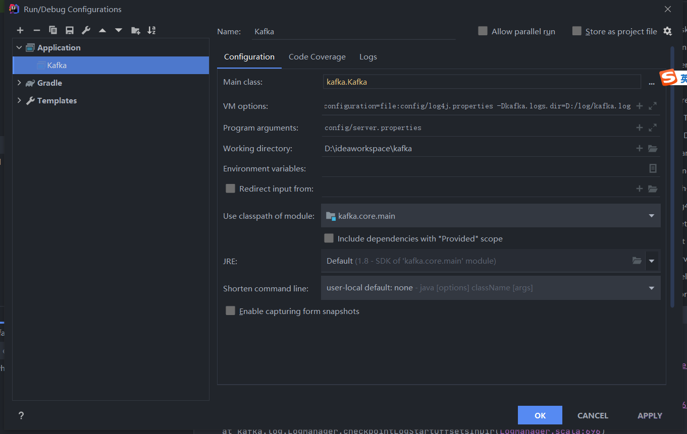

# Kafka 最新编译环境

- kafka 版本
  - tag 2.8.0

- 相关文档：
  - https://medium.com/@chandreshpancholi007/how-to-setup-apache-kafka-source-code-on-intellij-b204966d7c2

- gradle 环境安装（包依赖）

- slf4j 引入

  - dependence.gradle

    - ```gradel
      versions += [
      ....
      slf4jlog4j12: "2.0.0-alpha1",
      
      libs += [
      ...
      slf4jlog4j12: "org.slf4j:slf4j-log4j12:$versions.slf4jlog4j12",
      
      
      ```

    - build.gradle

      - ```gradel
        project(':core') {
        ...
        dependencies {
            ...
            implementation libs.log4j
            implementation libs.slf4jlog4j12
        }
        ```

      - 

- vm 参数配置：

  - -Dlog4j.configuration=file:config/log4j.properties -Dkafka.logs.dir=D:/log/kafka.log

- program agruments:

  - config/server.properties


- 运行
  - 


