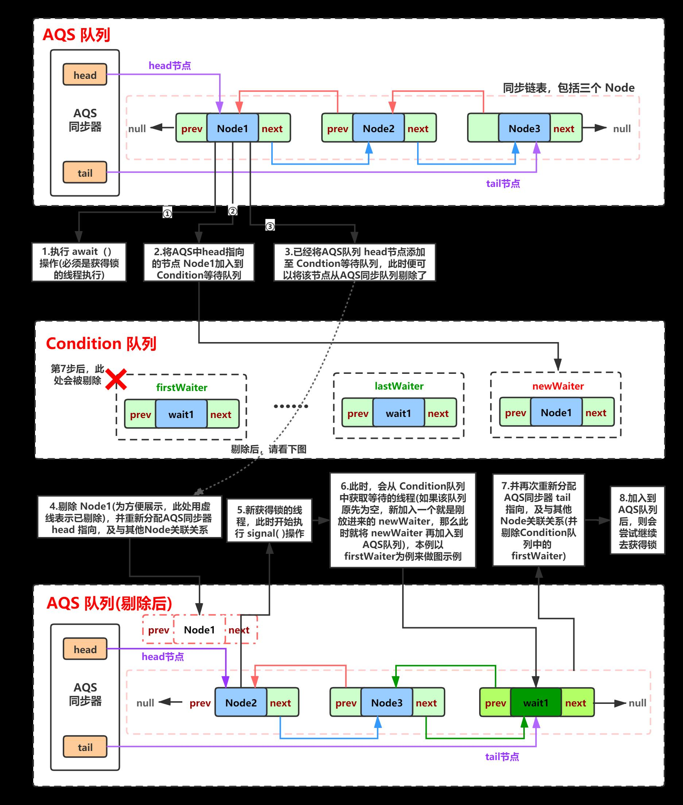

# JUC 源码
- 目标：学习源码思路，如何打造高性能容器（无锁、少竞争）

## CopyOnWriteArrayList
```java
public boolean add(E e) {
    final ReentrantLock lock = this.lock;
    lock.lock();
    try {
        Object[] elements = getArray();
        int len = elements.length;
        Object[] newElements = Arrays.copyOf(elements, len + 1);
        newElements[len] = e;
        setArray(newElements);
        return true;
    } finally {
        lock.unlock();
    }
}
public E get(int index) {
    return get(getArray(), index);
}
```
- 我擦。这个add性能能好吗,需要复制一份数据。
- get获取不加锁。
- 有个疑问：我Arraylist 只对add 加锁。不对read 加锁。不比其快吗。
    - 读写互斥问题:
        - 传统arraylist如果读取不加锁时。可能会存在问题。当一开始获取list长度之后。
        - 当数组发生了修改操作，将导致数据的越界问题，
        - 而使用COW则不会。因为在读取过程中forEach，删除了字段。list一开始获取为指向的旧数组的引用。
        - 当更新时。foreach 已经指向旧引用不变
        ```java
         public void forEach(Consumer<? super E> action) {
                 if (action == null) throw new NullPointerException();
                 Object[] elements = getArray();
                 int len = elements.length;
                 for (int i = 0; i < len; ++i) {
                     @SuppressWarnings("unchecked") E e = (E) elements[i];
                     action.accept(e);
                 }
             }
        ```
- 总结：
    - cow 思想在读远大于写入时场景下最适合。不适合于大批量插入。
## Condition
- condition 是juc 用来代替wait()、notity().实现精准停止与唤醒
```java
private static Lock lock = new ReentrantLock();
    private static Condition conditionB = lock.newCondition();
    private static Condition conditionC = lock.newCondition();
    private static Condition conditionD = lock.newCondition();

    public static void main(String[] args) {
        // 多线程通知唤醒。
        // 精确通知、唤醒、条件唤醒、await释放锁。single唤醒时重新获得锁
        ConditionAwaitNotifyTest test = new ConditionAwaitNotifyTest();
        new Thread(()-> test.printA()).start();
        new Thread(()-> test.printB()).start();
        new Thread(()-> test.printC()).start();
        new Thread(()-> test.printD()).start();

    }

    public void printA(){
        try{
            Thread.sleep(1000);
            lock.lock();
            for (int i = 0; i < 10 ; i++) {
                System.out.println("AAAAAAAAAAAAA");
            }
            conditionB.signal();
        }catch (Exception e ){
            e.printStackTrace();
        }finally {
            lock.unlock();
            System.out.println("释放锁");
        }
    }

    public void printB()  {
        try{
//            Thread.sleep(1000);
            lock.lock();
            // 没人唤醒他。
            conditionB.await();
            for (int i = 0; i < 10 ; i++) {
                System.out.println("BBBBBBBBBBB");
            }
            conditionC.signal();
        } catch (Exception e) {
            e.printStackTrace();
        } finally {
            lock.unlock();
        }
    }

    public void printC() {
        try{
            lock.lock();
            conditionC.await();
            for (int i = 0; i < 100 ; i++) {
                System.out.println("CCCCCCCCCC");
            }
            conditionD.signal();
        } catch (InterruptedException e) {
            e.printStackTrace();
        } finally {
            lock.unlock();
        }
    }


    public void printD() {
        try{
            lock.lock();
            conditionD.await();
            for (int i = 0; i < 100 ; i++) {
                System.out.println("DDDDDDDDD");
            }
        } catch (InterruptedException e) {
            e.printStackTrace();
        } finally {
            lock.unlock();
        }
    }
```
- condition 实现原理
    - Condition队列：用于存储处于等待状态的队列；          AQS队列：用于存储即将要获得锁的线程。
    - await操作： 1.LockSupport.park 进行阻塞、挂起。2.放到condition 队列
    - signal操作：1.放到AQS队列后面。2.若符合唤醒条件则LockSupport.unpark
    - 

## Fair & No Fair 
- 通用的锁获取逻辑
```java
public final void acquire(int arg) {
    // 尝试获取锁
    if (!tryAcquire(arg) &&
        acquireQueued(addWaiter(Node.EXCLUSIVE), arg))
        selfInterrupt();
}
// 释放锁会将state 设为0.可以去竞争
protected final boolean tryRelease(int releases) {
    int c = getState() - releases;
    if (Thread.currentThread() != getExclusiveOwnerThread())
        throw new IllegalMonitorStateException();
    boolean free = false;
    if (c == 0) {
        free = true;
        setExclusiveOwnerThread(null);
    }
    setState(c);
    return free;
}

```
- Fair ReentrantLock Lock
- CAS + 对头判断（若对头则抢。否则则进队列。阻塞等待被唤醒）
```java
protected final boolean tryAcquire(int acquires) {
    final Thread current = Thread.currentThread();
    int c = getState();
    if (c == 0) {
        // 是否为对头
        if (!hasQueuedPredecessors() &&
            compareAndSetState(0, acquires)) {
            setExclusiveOwnerThread(current);
            return true;
        }
    }
    else if (current == getExclusiveOwnerThread()) {
        int nextc = c + acquires;
        if (nextc < 0)
            throw new Error("Maximum lock count exceeded");
        setState(nextc);
        return true;
    }
    return false;
}
```
- No Fair ReentrantLock Lock
- 非公平锁。每次获取时去抢一下。抢不到就进队列。效率会高效一点
```java
final void lock() {
    if (compareAndSetState(0, 1))
        setExclusiveOwnerThread(Thread.currentThread());
    else
        acquire(1);
}

protected final boolean tryAcquire(int acquires) {
    return nonfairTryAcquire(acquires);
}
final boolean nonfairTryAcquire(int acquires) {
    final Thread current = Thread.currentThread();
    int c = getState();
    if (c == 0) {
        if (compareAndSetState(0, acquires)) {
            setExclusiveOwnerThread(current);
            return true;
        }
    }
    else if (current == getExclusiveOwnerThread()) {
        int nextc = c + acquires;
        if (nextc < 0) // overflow
            throw new Error("Maximum lock count exceeded");
        setState(nextc);
        return true;
    }
    return false;
}
```
